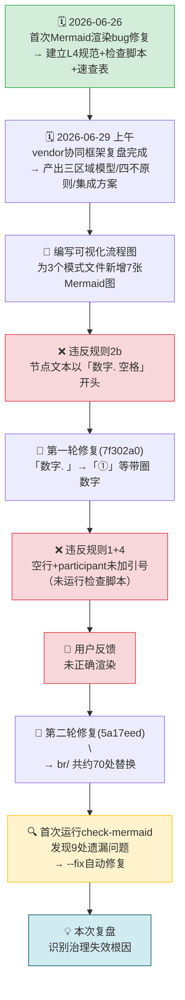

# 执行复盘：Mermaid 渲染回归问题的时间线与根因

## 一、时间线

## 二、关键节点分析

### 节点 T2：编写 7 张 Mermaid 图时为什么没查规范？

**事实**：
- 规范文件存在：`mermaid-safe-coding-rules.md`（L4标准化）
- 检查脚本存在：`check-mermaid.py`
- 模板存在：`.agents/templates/mermaid-templates/`
- 但全部未被使用

**分析**：
1. **上下文未关联**：编写Mermaid图时，注意力集中在"内容表达"（三区域模型的三列布局、四不原则的纵深防御层次），而非"Mermaid语法安全"。大脑处于"创作模式"而非"校验模式"。
2. **记忆偏差**：记得"不能有空行"和"要加引号"，但忘记了"列表触发"和"换行符"规则——3天前建立的5条规则，在实际编码时只能回忆起2条。
3. **触发机制缺失**：项目没有"编写Mermaid前自动提示查阅规范"的机制。阶段守卫（stage-guardrails）刚建立但未覆盖Mermaid编写场景。

### 节点 T4：第一轮修复后为什么没运行检查？

**事实**：修复 list 触发问题（7f302a0提交）后，直接提交，未运行 `check-mermaid.py`。

**分析**：
1. **局部最优陷阱**：修复了用户报告的特定问题后，认为"问题已解决"，未进行系统性验证。
2. **工具调用成本认知**：在编写-修复循环中，运行检查脚本被视为"额外步骤"而非"必要步骤"。
3. **修复范围错觉**：认为修改只是简单的字符替换（`1.`→`①`），不会引入新问题，却忽略了原始代码中已存在的空行/引号问题。

### 节点 T7：第二轮修复时为什么还遗漏了空行/引号？

**事实**：修复 `\n`→` ` 问题时（5a17eed提交），仍然没有运行检查脚本，导致9处空行和引号问题遗留到复盘时才发现。

**分析**：
1. **同上局部最优陷阱**：用户报告什么修什么，不做全面扫描。
2. **对 `\n` 问题的注意力聚焦**：搜索 `\n` 并替换为 ` ` 时，注意力集中在换行符本身，未注意到同一代码块中的其他问题。
3. **工具信任缺失（反向）**：不是过度信任工具，而是根本没想到用工具——手动检查的盲区比想象中大。

## 三、量化数据

| 指标 | 数值 |
|------|------|
| 新增/修改 Mermaid 图数量 | 7 张（3个文件） |
| 第一轮修复：list 触发问题 | ~5 处 |
| 第二轮修复：`\n` 换行问题 | ~70 处 |
| 第三轮修复（检查脚本发现）：空行+引号 | 9 处（自动修复） |
| 总问题数 | ~84 处 |
| 用户反馈轮次 | 2 轮 |
| 从规范建立到回归发生 | 3 天 |
| 检查脚本覆盖率 | 4/5 规则（缺 `\n` 检测） |
| 规范在编写时的查阅率 | 0%（完全未查阅） |
| 检查脚本在提交前的运行率 | 0%（从未运行直到复盘） |

## 四、根因分析：为什么治理失效？

### 直接原因（Symptom）

编写 Mermaid 代码时违反了已有的安全编码规则。

### 间接原因（Cause）

1. **规范查阅缺乏触发**：编写Mermaid时没有强制机制提示查阅规范
2. **检查脚本未被集成到工作流**：提交前没有自动运行检查
3. **检查脚本规则不完整**：缺少 `\n` 换行符检测

### 根本原因（Root Cause）

**规范体系停留在"文档化"阶段，未进入"强制执行"阶段。**

项目建立了完整的规范体系（规则→速查表→检查脚本→模板），但这些资产处于"被动可用"状态——需要开发者主动想起、主动查阅、主动运行。当开发者处于"创作模式"时，工作记忆容量有限，无法同时兼顾内容创作和规范遵守。

这对应到治理成熟度的一个经典断层：

| 成熟度等级 | 特征 | 本项目现状 |
|-----------|------|-----------|
| L0 无意识 | 无规范，靠个人经验 | ✅ 已超越 |
| L1 有规范 | 规范文档存在 | ✅ 已达到 |
| L2 有工具 | 有自动化检查工具 | ✅ 已达到 |
| L3 有执行 | 工具被集成到工作流，强制执行 | ❌ 未达到 |
| L4 有预防 | 模板/脚手架从源头避免错误 | ⚠️ 模板存在但未被使用 |

**本项目处于 L2，缺失 L3 执行层的强制机制。**

## 五、交付物清单

本次复盘工作本身的交付物：

| 文件 | 变更类型 | 说明 |
|------|---------|------|
| [vendor-flexloop-integration-guide.md](../../../../../knowledge/operations/vendor-flexloop-integration-guide.md) | 修复 | Mermaid空行+participant引号（--fix自动修复） |
| [three-zone-boundary-model.md](../../../../patterns/methodology-patterns/governance-strategy/three-zone-boundary-model.md) | 修复 | Mermaid空行+participant引号（--fix自动修复） |
| [four-negatives-external-dependency.md](../../../../patterns/methodology-patterns/governance-strategy/four-negatives-external-dependency.md) | 修复 | Mermaid空行+迁移标签引号（--fix自动修复） |
| README.md | 新增 | 本复盘报告入口 |
| execution-retrospective.md | 新增 | 执行复盘（本文件） |
| insight-extraction.md | 新增 | 洞察萃取 |
| export-suggestions.md | 新增 | 改进建议 |

**统计**：7 个文件，Mermaid自动修复 11 个代码块，新增复盘文档 4 个。
