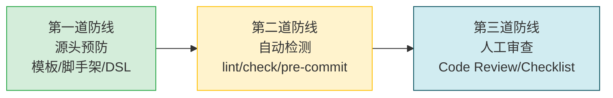

# 洞察萃取：治理失效的模式与规律

## 一、关键发现

### 发现 1：规范的"被动可用"≠"主动生效"

**事实**：Mermaid安全编码五规则在3天前已达到L4标准化级别，有完整的文档、速查表、检查脚本和模板，但在编写新Mermaid图时全部未被使用。

**规律**：规范的有效性 ≠ 规范的存在性。规范从"存在"到"生效"需要跨越三个鸿沟：
1. **知晓鸿沟**：开发者知道规范存在 → 本次知晓但未回忆起
2. **查阅鸿沟**：开发者在需要时主动查阅 → 本次未查阅
3. **执行鸿沟**：开发者按规范执行 → 本次未执行（甚至未运行检查脚本）

仅靠文档化无法跨越这三个鸿沟，每个鸿沟都需要专门的机制设计。

### 发现 2：创作模式与校验模式的认知切换成本

**事实**：编写Mermaid图时，注意力集中在内容表达（架构逻辑、流程正确性），而非语法细节。即使知道规范存在，也难以在创作过程中实时自检。

**规律**：人类工作记忆容量有限（Miller's Law: 7±2 chunks）。在"创作模式"下，认知资源被内容创作占据，留给"规范遵守"的资源极少。要求开发者在创作时同时自检所有规则，违反认知科学基本规律。

**推论**：语法/格式类规则必须由**自动化工具强制执行**，不能依赖人工记忆和自觉遵守。内容类规则（如架构设计合理性）才需要人工审查。

### 发现 3：局部修复陷阱——"用户报什么修什么"的恶性循环

**事实**：
- 用户报"list解析错误"→ 只修list触发问题，不运行全面检查
- 用户报"\n不渲染"→ 只修换行符，不运行全面检查
- 直到复盘时才运行检查，发现更多遗漏问题

**规律**：在bug修复场景中，存在"点修复偏误"（point-fix bias）：
1. 修复者倾向于只修复报告的表面症状
2. 不对同一代码块/文件做系统性扫描
3. 修复后不运行验证工具确认无其他问题
4. 导致同一文件中的其他同类问题被遗漏，触发下一轮用户反馈

**破解方法**：修复Mermaid类问题后，必须对**所有相关文件**运行 `check-mermaid.py`，而非只修报告的点。

### 发现 4：工具覆盖度的"长尾盲区"

**事实**：check-mermaid.py 覆盖了空行、引号、列表触发，但未覆盖 `\n` 换行符问题。这个遗漏导致即使运行了检查脚本，`\n` 问题也无法被自动发现。

**规律**：检查工具的规则覆盖度遵循"发现一个补一个"的长尾模式。每次用户报告新的渲染bug，都是在为工具补全规则。要加速这个过程：
1. 每次修复Mermaid bug后，将对应的检测规则添加到check-mermaid.py
2. 不能只修代码不修工具——否则同样的bug会在下次回归

### 发现 5：治理成熟度的"L2→L3断层"

**事实**：项目有规范(L1)、有工具(L2)，但没有强制执行(L3)。

**规律**：这是一个普遍的治理断层——建设规范和工具相对容易，将工具集成到工作流使其"不可绕过"需要额外的工程投入和文化建设。L2→L3的跳跃需要：
1. **技术手段**：pre-commit hook、CI gate、编辑器实时检查
2. **流程手段**：Code Review checklist、提交模板强制检查项
3. **体验手段**：让遵守规范比违反规范更省力（如模板脚手架、--fix自动修复）

## 二、可复用模式萃取

### 模式 A：治理成熟度四级跃迁模型

从本次事件中萃取出一个通用的治理成熟度模型，适用于任何编码规范类问题（不仅是Mermaid）：

| 等级 | 名称 | 核心问题 | 关键机制 |
|------|------|---------|---------|
| L0 | 无意识 | "我们遇到了重复出现的问题" | 问题识别 |
| L1 | 有规范 | "规范写在哪里？" | 文档化（rules/patterns） |
| L2 | 有工具 | "怎么自动检查？" | 自动化（lint/check脚本） |
| L3 | 有执行 | "我可以不遵守吗？" | 强制化（pre-commit/CI gate） |
| L4 | 有预防 | "想犯错都难" | 源头化（模板/脚手架/DSL） |

**关键洞察**：L1→L2是工具建设，L2→L3是工作流集成，L3→L4是开发体验优化。每个阶段的投入性质不同。

### 模式 B：规范遵守的"三道防线"

确保规范被执行需要三道防线，缺一不可：

- **第一道防线**（最强）：从源头避免错误产生，如使用安全模板
- **第二道防线**（最经济）：自动检测并修复，成本远低于人工审查
- **第三道防线**（兜底）：人工判断内容质量和逻辑正确性

本次失败的原因是：第二道防线（check-mermaid.py）存在但未被激活，第一道防线（模板）存在但未被使用，直接跳到了第三道防线（用户反馈=人工审查）。

### 模式 C：点修复偏误（Point-Fix Bias）

**定义**：在bug修复中，倾向于只修复用户报告的具体症状，而不对同类问题进行系统性扫描和修复。

**触发条件**：
- 修复者处于"快速响应"心态
- 修复操作简单（如字符替换），容易产生"修完了"的错觉
- 缺乏"修复→验证"的标准流程强制

**规避策略**：
1. **修复规则**：修复Mermaid/格式类bug后，必须对整个文件（或整个目录）运行检查脚本
2. **工具要求**：检查脚本必须支持 `--fix` 自动修复，降低全面修复的成本
3. **提交前验证**：提交前运行相关检查，确保无遗漏

## 三、模式成熟度评估

| 模式 | 成熟度 | 理由 |
|------|-------|------|
| 治理成熟度四级跃迁模型 | L1（观察） | 本次首次系统阐述，需更多案例验证 |
| 规范遵守三道防线 | L1（观察） | 与经典质量管控理论一致，但项目中首次具体化 |
| 点修复偏误 | L2（复用） | 已在link-fix-depth-adjustment复盘中观察到类似模式 |

## 四、与既有模式的关系

- [mermaid-safe-coding-rules.md](../../../../patterns/code-patterns/mermaid-safe-coding-rules.md)：本次发现其L4"标准化"评估过早——规范本身完整，但执行机制缺失，实际上是L2。
- [mermaid-trap-cheatsheet.md](../../../../patterns/code-patterns/mermaid-trap-cheatsheet.md)：需补充 `\n` vs ` ` 陷阱条目。
- 与[scripts-shared-lib-extraction复盘](../../tools-and-automation/retrospective-scripts-shared-lib-extraction-20260626/README.md)的关联：共享库建设（L2）和共享库强制使用（L3）是同一问题的两面。
