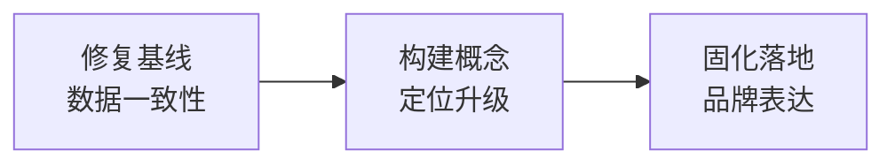

# 洞察与萃取

## 一、模式识别

### 模式 1：三阶段递进式文档改造



**模式特征**：
- 第一阶段解决"文档债"（滞后数据修正）
- 第二阶段解决"定位债"（缺乏品牌关键词）
- 第三阶段解决"落地债"（概念进入文档）

**适用场景**：对已有文档进行品牌化/定位升级时，应先修基、再建新、后落地。

### 模式 2：品牌命名选型框架

本次选型建立了可复用的品牌命名评估四维度：

| 维度 | 评估问题 | SpecWeave 得分 |
|------|---------|---------------|
| 语义覆盖 | 是否命中项目的核心维度？ | 高（规范+编织，两维度） |
| 品牌辨识度 | 是否独特、易记、可搜索？ | 高（无重名项目） |
| 隐喻延展性 | 是否可衍生品牌叙事？ | 高（编织→经纬、针法、图样） |
| 中英兼容性 | 是否在两种语境下自然？ | 高（规范之网/织范） |

### 模式 3：文档派生→权威源的双向同步策略

```
权威源（AGENTS.md）  ──单向同步──▶  派生文档（README.md）
     ▲                                    │
     │         ┌─────────────────────┐     │
     └─────────│ 发现不一致 → 对齐权威源 │◀────┘
               └─────────────────────┘
```

**核心原则**：
- 存在权威源时，派生文档必须对齐权威源
- 不存在权威源时，在 AGENTS.md 中先定义再同步
- Markdown 表格修改遵循"整表替换优先"原则

## 二、方法论萃取

### 方法论 M1：文档一致性同步方法

**适用场景**：项目中存在主从关系的文档对（如 AGENTS.md ↔ README.md），需要保持数据一致。

**操作步骤**：

1. **确定权威源**：明确哪个文档是数据的权威定义方
2. **全量对比**：用 Grep 提取关键数字和列表进行结构化对比
3. **差异分类**：区分"权威源已更新但派生文档滞后"和"双方均需新增"
4. **单向修正**：仅修改派生文档，不反向修改权威源
5. **表格整表替换**：涉及行数/列数变化时替换整表，纯文本修改可局部替换
6. **多处同步**：同一数据在派生文档中可能出现在多处，须全部修正

**本次实践验证**：6 处不一致（角色 5→7 × 3 + 协议 4→5 × 3），全部修正且无遗漏。

### 方法论 M2：品牌复合词造词方法

**适用场景**：为技术项目创建具有品牌辨识度的命名。

**操作步骤**：

1. **核心维度提取**：从项目本质中提取 2-3 个核心关键词
2. **词根配对**：将关键词翻译为英文词根，尝试两两组合
3. **四维评估**：对每个候选词评估语义覆盖、辨识度、延展性、兼容性
4. **排他性验证**：Google/GitHub 搜索确认无同名项目
5. **中文回译**：确保中文译法自然且有传播力

**项目维度 → 词根映射**：

| 项目维度 | 英文词根 | 候选组合 |
|---------|---------|---------|
| 规范体系 | Spec | SpecWeave、AgentSpec |
| 智能体 | Agent | AgentPact、AgentCraft |
| 契约治理 | Pact | AgentPact、PactForge |
| 体系编织 | Weave | SpecWeave、AgentWeave |
| 工艺方法 | Craft | AgentCraft、SpecCraft |
| 锻造创建 | Forge | ProtoForge、SpecForge |

### 方法论 M3：三层品牌表达架构

**适用场景**：为文档设计品牌信息层级。

```
第一层：品牌名 + 品类描述    （标题行，1 秒识别）
第二层：Slogan + 隐喻阐释    （标识行，3 秒理解）
第三层：详细说明              （引言行，30 秒认知）
```

**设计原则**：
- 每一层可独立传达信息，不依赖其他层
- 逐层递进，从具体到抽象再到具体
- 标题和标识行使用统一的品牌名，形成视觉锚点

## 三、可复用资产

### 资产 1：品牌词选型对比表模板

```markdown
| 候选词 | 构成 | 语义 | 品牌感 | 记忆度 | 排他性 |
|--------|------|------|--------|--------|--------|
| **候选A** | X + Y | 释义 | 高/中/低 | 高/中/低 | ✅/⚠️/❌ |
| **候选B** | ... | ... | ... | ... | ... |
```

### 资产 2：文档同步检查清单

```
□ 确定权威源
□ 提取权威源的关键数据（数字、列表、枚举）
□ 在派生文档中搜索所有引用位置
□ 标记不一致项
□ 整表替换（结构变化）/ 局部替换（文本变化）
□ 验证所有引用位置均已修正
□ 确认无遗漏
```

### 资产 3：品牌命名四维评估矩阵

| 维度 | 权重 | 评估方法 |
|------|------|---------|
| 语义覆盖 | 30% | 是否命中项目核心维度 |
| 品牌辨识度 | 25% | 是否独特、易记、可搜索 |
| 隐喻延展性 | 25% | 是否可衍生品牌叙事 |
| 中英兼容性 | 20% | 是否两种语境自然 |
