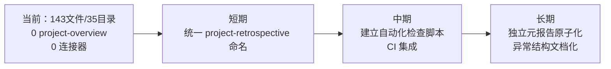

# 四~五、导出建议

## 4.1 改进建议

| # | 优先级 | 建议 | 依据 |
|---|--------|------|------|
| A1 | 🟡 中 | 统一 `project-retrospective.md` 命名为 `project-overview.md`（仅 1 处） | 洞察四：命名不一致导致批量操作漏检风险 |
| A2 | 🟡 中 | 建立原子化目录结构自动化检查脚本：验证 (1) 每目录 4 文件、(2) 0 project-overview.md 残留、(3) README source 指向正确 | 当前无自动化验证手段 |
| A3 | 🟢 低 | 为 `reports-duplication-optimization-report.md`（独立元报告）建立自己的原子化目录 | 它关于报告体系的分析本身就值得原子化保存 |
| A4 | 🟢 低 | 将 project-governance 的两种"标准化例外"写入 reports/README.md 的结构说明 | 供未来贡献者理解非标准结构的合理性 |

## 4.2 reports/ 体系当前全貌（终结状态）

```
reports/
├── README.md                              ← 分类索引（35 条目，5 张表，完整清单）
├── atomization/           (10目录×4=40)   ← ✅ 完全标准化
├── insight-extraction/    ( 8目录×4=32)   ← ✅ 完全标准化
├── spec-system/           ( 7目录×4=28)   ← ✅ 完全标准化
├── roles-teams/           ( 3目录×4=12)   ← ✅ 完全标准化
└── project-governance/    ( 7目录，31文件) ← ⚠️ 含 2 例外
    ├── retrospective-comprehensive-20260623/  (6 模块，含 project-retrospective 合并)
    ├── reports-duplication-optimization-report.md  (独立元报告)
    └── 其余 6 目录 × 4 = 24                           (完全标准化)
```

## 4.3 后续方向



## 4.4 修复 `project-retrospective.md` 命名的操作清单

若执行 A1 建议：

1. 重命名 `retrospective-comprehensive-20260623/project-retrospective.md` → `project-overview.md`
2. 更新该目录 README.md 的导航表中对应文件名
3. 更新该目录 README.md 中 `## 项目概览` → `## 项目复盘回顾` 的反向映射（当前章节名是合并 project-retrospective 时生成的）

> 注意：该目录目前的 README 中从 project-retrospective 合并的内容被放在 `## 项目复盘回顾` 下，而非 `## 项目概览`，因为其内容远超"概览"范围。重命名后该章节标题可保持或调整。
