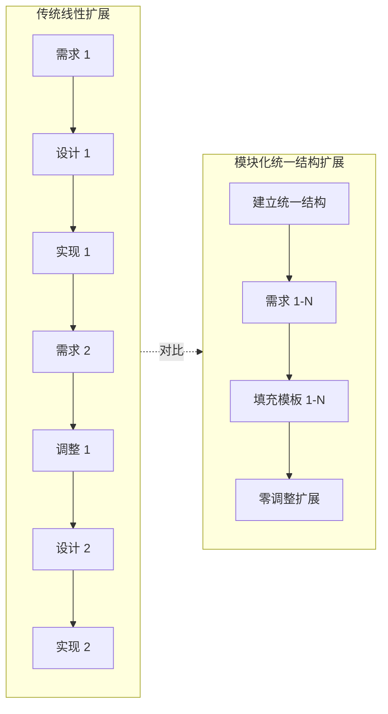
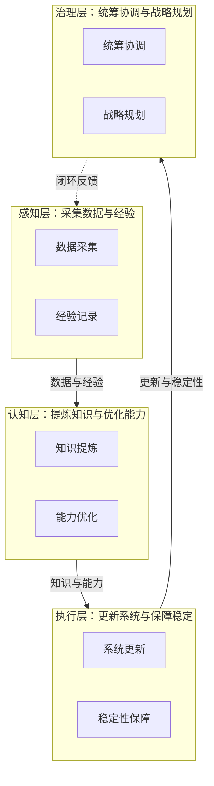

# 三、洞察环节

## 3.1 关键发现

#### 发现 1：增量式需求是常态而非异常

**支撑事实**：用户在看到 4 模块后自然联想到补充 4 模块，形成完整的自我治理体系。这一现象在文档优化、架构设计等任务中反复出现——用户需要看到部分成果才能明确完整需求。

**深层含义**：系统设计应预设可扩展性。模块化设计与统一结构使增量扩展零成本，这正是应对增量式需求的核心策略。将增量式需求视为常态，而非异常，能够改变任务规划的方式。

#### 发现 2：统一结构是可扩展性的基石

**支撑事实**：五要素统一结构使 4 → 8 扩展零返工。已有 4 模块保持原样，新增 4 模块仅需填充模板。对比缺乏统一结构的场景（每次扩展需调整已有内容），统一结构将扩展成本从 O(n) 降至 O(1)。

**深层含义**：结构一致性比内容完整性更重要。在设计阶段投入精力建立统一结构，能够为后续扩展节省指数级的调整成本。这是"约定优于配置"原则在文档设计中的体现。

#### 发现 3：四层闭环架构具有普适性

**支撑事实**：感知 → 认知 → 执行 → 治理的四层分类成功组织了 8 个模块，且各层间存在天然的"采集 → 分析 → 执行 → 统筹"数据流关系。这一架构不仅适用于自我治理系统，也可迁移至任何闭环优化体系。

**深层含义**：这是一个可迁移的架构模式。任何需要"感知环境 → 理解分析 → 执行行动 → 治理统筹"的系统都可以采用四层闭环架构，如 DevOps 流水线、质量保障体系、知识管理系统等。

#### 发现 4："自我X"命名模式具有认知一致性

**支撑事实**：八个模块统一以"自我"前缀命名（自我迭代、自我进化、自我验证、自我洞察、自我复盘、自我萃取、自我管理、自我发展），降低了理解成本。读者看到"自我X"即可立即理解这是系统自我治理能力的一部分。

**深层含义**：命名一致性是认知效率的杠杆。统一的命名模式不仅降低了单个模块的理解成本，更通过模式识别加速了整体架构的理解。这是"命名即文档"原则的体现。

## 3.2 规律认知

**模块化设计的可扩展性曲线**：传统线性扩展中，每次新增需求都需要调整已有内容，扩展成本随模块数线性增长（O(n)）。模块化统一结构扩展中，前期投入建立统一结构后，后续新增模块仅需填充模板，扩展成本接近常数（O(1)）。当模块数超过临界点（通常为 3-4 个）时，模块化设计的总成本显著低于线性扩展。

## 3.3 潜在机会

- **五要素结构可萃取为功能模块设计标准模板**：技术架构 + 关键实现步骤 + 资源需求 + 时间节点 + 预期成果指标的结构可直接复用于任何功能模块规划任务
- **四层闭环架构可萃取为自我治理系统设计模式**：感知 → 认知 → 执行 → 治理的分层适用于任何闭环优化体系
- **八模块可形成完整的"自我治理能力矩阵"**：8 模块 × 5 要素 = 40 个能力点，可构建能力评估矩阵
- **"自我X"命名模式可推广至其他系统设计**：统一的"自我"前缀命名可应用于任何需要表达系统自我能力的场景

## 3.4 知识萃取

### 模式 1：功能模块设计五要素标准结构

- **模式名称**：功能模块设计五要素标准结构
- **结构**：

| 要素 | 呈现形式 | 作用 |
|------|---------|------|
| 技术架构 | 文字描述 + Mermaid 图（可选） | 阐明模块的技术组成与数据流 |
| 关键实现步骤 | 表格（步骤 + 说明） | 列出实现路径的关键节点 |
| 资源需求 | 人员配置 + 时长 | 明确实施所需的人力与时间投入 |
| 时间节点 | 里程碑编号（如 M1-M2） | 标识实施的相对时间顺序 |
| 预期成果指标 | 表格（指标 + 目标） | 量化模块的预期成效 |

- **适用场景**：任何需要详细设计的功能模块规划，包括但不限于系统功能设计、技术方案规划、项目模块设计
- **复用方式**：填充各要素内容即可，无需重新设计结构
- **来源**：本次系统规划八模块设计（README 系统规划章节）
- **关联模块**：`docs/retrospective/templates/retrospective-report-template.md`（结构一致性参考）

### 模式 2：四层闭环架构

- **模式名称**：四层闭环架构（感知 → 认知 → 执行 → 治理）
- **结构**：

- **适用场景**：自我治理系统、闭环优化体系、多模块协同设计、DevOps 流水线、质量保障体系、知识管理系统
- **复用方式**：将功能模块按四层归类，建立"感知 → 认知 → 执行 → 治理 → 闭环反馈至感知"的数据流闭环
- **来源**：本次系统规划八模块组织（README 系统规划章节整体架构）
- **关联模块**：`docs/retrospective/patterns/architecture-patterns/perception-check-report-model.md`（三层模型的扩展）

---