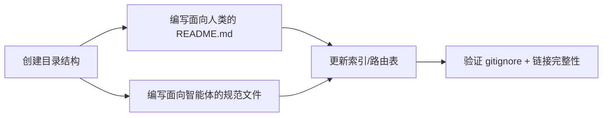
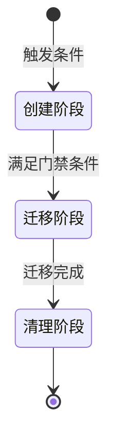

# 三、洞察环节

## 3.1 关键发现

#### 发现 1："暂存→正式"双区开发模式具有通用性

本项目引入的 `.temp/` → `apps/` 迁移规则并非孤立设计——它与 `dependency-management.md` 中 `.temp/` 作为中间产物暂存区的定位一脉相承。将这种模式抽象化后，可得到一种通用的"双区开发模型"：**非正式工作区（高熵、允许快速迭代）+ 正式工作区（低熵、受规范严格约束）**。这种模式不仅适用于应用开发，也可推广到文档编写、配置管理等领域。

#### 发现 2：新协议与既有协议的"继承+专项化"关系模式

`app-development-workflow.md` 并非独立存在，它通过显式引用 `dependency-management.md` 建立了"通用章程 → 专项规则"的继承关系。这种模式的价值在于：(1) 避免规则重复定义；(2) 当通用章程变更时，专项规则自动感知（通过引用链）；(3) 降低认知负担——智能体只需在特定场景下加载专项规则，通用场景下仍使用通用章程。

#### 发现 3：路由表采用"追加式"更新无破坏性

`AGENTS.md` 的上下文路由表和协作协议概要均采用**在末尾追加新行**的更新方式，而非插入或重排序。这种方式最大程度降低了修改 `AGENTS.md` 的风险——无需重新计算行号偏移，不破坏已有条目的引用完整性。

## 3.2 规律认知

#### 方法论 1：目录创建的"三件套"模式

当项目中新增一个顶级目录时，可遵循"三件套"模式：
1. **物理创建**：目录 + 必要的子目录 + .gitkeep
2. **双层文档**：面向人类的 README.md + 面向智能体的 .agents/ 规范
3. **索引同步**：更新 project-structure.md + AGENTS.md 路由表

此模式在此次任务中验证有效，已在 `teams/` 模块创建中也有类似体现。

#### 方法论 2：生命周期协议的"三阶段"标准结构

`app-development-workflow.md` 的生命周期定义可抽象为通用模板：

其中每个阶段包含：
- **进入条件**（明确的准入标准）
- **执行规范**（目录结构、操作步骤、参与角色）
- **退出标准**（验证方式、负责角色）
- 阶段之间通过**门禁条件**（必须全部满足的检查项）连接

此结构可复用于任何需要阶段性生命周期管理的场景（如文档审批流程、代码审查流程、部署流水线）。

## 3.3 潜在机会

| 机会 | 描述 | 可行性 |
|---|---|---|
| 双区开发模式推广 | 将 `.temp/` → `正式区` 模式推广到文档编写、配置管理等领域，形成项目级的"非正式→正式"工作流框架 | 高——既有 .temp/ 已用于多种场景 |
| 生命周期协议模板化 | 提炼 `app-development-workflow.md` 的"三阶段+门禁"结构为通用模板，供后续新协议快速复用 | 高——结构清晰，适合模板化 |
| 路由表追加式更新规范化 | 将"AGENTS.md 路由表更新一律在末尾追加"固化为开发规范，降低索引文件修改风险 | 中——需要更多案例验证 |

---