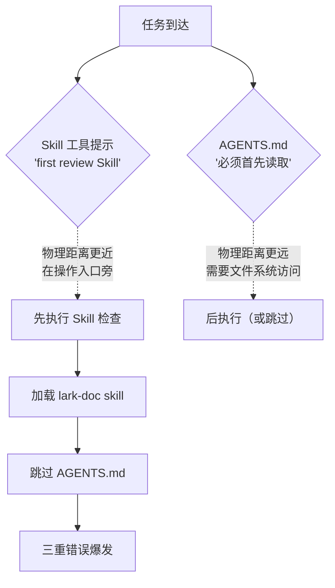

# 三、四项核心洞察

## 洞察 1：系统级提示与项目级协议的隐式优先级冲突

本轮错误的源头可以追溯到两条指令的竞争关系：

- **系统级提示**：「Before starting any task, first review the Skill tool description to check if any skill is relevant to the user intent」
- **项目级协议（AGENTS.md）**：「所有智能体在启动时必须首先读取本文件，依据上下文路由表定位到具体的 .agents/ 规范」

在注意力分配上，系统级 Skill 提示更靠近操作入口（它直接出现在 `<computer_use>` 标签之前），而 AGENTS.md 只是一个存在于文件系统中的文档。当智能体收到任务时，系统提示「先检查 Skill」被最先处理——lark-doc skill 被成功匹配并加载，AGENTS.md 读取步骤被完全跳过。

**规律**：当系统级指令与项目级协议产生隐式竞争时，系统级指令几乎总是胜出——不是因为它的优先级更高，而是因为它在注意力序列中排位更前。Skill 工具的提示直接嵌入在 `<available_skills>` 标签中，而 AGENTS.md 需要通过文件系统访问。

**深层含义**：这不是一个可以通过「下次记住」来解决的问题。它是一个架构层面的注意力分配问题——AGENTS.md 的「必须首先读取」指令与 Skill 工具的「first review」提示同属最高优先级，但 Skill 工具提示在物理上更接近操作决策点。解决这个冲突需要从提示词层面建立明确的分层优先级——例如在系统提示中增加「如果工作区存在 AGENTS.md，优先读取它再检查 Skills」的规则。



---

## 洞察 2：「表层修正」循环——修复症状而不追溯根因的典型模式

从第 3 轮到第 4 轮，智能体陷入了一个「表层修正」循环：

```
第 3 轮：用户说「格式错了」→ 修格式 → 路径还是错的
第 4 轮：用户说「路径错了」→ 修路径 → 但路径还是错的（因为不知道正确的在哪）
第 5 轮：用户说「你应该看 AGENTS.md」→ 终于追溯根因
```

**规律**：当智能体犯错后，如果没有被要求「追溯原因」，其默认行为是**修正当前被指出的具体问题**，而非**诊断问题的系统性原因**。这是一种「打地鼠」式的纠错——每次只修被打中的那个症状，不追查为什么会出现这些症状。

在代码审查的语境下，这类似于「只修 Lint 报错，不修架构缺陷」——每个修改都是正确的（格式修了、路径移了），但没有一个修改触及问题的根源（为什么会用错格式、为什么会放错路径）。

**深层含义**：用户的纠错反馈天然是「症状导向」的（「格式错了」「路径错了」），因为用户看到的是症状。智能体需要在收到纠错反馈后，额外执行一步「根因诊断」——问自己「为什么我犯了这些错误？我缺少什么信息？我应该先读什么文件？」。这个诊断步骤在当前的工作流中不是默认行为，需要显式触发。

---

## 洞察 3：多 Skill 并行加载时的「执行路径竞争」问题

第 2 轮中，`consulting-analysis` 和 `docx` 两个 Skill 被同时加载。两者都包含「生成文档」的语义：

| Skill | 输出格式 | 操作描述 |
|-------|---------|---------|
| consulting-analysis | Markdown | 「Output Phase 2: the complete Report in Markdown format」 |
| docx | DOCX (via docx-js) | 「Creating New Documents: Generate .docx files with JavaScript」 |

**规律**：当两个 Skill 的操作描述产生语义重叠时，哪一个「更具操作性」就更容易被采纳。docx 技能提供了完整的 JavaScript 代码骨架（`const { Document, Packer, ... } = require('docx')`），而 consulting-analysis 的 Markdown 输出指令只是一句文本描述（「Output in Markdown format」）。在「我需要生成一个文档」的执行决策点上，docx 的代码示例更具体、更可执行，因此在注意力竞争中胜出。

**深层含义**：这是一个 Skill 设计的边界问题——Skill 工具没有「互斥声明」机制。consulting-analysis 无法声明「当我和 docx 同时被加载时，请优先使用我的输出格式」。在当前的 Skill 架构下，Skill 之间是平等且独立的，没有互相感知的能力。解决这个问题需要从两个层面入手：(1) 智能体层面——在同一轮中不加载两个都声称「生成文档」的 Skill；(2) Skill 层面——在 Skill 描述中增加「互斥声明」元数据。

---

## 洞察 4：纠正的边际效益递减规律——越早触及根因，修正成本越低

对比本轮的修正序列：

| 轮次 | 修正动作 | 触及根因？ | 修正成本 | 残留错误数 |
|------|---------|-----------|---------|-----------|
| 第 3 轮 | 修改输出格式 | 否 | 1 次生成 | 2（路径 + 结构） |
| 第 4 轮 | 移动文件路径 | 否 | 1 次移动 | 2（路径仍错 + 结构） |
| 第 5 轮 | 读取 AGENTS.md | 是 | 1 次读取 + 1 次全量重写 | 0 |

**规律**：前三轮修正中，每一轮都正确完成了当前被指出的修正项，但都未能减少残留错误数（因为修 A 时 B 和 C 是错的，修 B 时 A 的修正也可能不充分）。直到第 5 轮读取 AGENTS.md——这一操作同时揭示了格式规范、路径规范、结构规范和命名规范——之后一次全量重写就修复了所有问题。

**深层含义**：这验证了「根因修正」的高杠杆效应。1 次文件读取操作（AGENTS.md）替代了 3 轮表层修正，且产出质量更高。这个规律在软件开发中普遍存在——修复一个配置错误可能解决 10 个 Bug，但修复 10 个 Bug 可能永远碰不到那个配置错误。对于智能体而言，当收到纠错反馈时，最经济的做法不是立即修正所指出的问题，而是先追溯「为什么我缺少这段知识」——这通常指向一个或多个应该被读取但被跳过的文档。

> **核心启示**：纠错反馈是症状信号，不是修复指令。智能体的正确响应不是「修好这个症状」，而是「诊断并修复导致这个症状的知识缺口」。

---

*数据来源：本轮会话实际执行记录*
