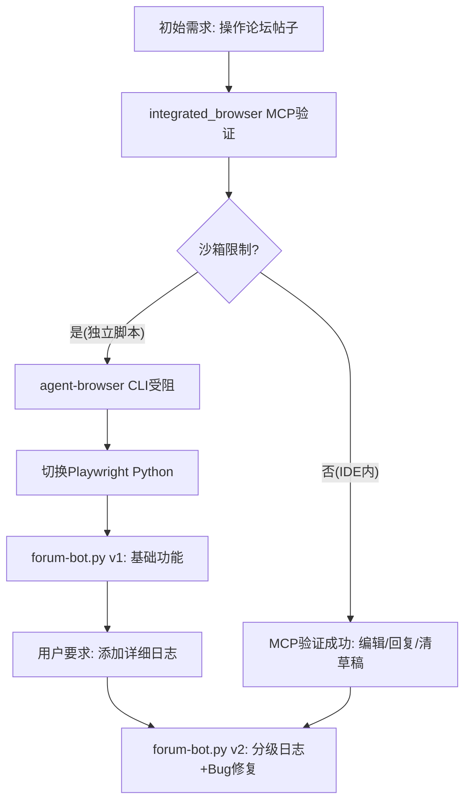

# forum-bot.py 浏览器自动化工具开发与日志增强复盘

> **复盘范围**：跨会话多轮任务（论坛帖子管理 → 自动化方案探索 → Playwright脚本封装 → 日志系统增强）
> **复盘日期**：2026-06-29
> **执行模式**：单智能体多轮会话，用户主动引导 + AI迭代修正
> **报告类型**：工具开发与日志治理复盘（已原子化）

## 项目概览

本次任务横跨多个技术方案探索和迭代，最终产出一个基于Playwright的Discourse论坛自动化脚本 [forum-bot.py](../../../../../../scripts/forum-bot.py)，并在用户要求下为核心分支添加了详细的分级日志系统。整个过程经历了**方案选型→MCP验证→脚本封装→日志增强→Bug修复**五个阶段，期间遇到了沙箱限制、选择器失效、JS语法错误、导航丢失、监听器漏注册等多个典型问题。

### 核心发现

**浏览器自动化脚本的"可观测性缺口"是比功能实现更优先的架构问题。** 在没有日志的情况下，自动化脚本失败时只能看到最终异常，无法定位是哪个元素选择器失败、哪次重试成功、页面状态是否符合预期。分级日志系统（控制台简洁INFO + 文件DEBUG全量）是调试自动化脚本的刚需。

### 技术方案演进路径

### 关键数据

| 指标 | 数值 |
|------|------|
| 跨会话技术方案 | 4种（MCP/agent-browser/REST API/Playwright） |
| 最终脚本文件 | ~580行 Python |
| 日志覆盖核心分支 | 7个（导航/登录/定位/点击/填写/提交/验证） |
| 修复的Bug数 | 4个（导航丢失/监听器漏注册/JS正则警告/静态资源刷屏） |
| 日志输出通道 | 2个（控制台 + 文件） |
| 重试覆盖操作 | 3个（导航/点击/提交） |

## 子模块导航

| 章节 | 文件 | 说明 |
|------|------|------|
| 执行复盘 | [execution-retrospective.md](execution-retrospective.md) | 时间线、关键决策、问题与根因分析 |
| 洞察萃取 | [insight-extraction.md](insight-extraction.md) | 浏览器自动化五大洞察、可观测性设计原则 |
| 导出建议 | [export-suggestions.md](export-suggestions.md) | 改进建议、行动计划、模式萃取建议 |
| 行动项Backlog | [insight-action-backlog.md](insight-action-backlog.md) | 洞察行动项Backlog（v1.2新增）：已完成项追踪 + 待执行行动计划 |
