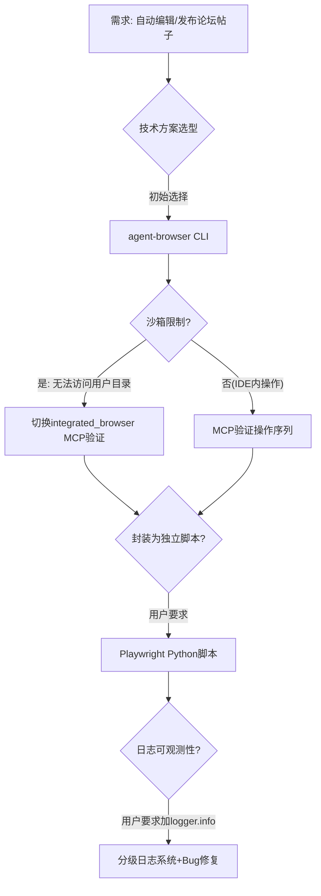

# 执行复盘 — forum-bot.py 浏览器自动化工具开发

## 一、实施过程回顾

### 1.1 时间线

| 阶段 | 时间 | 事件 | 结果 |
|------|------|------|------|
| 需求确认 | Day1 | 用户确认三个论坛帖子审核状态、修复标题残留 | ✅ 完成 |
| 方案探索 | Day1 | 执行`/spec`探索论坛自动发布功能 | ✅ 四方案对比完成 |
| 方案调整 | Day1 | 用户反馈"Use Skill: agent-browser"纳入方案 | ✅ PRD更新 |
| MCP验证 | Day1 | 使用integrated_browser MCP验证编辑/回复/清草稿 | ✅ 全部验证成功 |
| CLI受阻 | Day1 | agent-browser因沙箱限制无法访问用户目录 | ❌ 转向备选 |
| 脚本封装 | Day2 | 基于Playwright封装独立Python脚本forum-bot.py | ✅ v1完成 |
| 日志增强 | Day2 | 用户要求"核心分支加详细logger.info" | ✅ v2完成+Bug修复 |

### 1.2 关键决策节点

**决策1：从agent-browser CLI转向Playwright**
- 决策依据：agent-browser在沙箱中无法访问`--profile Default`复用Chrome登录状态，且需要额外安装
- 替代方案：Playwright是Python生态最成熟的浏览器自动化库，API稳定、文档完善
- 后续验证：Playwright的`storage_state`机制完美解决登录状态持久化

**决策2：日志采用控制台INFO+文件DEBUG双轨制**
- 决策依据：控制台需要简洁（避免刷屏），文件需要完整（事后排查）
- 设计原则：logger始终DEBUG级→handler按级别过滤，而非logger过滤handler
- Bug发现：初始实现把logger级别设为INFO，导致DEBUG消息无法到达FileHandler

### 1.3 遇到的问题与根因分析

#### Bug #1: check_login导致页面导航丢失

| 项目 | 详情 |
|------|------|
| 现象 | `do_read`执行`check_login`后，后续获取到的是论坛首页内容而非目标帖子 |
| 根因 | `_get_current_username`无条件导航到`FORUM_URL`首页检测登录状态，改变了当前页面URL |
| 修复 | 双层防护：(1) 优先在当前页面检测（不导航），(2) `check_login`保存URL并在检测导致跳转时恢复 |
| 教训 | **任何"检查类"函数不应改变系统状态**（导航、修改DOM等），检查应是纯读操作 |

#### Bug #2: 网络事件监听器在复用状态分支漏注册

| 项目 | 详情 |
|------|------|
| 现象 | 复用已保存登录状态时，网络请求日志完全缺失 |
| 根因 | `if STATE_FILE.exists()`分支有early return，`context.on(...)`监听器注册代码在if块之后，只覆盖了新上下文分支 |
| 修复 | 提取`_attach_network_logging()`函数，两个分支都调用 |
| 教训 | **early return是高风险模式**——在分支返回前必须确认所有公共初始化逻辑已执行 |

#### Bug #3: JS正则表达式SyntaxWarning

| 项目 | 详情 |
|------|------|
| 现象 | Python输出`SyntaxWarning: invalid escape sequence '\/'` |
| 根因 | JavaScript正则表达式`\/`在Python普通字符串中被解释为无效转义序列 |
| 修复 | Python字符串加`r`前缀（raw string） |
| 教训 | **嵌入JS正则的Python字符串必须用raw string**，这是一个常见陷阱 |

#### Bug #4: 网络日志过于冗长

| 项目 | 详情 |
|------|------|
| 现象 | debug模式下每个CSS/JS/PNG请求都打印，关键信息淹没在噪音中 |
| 根因 | 初始实现监听所有request/response事件，没有过滤 |
| 修复 | 添加`_should_log()`过滤器，跳过静态资源，只记录API请求和4xx/5xx错误响应 |
| 教训 | **日志必须设计信噪比**——全量日志等于没有日志 |

### 1.4 成功经验

1. **多信号组合检测**：登录状态检测使用4种信号源（Discourse.User全局对象、meta标签、头像链接、用户菜单），任一命中即可确认登录，鲁棒性强
2. **幂等性检查**：编辑操作前检查是否已有指定前缀，避免重复追加内容
3. **dry-run模式**：写操作支持试运行，不实际提交，降低调试风险
4. **失败自动截图**：异常时保存截图到config目录，方便事后分析
5. **渐进式验证**：先MCP验证操作序列→再封装脚本→再增强日志，每步验证后再推进
