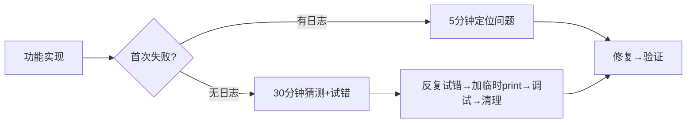
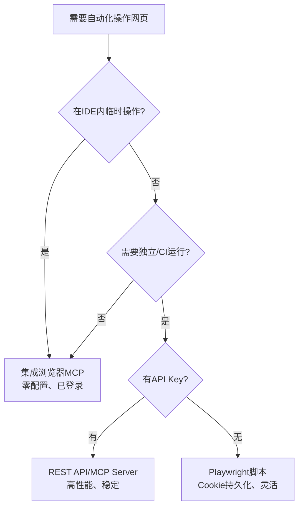

# 洞察萃取 — 浏览器自动化脚本的可观测性设计

## 洞察一：检查函数的"纯读"原则（Check-Purity Principle）

### 发现

在浏览器自动化脚本中，**状态检查函数（如check_login、check_exists）必须是纯读操作，绝不能改变当前页面状态**（导航、点击、修改DOM）。本次发现的`check_login`导航到首页导致后续操作目标页面丢失的bug，根因就是违反了这个原则。

### 深层含义

这个原则不仅适用于浏览器自动化，而是一个通用的软件工程原则：

- **查询与命令分离（CQS原则）**：返回数据的方法不应有副作用
- **浏览器自动化特殊性**：页面状态是全局共享的，一个函数的导航会影响后续所有操作
- **检测→恢复模式**：如果检测确实需要导航到特殊页面，必须在检测完成后恢复原状态

### 应用模式

```python
def check_something(page):
    saved_url = page.url          # 1. 保存当前状态
    result = detect(page)         # 2. 执行检测（可能导航）
    if page.url != saved_url:     # 3. 如有必要恢复
        page.goto(saved_url)
    return result
```

---

## 洞察二：自动化脚本的可观测性缺口优先于功能实现

### 发现

当用户要求"加详细logger.info"时，脚本的基础功能（read/edit/reply）已经实现，但在没有日志的情况下调试一个失败场景需要反复猜测：是选择器找不到？是页面没加载完？是权限问题？是重试成功了还是直接失败？**添加日志后，每个步骤的状态、选择器命中、重试次数、HTTP状态都清晰可见**，问题排查效率提升一个数量级。

### 深层含义



**可观测性不是锦上添花，而是自动化脚本的基础架构。** 就像编译型语言需要调试符号一样，自动化脚本需要分级日志才能维护。

### 日志分级设计最佳实践

| 级别 | 使用场景 | 控制台 | 文件 |
|------|---------|--------|------|
| ERROR | 操作失败、不可恢复错误 | ✅ | ✅ |
| WARNING | 重试触发、降级兜底、非预期状态 | ✅ | ✅ |
| INFO | 步骤开始/完成、关键数据、耗时 | ✅ | ✅ |
| DEBUG | 选择器命中、JS返回值、HTTP请求、重试细节 | 仅--debug | ✅ 始终 |

**关键设计决策**：Logger本身始终设为DEBUG级，由Handler控制输出粒度——而不是反过来。否则FileHandler永远收不到DEBUG消息。

---

## 洞察三：Early Return的监听器泄漏陷阱

### 发现

`launch_browser`函数中，"复用已保存状态"分支使用early return，导致网络事件监听器只在"创建新上下文"分支注册，复用状态时完全没有网络日志。

### 深层含义

当函数内存在条件分支+early return时，**分支公共初始化代码（监听器注册、资源配置、默认值设置）容易被遗漏**。这是一个经典的"代码复制粘贴→修改时漏改"问题。

### 防护模式

1. **提取公共初始化函数**：将跨分支共享的设置提取为独立函数（如`_attach_network_logging(context)`）
2. **Single Entry, Single Exit (SESE)**：对于有资源清理需求的函数，考虑统一出口
3. **分支对称检查**：写完if/else后自查——两个分支是否都执行了必要的公共初始化？

---

## 洞察四：静态资源日志过滤的信噪比原则

### 发现

初始版本的网络日志记录所有HTTP请求，包括.css/.js/.png/.woff等静态资源，导致一次read操作输出数十条无用日志，关键的API请求和错误响应被淹没。添加扩展名过滤后，日志量减少80%以上，信噪比显著提升。

### 深层含义

**全量日志等于没有日志。** 日志系统必须回答"这条日志是否帮助排查问题？"——如果不能，它就是噪音。浏览器自动化中，静态资源加载成功/失败对业务逻辑排查几乎没有价值，应默认过滤。

但有一个例外：**4xx/5xx响应无论什么资源类型都应记录**，因为它可能指示CDN故障、权限问题或资源缺失。

---

## 洞察五：多信号组合检测提升鲁棒性

### 发现

Discourse页面的登录状态检测采用4种信号源组合：
1. `window.Discourse.User.current()`全局对象
2. `<meta name="discourse-current-username">`标签
3. 头像链接`a[href^="/u/"]`
4. 用户菜单`.current-user .username`

加上反向信号"是否存在登录按钮"。这种多信号组合比单一检测源鲁棒得多。

### 深层含义

在浏览器自动化中，**任何单一DOM选择器都可能因页面改版、A/B测试、用户状态而失效**。多信号组合检测遵循：
- **或逻辑**：任一信号命中即可确认状态
- **优先级排序**：最可靠的信号优先（全局对象 > meta标签 > DOM元素）
- **反向信号**：不存在负面信号（如"登录按钮存在"）可辅助判断
- **原始数据可追溯**：DEBUG模式输出完整JSON结果，方便分析检测失败原因

---

## 洞察六：浏览器自动化技术选型的三级决策模型

### 发现

本次探索了4种浏览器自动化方案，最终形成"双轨+备选"的选型结论，提炼出一个三级决策模型：



| 场景 | 首选方案 | 理由 |
|------|---------|------|
| IDE内探索/调试 | integrated_browser MCP | 零配置、已登录、所见即所得 |
| 本地独立脚本 | Playwright Python | 生态成熟、Cookie持久化、CI友好 |
| 长期服务/集成 | REST API / @discourse/mcp | 高性能、稳定契约、官方维护 |
