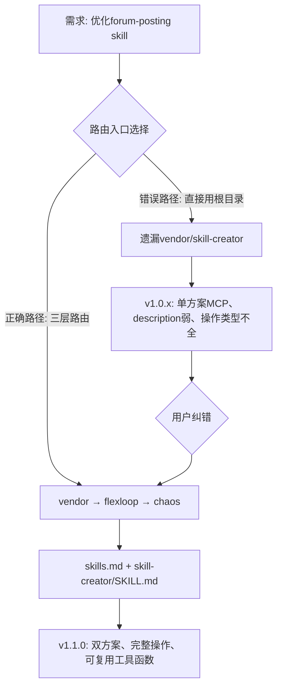

# 执行复盘 — forum-posting Skill 优化与三层路由合规

## 一、实施过程回顾

### 1.1 时间线

| 阶段 | 事件 | 结果 |
|------|------|------|
| 需求接收 | 用户请求：优化 `d:\spaces\SpecWeave\.agents\skills\forum-posting` | - |
| 初始优化（违规） | 直接读取根目录 skills 相关内容，做了基础优化 | ❌ 未遵循三层路由 |
| 用户纠错 | 用户指出："为何没有使用 vendor/flexloop/apps/chaos/.agents/skills/skill-creator？" | ⚠️ 触发协议纠偏 |
| 三层路由执行 | 按启动协议读取 vendor/AGENTS.md → flexloop/AGENTS.md → chaos/AGENTS.md | ✅ 路由合规 |
| 规范学习 | 读取 chaos/.agents/rules/skills.md + skill-creator/SKILL.md | ✅ 获取最佳实践 |
| v1.1.0 重构 | 按 skill-creator 原则（description优化/渐进式披露/双方案整合/解释Why）重写 | ✅ 版本升级完成 |
| 复盘+洞察+萃取+导出 | 用户请求完整复盘流程 | ⏳ 当前阶段 |

### 1.2 关键决策节点

**决策1（错误）：直接使用根目录规范**
- 问题表现：认为 `.agents/skills/forum-posting/` 就在 SpecWeave 根目录下，不需要进入 vendor 区域
- 根因：没有严格执行启动协议步骤2（按上下文路由表确定需要读取的规范文件），对"任务涉及 skill 创建/优化"场景没有联想到 vendor/flexloop 下有 skill-creator
- 后果：第一版优化只整合了已有的 forum-bot.py 知识库，没有应用 skill-creator 中关于 description 优化、触发词设计、长度控制、解释"Why"等方法论

**决策2（纠偏后）：按三层路由完整执行**
- 执行路径：vendor/AGENTS.md → vendor/flexloop/AGENTS.md → vendor/flexloop/apps/chaos/AGENTS.md → chaos/.agents/rules/skills.md → chaos/.agents/skills/skill-creator/SKILL.md
- 关键收获：skill-creator 明确指出了 Claude 在触发 skill 时倾向于"undertrigger"，description 必须包含触发关键词和"必须使用"等强制性措辞；建议控制在500行以内；解释"为什么"而非仅列MUST规则

### 1.3 遇到的问题与根因分析

#### 问题 #1：三层路由协议未主动执行（核心问题）

| 项目 | 详情 |
|------|------|
| 现象 | 优化 skill 时只看了根目录的现有 skill 文件和 AGENTS.md 路由表，没有意识到"优化 skill"这个任务本身应该路由到 vendor/flexloop 的 skill-creator |
| 根因1 | **"就近直觉"偏差**：工作目录在 `.agents/skills/`，直觉认为相关规范就在同一目录层级，没有主动检查 vendor 子模块 |
| 根因2 | **路由表语义匹配不足**：AGENTS.md 上下文路由表中 skill-creator 的入口是 `vendor/flexloop/apps/chaos/.agents/skills/skill-creator/SKILL.md`，但没有在"skill 创建/优化"场景直接标注"必须使用 skill-creator" |
| 根因3 | **启动协议执行不完整**：虽然读了 AGENTS.md，但在步骤2（确定需要读取的规范）时，没有按任务类型"skill 优化"去检索 vendor 区域是否有对应方法论 |
| 修复 | 用户显式纠错后，按三层路由协议完整读取 vendor 链路上的所有 AGENTS.md 和 skills.md/skill-creator |
| 教训 | **三层路由不是只在"工作目录在vendor/内"时才执行**——即使工作目录在根目录，如果任务类型涉及 vendor 内有更成熟资产的领域（如skill创建/优化），也需要主动路由到vendor获取方法论 |

#### 问题 #2：description 触发词不足导致 undertrigger 风险

| 项目 | 详情 |
|------|------|
| 现象 | 初始版本的 description 简短，触发词覆盖不全 |
| 根因 | 不了解 Claude 的 skill 触发机制倾向于"undertrigger"，需要在 description 中明确列出触发关键词和强制措辞 |
| 修复 | v1.1.0 的 description 包含完整触发词列表（发帖/编辑/回复/清理草稿/forum-bot等），明确声明"必须使用此技能"，同时说明双方案优势 |
| 教训 | **Skill description 是触发的唯一入口**，不是功能简介。它需要像广告文案一样"有说服力"，而不是像API文档一样简洁 |

#### 问题 #3：遗漏了已有的 forum-bot.py 脚本方案

| 项目 | 详情 |
|------|------|
| 现象 | 初始版本只支持 integrated_browser MCP 方案 |
| 根因 | 虽然 forum-bot.py 在 `.agents/scripts/` 中已存在，但初始优化时没有把它作为 skill 的可选方案整合进去 |
| 修复 | v1.1.0 增加双方案支持，提供方案选型决策树，写操作优先推荐 forum-bot.py 的 dry-run 机制 |
| 教训 | **优化现有 skill 时必须先做资产盘点**——检查项目中是否已有相关脚本/工具/文档可以整合，而不是只盯着已有 skill 文档的内容 |

### 1.4 成功经验

1. **用户纠错响应及时**：收到用户反馈后没有辩解，立即执行三层路由协议完整链路
2. **skill-creator 原则落地完整**：description优化、双方案整合、解释"Why"、长度控制（307行<500行）、渐进式披露（详细参数引用知识库）
3. **双方案决策树设计**：不是简单罗列两个方案，而是给出清晰的选型逻辑（IDE内→MCP，独立运行/CI/dry-run→脚本）
4. **可复用JS工具函数封装**：setTextareaContent/prependToPost/checkLoginStatus/getCurrentUsername 四个函数覆盖MCP操作的核心需求
5. **安全机制系统性设计**：dry-run预览、diff确认、幂等检查、检查清单十项确认，形成多层防护

## 二、执行结果数据

| 产出物 | 路径 | 说明 |
|--------|------|------|
| 优化后 SKILL.md | [.agents/skills/forum-posting/SKILL.md](../../../../../../skills/forum-posting/SKILL.md) | v1.1.0，307行 |
| 配套知识库（已有） | [docs/knowledge/operations/forum-automation.md](../../../../../../docs/knowledge/operations/forum-automation.md) | DOM选择器、故障排查 |
| forum-bot.py（已有） | [.agents/scripts/forum-bot.py](../../../../../../scripts/forum-bot.py) | Playwright脚本 |
