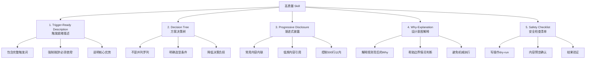

# 规律1：Skill开发的五要素模型

→ 正式模式：[skill-five-elements-model.md](../../../../../patterns/methodology-patterns/ai-collaboration/skill-five-elements-model.md)（已入库L1）

## 核心规律

从本次优化和 skill-creator 方法论中，可以提炼出高质量 Skill 的五个核心要素，每个要素解决一个特定问题，共同构成可预测、高质量的 Skill 开发标准：

## 前置步骤（优化现有Skill时）

在开始修改Skill文档之前，必须先做**资产盘点**，而不是只盯着现有SKILL.md文件改：
- 检查是否已有相关脚本/工具可以整合进Skill
- 检查是否已有可复用的共享库函数（如lib/下）
- 检查是否已有相关规则/规范文档需要引用
- 检查vendor/下是否有更权威的方法论资产需要遵循
- 检查是否已有类似Skill可以参考模式

## 验证工具

- **自动化检查**：运行 `.agents/scripts/check-skill-quality.py` 自动检测五要素完整性，输出0-100分质量评分
- **模板参考**：`.agents/skills/SKILL-TEMPLATE.md` 包含完整五要素框架，直接填空即可

## 关联洞察

- 所有finding-02~finding-05分别对应五要素的验证
- [template-variance-control.md](../../../../../patterns/methodology-patterns/ai-collaboration/template-variance-control.md) — 用模板固化五要素降低质量方差
- [spec-as-code-automated-gates.md](../../../../../patterns/methodology-patterns/tools-automation/spec-as-code-automated-gates.md) — 用检查脚本自动化门禁

---
*来源：[forum-posting Skill优化复盘](../README.md)*
