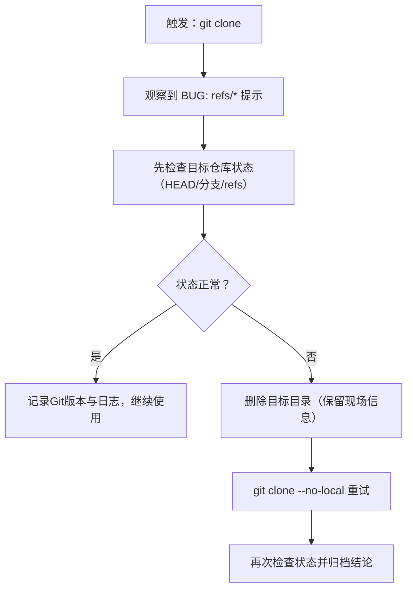

# Windows 本地路径 Git 克隆异常排查复盘（BUG: refs/files-backend.c:3174）

> **复盘范围**：单次故障排查任务（Windows 环境，本地路径 `git clone`）
> **复盘日期**：2026-07-01
> **执行模式**：短时分析型任务（证据有限 → 保守判断 → 输出可执行SOP）
> **报告类型**：工具链故障处置复盘（已原子化）

## 项目概览

用户在 Windows 工作区执行本地路径克隆：

```powershell
git clone D:\AI
```

终端输出在 `done.` 之后出现：

```text
BUG: refs/files-backend.c:3174: initial ref transaction called with existing refs
```

该信息指向 Git 内部实现（refs 写入事务），属于工具链内部异常信号，而非仓库业务逻辑错误。由于异常出现在克隆收尾阶段，本次处置的核心策略是：**先检查目标仓库引用状态 → 再决定是否重克隆 → 重试优先禁用本地优化路径（`--no-local`）**。

### 核心发现

**“done.” 只意味着对象与工作区内容大概率复制完成，不代表 refs 写入成功；看到 `BUG:` 必须把问题提升到工具链异常级别，并优先采取最小破坏策略（先检查再清理）。**

### 处置路径（建议SOP）



### 关键数据

| 指标 | 数值 |
|------|------|
| 异常信号 | `BUG: refs/files-backend.c:3174` |
| 触发方式 | Windows + 本地路径克隆（可能走本地优化路径） |
| 主要风险 | 目标仓库 `refs/HEAD/branch` 半完成或冲突 |
| 规避策略 | `--no-local` 关闭本地优化路径，提升稳定性 |
| 缺失证据 | 未采集 `git --version`、`git fsck`、目标仓库自检输出 |

## 子模块导航

| 章节 | 文件 | 说明 |
|------|------|------|
| 执行复盘 | [execution-retrospective.md](execution-retrospective.md) | 时间线、关键决策、风险判断与问题分层 |
| 洞察萃取 | [insight-extraction.md](insight-extraction.md) | 可复用的"工具链 BUG 信号"处置洞察与最小闭环策略 |
| 导出建议 | [export-suggestions.md](export-suggestions.md) | 行动项、验证清单、后续沉淀与自动化机会 |
| 行动项Backlog | [insight-action-backlog.md](insight-action-backlog.md) | 洞察行动项Backlog（v1.2新增）：1项已完成，9项待执行/待规划 |

