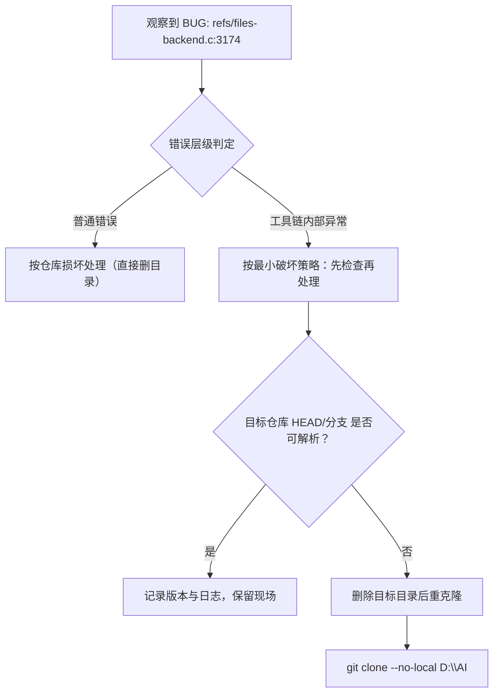

# 执行复盘 — Windows 本地路径 Git 克隆异常排查

## 一、实施过程回顾

### 1.1 事实时间线（基于可见证据）

| 阶段 | 事实输入 | 关键判断 | 产出 |
|------|----------|----------|------|
| S1 异常识别 | 命令：`git clone D:\AI`；输出：`done.` 后出现 `BUG: refs/files-backend.c:3174...` | 将异常归类为 Git 内部实现异常（refs 写入事务），而非普通使用错误 | 明确风险级别：工具链异常信号 |
| S2 风险判断 | 异常发生在克隆收尾阶段 | 对象/工作区复制大概率完成，但引用元数据写入可能处于半完成状态 | 结论：目标仓库“可能可用，也可能不可用” |
| S3 方案输出 | 证据不足（缺少自检输出） | 以“最小破坏”为原则：先检查，再重试；重试关闭本地优化 | 输出可复制命令：状态检查 + `--no-local` 重试 |

### 1.2 关键决策节点



**决策 D1：将异常定性为 Git 内部 Bug**
- 决策依据：输出含 `BUG:` 前缀且指向 Git 源码路径（`refs/files-backend.c`），属于实现层异常信号。
- 风险控制：避免误导为“仓库一定损坏”，降低不必要的破坏性操作概率。

**决策 D2：不直接判定克隆失败**
- 决策依据：`done.` 已出现，说明大部分拷贝流程可能完成；真正不确定的是 refs 写入是否一致。
- 策略选择：先通过 `HEAD/branch` 自检验证“是否可用”，再决定是否删目录重试。

**决策 D3：推荐 `--no-local` 作为规避方案**
- 决策依据：本地路径克隆会启用本地优化路径（如硬链接/对象复用），在 Windows 文件系统边界条件下更容易触发实现层边界问题。
- 预期效果：关闭本地优化路径以提升稳定性，牺牲少量速度换取更高成功率。

### 1.3 状态检查清单（当时未执行，作为闭环入口）

```powershell
cd AI
git status
git branch -a
git rev-parse HEAD
```

补充信息采集（用于定位是否为特定 Git 版本缺陷）：

```powershell
git --version
git fsck --full
```

## 二、问题与根因假设（证据有限下的保守分析）

### 2.1 问题定义

| 项目 | 内容 |
|------|------|
| 现象 | `git clone D:\AI` 在 `done.` 后抛出 `BUG: refs/files-backend.c:3174: initial ref transaction called with existing refs` |
| 影响 | 目标仓库可能存在 refs/HEAD 异常，导致分支不可用、后续 fetch/checkout 异常 |
| 直接风险 | “表面存在目录但不可用”导致后续操作出现二次异常，且现场被覆盖 |

### 2.2 根因假设（按可能性排序）

1. **本地优化路径触发的 refs 事务边界问题**：本地克隆可能走特殊路径导致 ref 事务初始化与“已存在 refs”冲突。
2. **目标目录已存在或残留 refs**：若 `AI/` 目录已存在且包含 `.git/refs` 残留，会提高触发概率（需通过现场检查确认）。
3. **Git 版本特定缺陷**：不同版本对 refs 事务与 Win 文件系统的处理差异可能触发此断言（需 `git --version` 验证）。

## 三、成功经验与不足

### 3.1 做对的点

- **错误分层正确**：优先识别 `BUG:` 为工具链异常信号，避免落入“仓库内容问题”的错误方向。
- **最小破坏策略**：在缺少验证输出时，优先给出“先检查、再重试”的可执行路径。
- **规避参数明确**：直接提供 `--no-local` 作为可复制的稳妥重试参数。

### 3.2 需要补齐的闭环点

- **证据闭环不足**：未采集 `git --version`、目标仓库自检输出，导致无法进一步判定是否为版本缺陷或环境触发。
- **现场留痕缺失**：缺少完整终端日志，降低后续复现与关联检索能力。

