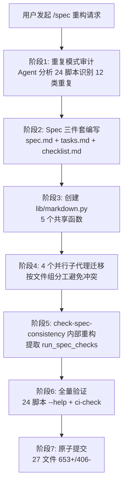

# 执行回顾 — 脚本共享代码库提取

## 一、任务背景与时间线

### 1.1 触发原因

用户请求 `/spec` 对 `.agents/scripts/` 目录进行代码重构，提取重复代码片段建立可复用代码库。此前项目已有 `lib/` 共享库（project/frontmatter/cli/link_fixer/spec 五模块），但约 30 个脚本中仍有大量绕过共享库的自建实现，累计约 280 行重复代码。

### 1.2 执行时间线



### 1.3 变更统计

| 指标 | 数值 |
|------|------|
| 变更文件数 | 27 个 |
| 新增代码行数 | 653 行 |
| 删除代码行数 | 406 行 |
| 新增共享模块 | 1 个（`lib/markdown.py`，145 行） |
| 新增共享函数 | 6 个 |
| 消除重复模式 | 12 类 |
| 消除重复代码 | ~280 行 |
| 并行子代理数 | 4 个 |

## 二、重复模式分析

### 2.1 12 类重复模式清单

通过 Agent 对 24 个 Python 脚本的全量审计，识别出 12 类重复代码模式：

| # | 重复模式 | 出现次数 | 典型文件 | 消除方式 |
|---|---------|---------|---------|---------|
| 1 | 硬编码 `Path(__file__).parent.parent.parent` | 9 | check-gitignore、check-vendor 等 | 迁移至 `lib.project.resolve_project_root` |
| 2 | 自建 `FRONTMATTER_RE` 正则 | 5 | check-source-traceability、verify-atomization 等 | 迁移至 `lib.frontmatter` |
| 3 | 重定义 `INLINE_LINK_RE` | 3 | check-move、check-links、build-ref-index | 迁移至 `lib.link_fixer.INLINE_LINK_RE` |
| 4 | 手写 `print("=" * 60)` | 10+ | check-gitignore、generate-* 等 | 迁移至 `lib.cli.print_header` |
| 5 | 手写 `--json`/`--path` 参数 | 4 | check-source-traceability、check-links 等 | 迁移至 `lib.cli.add_common_args` |
| 6 | 本地重定义 `EXCLUDED_DIRS` | 2 | check-filename-convention、check-vendor | 统一引用 `constants.EXCLUDED_DIRS` |
| 7 | 自建 `discover_spec_dirs` | 2 | check-spec-consistency、generate-tests | 提取至 `lib.spec.discover_spec_dirs` |
| 8 | 自建 `update_readme`/`update_file` | 3 | generate-apps-index、generate-nav、generate-dashboard | 迁移至 `lib.markdown.update_marker_region` |
| 9 | 自建 `extract_title`/`extract_description` | 3 | generate-apps-index、generate-nav | 迁移至 `lib.markdown.extract_title/description` |
| 10 | 自建 Markdown 文件遍历 | 5 | check-links、check-mermaid 等 | 迁移至 `lib.markdown.find_markdown_files` |
| 11 | check-spec-consistency 内部重复 | 1 | main() JSON 批量 vs `check_single_spec()` | 提取 `run_spec_checks()` 共享函数 |
| 12 | 自建 `MATURITY_RE`/`TOML_ID_RE` 等专用正则 | 4 | verify-atomization、check-atomization-duplication | 迁移至 `lib.frontmatter.extract_frontmatter_field` |

### 2.2 重复模式根因分析

**五问法根因分析**：

1. **为什么会有大量重复代码？** → 各脚本独立开发，遇到相同需求时直接复制粘贴
2. **为什么不使用已有的 `lib/` 共享库？** → 部分脚本早于共享库创建；部分脚本作者不知道共享库存在
3. **为什么不知道共享库存在？** → 缺少"新增脚本前先检查 `lib/`"的约定
4. **为什么缺少这个约定？** → 项目初期脚本较少，重复不明显；脚本数量增长后未及时审计
5. **根本原因**：**缺少系统性的重复代码检测机制和"先查共享库"的开发约定**

### 2.3 重复模式的分布特征

| 分布特征 | 说明 | 启示 |
|---------|------|------|
| 路径解析类（模式1） | 9 个脚本全部使用 `Path(__file__).parent.parent.parent` | 最普遍的重复，目录调整时风险最高 |
| 正则解析类（模式2/3/12） | 12 个脚本自建正则解析 frontmatter/链接 | 正则变体最多，统一后一致性提升最大 |
| CLI 输出类（模式4/5） | 10+ 个脚本手写输出格式 | 视觉一致性差，修改成本高 |
| 功能重复类（模式7/8/9/10/11） | 6 个脚本自建已存在的功能函数 | 最容易消除，直接替换为共享调用 |

## 三、重构过程

### 3.1 共享模块设计

新增 `lib/markdown.py` 模块（145 行），按概念域组织 5 个函数：

```
lib/markdown.py
├── find_markdown_files(root, exclude_dirs=None)  # 文件遍历
├── extract_title(path)                            # 标题提取
├── extract_description(path)                       # 描述提取
├── parse_inline_links(content)                     # 链接解析
└── update_marker_region(file_path, marker_start,   # 标记区替换
                          marker_end, new_content)
```

设计决策：
- **复用已有常量**：`find_markdown_files` 默认使用 `constants.EXCLUDED_DIRS`
- **复用已有正则**：`parse_inline_links` 使用 `lib.link_fixer.INLINE_LINK_RE`
- **单一职责**：每个函数只做一件事，无副作用
- **统一导出**：通过 `lib/__init__.py` 暴露所有公共函数

### 3.2 并行迁移策略

按文件组分工，4 个并行子代理处理非重叠文件集：

| 子代理 | 负责文件组 | 迁移内容 |
|--------|-----------|---------|
| Agent A | check-gitignore、check-vendor、check-filename-convention、check-action-items | resolve_project_root + print_header + EXCLUDED_DIRS |
| Agent B | check-source-traceability、check-atomization-coverage、pattern-maturity-stats、verify-atomization、check-atomization-duplication | lib.frontmatter 迁移 |
| Agent C | check-move、check-links、build-ref-index | INLINE_LINK_RE 迁移 |
| 主代理 | generate-apps-index、generate-nav、generate-dashboard、check-spec-consistency、generate-tests | lib.markdown + discover_spec_dirs + 内部重构 |

**冲突避免策略**：
- 每个子代理只修改自己负责的文件
- `lib/__init__.py` 和 `lib/spec/__init__.py` 由主代理统一更新
- `lib/spec/utils.py` 的 `discover_spec_dirs` 由主代理添加

### 3.3 check-spec-consistency 内部重构

重构前 `main()` 的 JSON 批量分支与 `check_single_spec()` 存在 80% 逻辑重复：

```
重构前：
  main() JSON 批量分支 → 重复解析+检查+统计逻辑（~80 行）
  check_single_spec() → 相同的解析+检查+统计逻辑（~80 行）

重构后：
  run_spec_checks(spec_dir, project_root, match_threshold) → 统一检查逻辑
    ├── check_single_spec() 调用 run_spec_checks()
    └── main() JSON 批量分支 调用 run_spec_checks()
```

提取的 `run_spec_checks()` 函数（160 行）封装了"解析 + 检查 + 统计"完整逻辑，返回结构化结果字典，供两个调用方共用。

## 四、验证结果

### 4.1 脚本级验证

| 验证项 | 结果 | 说明 |
|--------|------|------|
| 24 个脚本 `--help` | ✅ 全部正常 | 14 个 check-*.py + 10 个其他脚本 |
| check-action-items `--help` 退出码 2 | ✅ 预期行为 | 该脚本非 argparse 脚本，`--help` 返回 2 是正常行为 |
| ci-check.ps1 综合检查 | ✅ 无新增回归 | pattern-maturity-stats `--check` 报告的 missing_fields 是预存项目数据问题 |

### 4.2 功能一致性验证

| 脚本 | 重构前 | 重构后 | 结论 |
|------|--------|--------|------|
| check-spec-consistency | 19 通过 | 25 通过 | ✅ 改善（修复了路径解析 bug） |
| check-links | 0 断链 | 0 断链 | ✅ 一致 |
| generate-dashboard | 看板正常 | 看板正常 | ✅ 一致 |
| check-source-traceability | 正常 | 正常 | ✅ 一致 |

### 4.3 隐藏 bug 发现

**路径解析 bug**：原 check-spec-consistency.py 中硬编码 `spec_dir.parent.parent.parent` 解析项目根目录，在部分 spec 目录层级下解析错误。迁移至 `resolve_project_root(__file__)` 后，通过 AGENTS.md 锚点自适应定位，检查结果从 19 通过提升至 25 通过。

此 bug 属于"重构发现隐藏问题"的典型案例，验证了 `diff-driven-refactoring.md` 模式中的"重构价值公式"：

```
重构价值 = 消除的重复代码量 + 发现的隐藏问题 + 建立的结构基础
        = 280 行 + 1 个路径解析 bug + lib/markdown.py 共享模块
```

## 五、成功经验

1. **先审计再重构**：使用 Agent 对 24 个脚本进行全量审计，识别 12 类重复模式后再制定迁移计划，避免遗漏
2. **Spec 驱动重构**：通过 spec.md/tasks.md/checklist.md 三件套规划 10 项任务和 29 项检查点，确保重构有据可依
3. **并行子代理分工**：4 个子代理按文件组并行迁移，避免冲突同时提升效率
4. **共享库先行**：先创建 `lib/markdown.py` 共享模块，再批量迁移脚本，确保迁移有明确目标
5. **全量验证兜底**：`--help` 输出 + ci-check.ps1 + 实际运行三层验证，确保功能一致

## 六、存在问题与不足

1. **`lib.frontmatter` API 不一致**：任务描述中假设 `parse_toml_frontmatter(content) -> dict`，实际 API 为 `parse_toml_frontmatter(file_path) -> str|None`。子代理 B 发现后需适配所有迁移，增加了沟通成本
2. **`INLINE_LINK_RE` 捕获组差异**：原 check-move.py 的正则有外层捕获组，与 lib 版本不同。子代理 C 通过 `m.group(0)` 和 `m.group(2)` 调整，需逐一验证数学等价性
3. **缺少自动化重复检测**：本次依赖人工（Agent）审计识别重复模式，缺少工具化检测手段
4. **未建立"先查共享库"约定**：重构消除了现有重复，但未建立防止未来重复的约定

## 七、闭环统计

| 指标 | 重构前 | 重构后 |
|------|--------|--------|
| 重复代码行数 | ~280 行 | ~0 行（核心逻辑统一到 lib/） |
| 共享模块数 | 5 个（project/frontmatter/cli/link_fixer/spec） | 6 个（+markdown） |
| 共享函数数 | ~20 个 | ~26 个（+6 个新增） |
| 硬编码路径解析 | 9 处 | 0 处 |
| 自建正则数 | 12+ 个 | 0 个 |
| check-spec-consistency 通过数 | 19 | 25 |
| Spec 检查点通过率 | — | 29/29（100%） |
