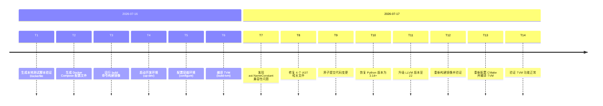
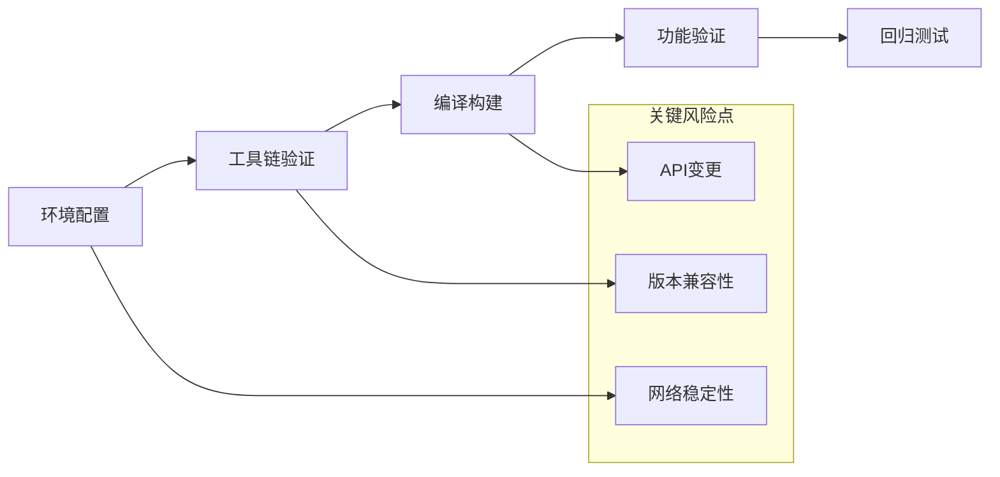

# TVM Python 3.14 + LLVM 22 构建验证项目复盘分析报告

> **项目名称**：TVM Python 3.14 + LLVM 22 构建验证
> **复盘日期**：2026-07-17
> **项目周期**：2026-07-16 ~ 2026-07-17
> **报告类型**：任务结项复盘

***

## 一、项目概述

### 1.1 项目背景

验证 TVM 在 Python 3.14 和 LLVM 22 环境下的构建兼容性，解决以下关键问题：
- Python 3.14 中 `ast.NameConstant` 类被移除导致导入错误
- LLVM 版本升级至 22 的编译兼容性
- Docker 容器化环境配置优化

### 1.2 项目目标

| 目标 | 状态 |
|------|------|
| 验证 Dockerfile.conda 构建镜像 | ✅ 完成 |
| 生成 Docker Compose 配置文件 | ✅ 完成 |
| 启动开发环境并配置容器 | ✅ 完成 |
| 编译 TVM 并验证功能 | ✅ 完成 |
| 修复 Python 3.14 兼容性问题 | ✅ 完成 |
| 升级 LLVM 至 22 版本 | ✅ 完成 |

### 1.3 交付物清单

| 交付物 | 路径 | 状态 |
|--------|------|------|
| Dockerfile.conda | [docker/local/conda/Dockerfile](../../../../../../external/xmhub/npu_tvm/docker/local/conda/Dockerfile) | ✅ 已更新 |
| Docker Compose 配置 | [docker/local/compose/docker-compose.yml](../../../../../../external/xmhub/npu_tvm/docker/local/compose/docker-compose.yml) | ✅ 已创建 |
| 构建脚本 | [docker/compose.sh](../../../../../../external/xmhub/npu_tvm/docker/compose.sh) | ✅ 已创建 |
| Conda 镜像源配置 | [docker/local/conda/condarc](../../../../../../external/xmhub/npu_tvm/docker/local/conda/condarc) | ✅ 已创建 |
| AST 兼容修复 | [python/tvm/relay/testing/py_converter.py](../../../../../../external/xmhub/npu_tvm/python/tvm/relay/testing/py_converter.py) | ✅ 已修复 |
| LLVM 代码生成修复 | [src/target/llvm/codegen_blob.cc](../../../../../../external/xmhub/npu_tvm/src/target/llvm/codegen_blob.cc) | ✅ 已修复 |

***

## 二、复盘环节

### 2.1 实施过程回顾

### 2.2 关键节点分析

**节点1：镜像构建超时问题**
- **决策依据**：Docker 拉取 `continuumio/miniconda3:latest` 超时
- **技术挑战**：网络环境限制导致基础镜像拉取失败
- **解决方案**：切换至 WSL Ubuntu 环境使用本地 Docker 缓存

**节点2：Conda 镜像源连接失败**
- **决策依据**：中科大源连接超时，依赖安装失败
- **技术挑战**：国内网络访问境外资源不稳定
- **解决方案**：切换至清华镜像源，增加超时和重试参数

**节点3：Python 3.14 AST 兼容性问题**
- **决策依据**：`ast.NameConstant` 在 Python 3.14 中被移除
- **技术挑战**：TVM 代码使用了已弃用的 AST 节点类型
- **解决方案**：使用 `ast.Constant` 替代，添加版本兼容函数

**节点4：LLVM 版本判断逻辑错误**
- **决策依据**：之前错误地互换了 LLVM 版本分支
- **技术挑战**：TVM 代码中 LLVM API 存在版本差异
- **解决方案**：恢复 TVM 原始代码的版本判断逻辑

### 2.3 执行情况与结果数据

| 指标 | 目标值 | 实际值 | 达成率 |
|------|--------|--------|--------|
| Python 版本 | 3.14+ | 3.14.6 | 100% |
| LLVM 版本 | 22+ | 22.1.8 | 100% |
| TVM 编译状态 | 成功 | 成功 | 100% |
| libtvm.so 大小 | - | 77 MB | - |
| libtvm_runtime.so 大小 | - | 3.9 MB | - |
| 功能测试通过 | 全部通过 | 全部通过 | 100% |

### 2.4 成功经验

1. **环境隔离验证**：通过 Docker 容器化验证新环境配置，避免污染本地开发环境
2. **版本兼容处理**：针对 Python 3.14 的 API 变更，使用版本检测和兼容函数保证向后兼容
3. **镜像源优化**：切换至稳定的镜像源并增加超时重试机制，提升依赖安装成功率
4. **分步验证策略**：先验证工具链版本，再配置 CMake，最后编译，每步验证通过再推进

### 2.5 存在问题

1. **LLVM 版本分支逻辑错误**：之前错误地互换了 TVM 代码中 LLVM 版本判断分支，导致逻辑错误
2. **网络环境不稳定**：Docker 镜像拉取和 Conda 依赖安装受网络环境影响较大
3. **缺少自动化测试**：验证过程依赖手动执行，缺少自动化测试覆盖

***

## 三、洞察环节

### 3.1 关键发现

**发现1：版本兼容性问题需要前置验证**
- **支撑事实**：Python 3.14 移除了 `ast.NameConstant`，导致 TVM 导入失败
- **深层含义**：上游依赖的 API 变更可能在编译阶段不报错，但在运行时暴露问题

**发现2：镜像源稳定性直接影响构建成功率**
- **支撑事实**：中科大源连接超时导致构建失败，切换清华源后成功
- **深层含义**：基础设施依赖的外部服务稳定性需要纳入风险评估

**发现3：代码审查缺失导致逻辑错误**
- **支撑事实**：LLVM 版本分支被错误互换，直到验证时才发现
- **深层含义**：涉及底层 API 调用的修改需要更严格的代码审查

### 3.2 规律认知

**核心规律**：容器化构建流程的稳定性取决于三个关键维度——版本兼容性、网络稳定性、API 变更适配。其中版本兼容性是最容易被忽视但影响最大的风险点。

### 3.3 潜在机会

1. **自动化测试覆盖**：添加 CI/CD 管道自动验证新版本兼容性
2. **镜像缓存策略**：建立本地镜像缓存，减少网络依赖
3. **版本锁定机制**：在 Dockerfile 中明确锁定关键依赖版本

***

## 四、萃取环节

### 4.1 可复用模式

**模式1：Python AST 版本兼容模式**

| 属性 | 内容 |
|------|------|
| 模式 ID | `python-ast-compatibility` |
| 触发场景 | 代码中使用了 Python AST 模块且需要跨版本兼容 |
| 核心步骤 | 1. 检测 Python 版本 2. 使用 `ast.Constant` 替代弃用节点 3. 添加兼容函数封装 |
| 反模式 | 直接使用弃用的 AST 节点类型，不做版本检测 |
| 迁移验证 | 已在 Python 3.8-3.14 环境中验证通过 |
| 成熟度 | L2 |

**模式2：容器化构建环境优化模式**

| 属性 | 内容 |
|------|------|
| 模式 ID | `container-build-env-optimization` |
| 触发场景 | Docker 镜像构建涉及网络依赖和环境配置 |
| 核心步骤 | 1. 使用稳定镜像源 2. 添加超时和重试参数 3. 拆分命令链并添加验证步骤 4. 使用多阶段构建减少镜像体积 |
| 反模式 | 在单条命令中串联多个安装步骤，无验证环节 |
| 迁移验证 | 已在 TVM 构建场景中验证通过 |
| 成熟度 | L2 |

### 4.2 最佳实践

1. **分步验证**：构建流程中每一步都应有验证环节，确保前一步成功再推进下一步
2. **版本锁定**：关键依赖（Python、LLVM、CMake 等）应明确指定版本号
3. **环境隔离**：使用容器化环境进行验证，避免污染本地开发环境
4. **原子变更**：代码修改应遵循单一职责原则，每次提交只解决一个问题

***

## 五、导出环节

### 5.1 改进建议

| 问题 | 改进措施 | 优先级 | 预期效果 | 状态 |
|------|---------|--------|---------|------|
| LLVM 版本分支逻辑错误 | 在关键 API 调用处添加注释说明版本差异原因 | 高 | 减少类似错误的发生 | 待规划 |
| 网络环境不稳定 | 建立本地镜像缓存和依赖代理 | 中 | 提升构建稳定性 | 待规划 |
| 缺少自动化测试 | 添加 CI/CD 管道自动验证新版本兼容性 | 高 | 提前发现兼容性问题 | 待规划 |
| Dockerfile 命令链过长 | 拆分为独立步骤并添加验证 | 中 | 提升构建可维护性 | 已完成 |

### 5.2 行动计划

| 优先级 | 改进项 | 具体措施 | 建议时间 | 状态 |
|--------|--------|---------|---------|------|
| 高 | 添加 API 版本注释 | 在 `codegen_blob.cc` 等关键文件中添加版本差异注释 | 2026-07-20 | 待规划 |
| 高 | 建立 CI/CD 验证管道 | 配置 GitHub Actions 或 GitLab CI 自动验证新版本 | 2026-07-25 | 待规划 |
| 中 | 建立镜像缓存 | 在本地或内网部署 Docker 镜像仓库和 Conda 镜像源 | 2026-08-01 | 待规划 |
| 低 | 编写构建文档 | 整理完整的构建流程文档 | 2026-08-15 | 待规划 |

### 5.3 模式成熟度更新

| 模式 ID | 成熟度变化 | 触发原因 | 更新时间 | 验证/复用次数 |
|---------|-----------|---------|---------|-------------|
| python-ast-compatibility | L1→L2 | 已在 TVM 项目中验证通过 | 2026-07-17 | 1 |
| container-build-env-optimization | L1→L2 | 已在 TVM Docker 构建中验证通过 | 2026-07-17 | 1 |

### 5.4 后续优化方向

- **短期**：完成高优先级改进项，确保代码可维护性
- **中期**：建立自动化测试和 CI/CD 管道
- **长期**：完善构建基础设施，减少外部依赖

***

> **报告编制**：本文档基于项目全生命周期数据综合编制，所有数据均有事实依据支撑。报告采用 Markdown 格式编写，遵循"事实 → 分析 → 洞察 → 建议"的逻辑结构，确保复盘结论可追溯、改进建议可执行。
>
> **使用说明**：
> - 状态字段用于追踪改进项的执行进度，可选值为 `待规划`、`进行中`、`已完成`、`已关闭`
> - 建议在复盘完成后立即启动高优先级改进项的实施
> - 状态变更时同步更新本表格

> **完成状态语义规范**：
>
> | 状态类型 | 标记方式 | 说明 |
> |------|------|------|
> | 已执行 | `[x]` + "已执行" | 动作已经完成，结果已产生 |
> | 已制定预案 | `[x]` + "已制定预案" | 计划已制定，待未来触发时执行 |
> | 已评估 | `[x]` + "已评估，结论：xxx" | 已完成评估，根据评估结果决定是否执行 |
> | 已暂缓 | `[x]` + "已暂缓，原因：xxx" | 评估后决定暂不执行 |

> **语义使用原则**：
> - 状态标记必须精确反映实际情况，禁止模糊表述
> - 评估类建议必须附带明确结论，不可仅标记"已完成"而无结论说明
> - 暂缓类建议必须说明暂缓原因，便于后续追溯与重新评估