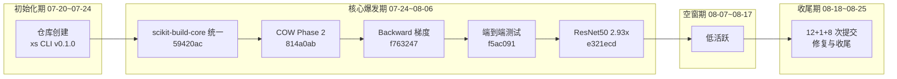

# 复盘报告：玄境（Xuanspace）全面复盘

> 复盘日期：2026-08-26 | 项目周期：2026-07-24 ~ 2026-08-25 | 提交总数：322 次 | 方法论：七概念（R→I→E→V→导出）

> 本报告为 xuanspace 首次全量历史全面复盘（区别于先例 [retrospective-xuanspace-mono-repo-20260724](../retrospective-xuanspace-mono-repo-20260724/README.md) 的 07-20~07-24 初始化阶段复盘，本次覆盖范围 322 次提交，聚焦演进节奏、质量投入与结构重心三大主题）。

## S1. 事实收集

### 提交规模与时间分布

| 维度 | 数值 | 来源 |
|------|------|------|
| 提交总数 | 322 次 | `git log --oneline` |
| 提交日期范围 | 2026-07-24 ~ 2026-08-25 | `git log --format=%ad` |
| 活跃日期数 | 17 天 | 同上 |
| 峰值日期 | 07-31（69 次） | 同上 |
| 次高峰日期 | 08-04（41）、08-05（37）、07-28（32） | 同上 |
| 低活跃日期 | 07-25（2）、08-06（6）、08-07（1）、08-19（1） | 同上 |
| 07-24~08-06 提交占比 | 300 / 322 = 93.2% | 汇总计算 |

### 提交类型与 Scope 分布

| 类型 | 数量 | | 类型 | 数量 |
|------|------|---|------|------|
| feat | 84 | | refactor | 13 |
| test | 62 | | perf | 9 |
| fix | 61 | | ci | 5 |
| docs | 48 | | build | 2 |
| chore | 37 | | merge | 1 |

- test + fix 合计 123 次，占全量 38.2%
- scope 分布：caffe-ffi 122、layers 29、npu-ffi 16、vendor 10、ci 8、okf 7、build 7、xs-cli 5；前五合计 185 次，占 57.5%
- 主题关键词（commit subject 口径）：Backward 21、COW 17、Perf/OpenMP 13

### 关键里程碑提交

| 哈希 | 提交主题 |
|------|---------|
| 2f930ff | 萃取 caffe-ffi 为独立项目并迁移至 libs 目录 |
| 59420ac | 全仓库统一为 scikit-build-core 构建后端，根目录改造为纯枢纽包 |
| 814a0ab | Phase 2 COW 写时复制机制核心实现 |
| f5ac091 | 迁移网络级端到端测试至 caffe_ffi，改写 read_net 推理路径 |
| f763247 | 实现 Softmax 层 Backward 梯度计算，支持分类网络概率层反向传播 |
| e321ecd | Release 模式条件编译 PERF 统计代码，ResNet50 延迟 2.93x 加速 |
| b46f400 | 新增版本一致性检查，防止文档版本声明漂移 |

### 仓库状态与版本

| 维度 | 事实 |
|------|------|
| 子模块 | libs/tvm-book、vendor/caffe、vendor/tvm-ffi 三个子模块均未初始化 |
| 工作区 | 干净（无未提交变更） |
| 版本 | 根 CHANGELOG v0.1.0（2026-07-23，xs CLI 12 子命令）；libs/caffe-ffi v1.1.0（COW 机制）与 v1.2.0（2026-07-31，InsertSplits 18 例边界测试、P3-C Transformer 13 例） |
| 构建 | 全仓库统一 scikit-build-core（spec 7 条规范），Python 3.14.6+，支持 PDM/uv/pip 多包管理器 |
| 文档 | Sphinx + MyST |
| 质量基线 | 核心模块测试覆盖率 ≥90%、一般 ≥80%、mypy 零新增告警、ruff 零错误 |

完整事实清单（F-001 ~ F-030）见 [insight-extraction.md](insight-extraction.md) 附录。

## S2. 过程分析（时间线聚类）

- **初始化期**：07-20~07-24（见先例报告），完成仓库骨架与 xs CLI v0.1.0
- **核心爆发期**：07-24~08-06（300 次提交，93.2%），主线为构建统一（scikit-build-core）、COW 内存机制、Backward 反向传播、端到端测试、性能优化五大工程线
- **空窗期**：08-07~08-17，11 个工作日内仅 08-18 集市提交，低活跃连续
- **收尾期**：08-18~08-25，12 + 1 + 8 次提交，以修复与收尾为主

### 三条主题线索

1. **内存机制线**：COW 写时复制（v1.1.0 → Phase 2 核心实现 → split 零拷贝里程碑），subject 关键词 17 次
2. **反向传播线**：Softmax Backward → 池化反向梯度路由 → 分类网络概率层支持，subject 关键词 21 次
3. **性能优化线**：OpenMP 并行（Conv v4 里程碑）、ResNet50 2.93x 加速、浮点精度 kink 防护，subject 关键词 13 次

## S3. 洞察提炼

三条洞察的完整四元组（陈述/证据/反常识/行动）见 [insight-extraction.md](insight-extraction.md) 第一节，摘要如下：

| # | 洞察主题 | 一句话陈述 |
|---|---------|-----------|
| I-1 | 冲刺式节奏 | 322 次提交中 93.2% 集中于 07-24~08-06（13 天），单日峰值 69 次，随后出现 11 天空窗 |
| I-2 | 质量前置 | test+fix 合计 123 次（38.2%）超过 feat 84 次（26.1%），质量投入与功能开发并行走 |
| I-3 | 结构重心 | caffe-ffi 独占 122 次（37.9%），scope 前五占 57.5%，与"多包 monorepo"定位形成剪刀差 |

## S4. 行动项（G4 原子化）

| ID | 行动项 | 优先级 | Owner | 时间节点 | 验收标准 |
|----|--------|:------:|-------|---------|---------|
| ACT-01 | 建立提交节奏观察告警：CI 定时统计空窗期（≥3 天仅记录不打断），输出节奏周报 | 中 | 项目维护者 | 下个迭代启动前 | CI 产出节奏报告，空窗可追溯 |
| ACT-02 | 质量投入门禁监测：为 caffe-ffi/layers 监控 test+fix 提交占比（基线 ≥30%） | 高 | 项目维护者 | 下个迭代周期 | CI 输出质量投入周报，占比可量化 |
| ACT-03 | 建立 caffe-ffi 单点风险日历：登记 API 破坏性变更窗口与外部依赖接入节点 | 中 | 项目维护者 | 每两星期更新 | 风险日历条目存在且可回溯 |
| ACT-04 | 里程碑风险登记（采纳 V-7）：规划下个里程碑时评估"冲刺-空窗"节奏成因 | 中 | 项目维护者 | 下个里程碑规划时 | 规划文档包含节奏风险评估段落 |
| ACT-05 | 子模块季度检查（采纳 V-8）：每季度检查 tvm-book/caffe/tvm-ffi 初始化状态并记录决策 | 低 | 项目维护者 | 每季度末 | 季度检查记录存档 |

## 附：质量门记录

| 质量门 | 结果 | 说明 |
|--------|:----:|------|
| G1 事实无因果词 | PASS | 30 条事实（F-001~F-030），无因果/判断词，全部可复验 |
| G2 洞察四元组 | PASS | 3 条洞察，证据均引用事实编号 |
| G3 模式可迁移 | PASS | 1 个模式（双轨演进制），4 反模式，跨场景迁移示例，L1 标注 |
| V 对抗审查 | PASS | 4 视角 8 条实质意见，采纳 5 条修正 |
| G4 行动项原子化 | PASS | 5 项行动项，单一职责、可独立验证、有 Owner 与时间节点 |