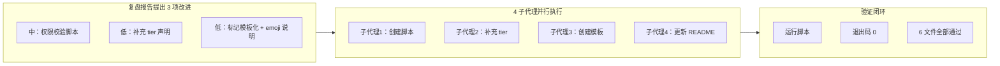

# 二、复盘环节

## 2.1 实施过程回顾

## 2.2 执行数据

| 指标 | 数值 |
|------|------|
| 触发的改进建议数 | 3 项（1 中 + 2 低） |
| 执行策略 | 4 个子代理并行 |
| 新建文件 | 2 个（check-role-permissions.py + role-marker-design-template.md） |
| 修改文件 | 8 个（5 角色文件 + README.md + scripts/README.md + 复盘报告） |
| 改进建议完成率 | 3/3 = 100% |
| 验证结果 | 脚本退出码 0，6 个角色文件全部校验通过 |

## 2.3 产出清单

| 优先级 | 改进建议 | 产出 | 类型 |
|--------|---------|------|------|
| 中 | 权限声明校验脚本 | `check-role-permissions.py` + scripts/README.md 文档 | 工具脚本 |
| 低 | 现有角色文件补充 tier 声明 | 5 个角色文件 frontmatter 补充 `tier = "standard"` | 数据一致性 |
| 低 | 角色标记模板化 | `role-marker-design-template.md` | 可复用模板 |
| 低 | emoji 环境兼容说明 | README.md 权限控制章节追加环境兼容性说明 | 文档增强 |

## 2.4 关键决策

| 决策 | 理由 | 结果 |
|------|------|------|
| 4 项任务并行执行 | 各项之间无依赖关系 | 零等待，全部一次通过 |
| 脚本正则修正 | `PERMISSIONS_TABLE_RE` 原始正则在 frontmatter 末尾匹配失败，修正为 `(?=\n\[|\Z)` | 脚本正确解析 co-founder.md |
| 脚本排除 README.md | README.md 非角色文件，无 frontmatter | 避免误报，精确校验 6 个角色文件 |

## 2.5 成功经验

1. **并行子代理零等待执行**：4 项任务之间无依赖关系，并行执行实现了零等待，全部一次性通过验证。
2. **脚本正则精准匹配**：针对 frontmatter 末尾匹配失败问题，通过调整正则表达式 `(?=\n\[|\Z)` 实现了正确解析。
3. **精确文件范围控制**：脚本排除非角色文件（README.md），确保只校验 6 个角色文件，避免误报。
4. **复盘→执行零延迟闭环**：从复盘报告提出改进建议到全部执行完毕，整个过程在一次会话中完成，验证了 AI 协作模式的固有特性。

## 2.6 存在问题

本次执行过程未发现明显问题，所有改进建议均已完成并通过验证。

---