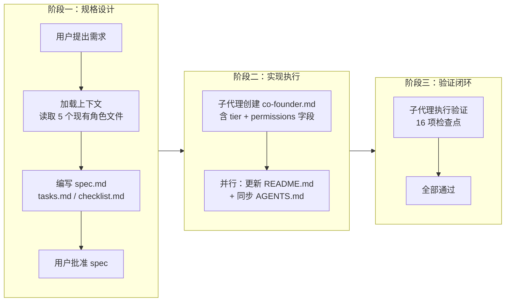

# 二、复盘环节

## 2.1 实施过程回顾

## 2.2 关键节点分析

#### 决策 1：`tier` 字段采用可选枚举而非布尔值

**决策依据**：选择 `tier = "co-founder" / "standard"` 枚举字段而非 `co_founder = true` 布尔字段。枚举设计具备可扩展性，未来可支持更多角色层级（如 `core`、`contributor`）而无需修改字段结构。

**技术挑战**：需确保现有角色文件未声明 `tier` 时按默认值 `standard` 处理，实现向后兼容。

**解决方案**：在 spec 中明确"未声明时按 `standard` 默认值处理"，现有 5 个角色文件无需任何修改。

#### 决策 2：视觉标记采用"徽章 + 文字前缀"双要素

**决策依据**：单一标记手段（仅徽章或仅文字）在 Markdown 渲染环境中辨识度不足。采用 🏛️ 徽章 + `[联合创始]` 文字前缀双要素，确保在纯文本、Markdown 预览、终端渲染等多种环境下均可识别。

**技术挑战**：需在索引清单（表格单元格）与详情页（标题行）两处保持标记一致性。

**解决方案**：索引清单表格"层级标记"列显示 `🏛️ 联合创始`，详情页标题以 `# [联合创始] 🏛️` 起始，两处均包含徽章与文字，形成双点一致。

#### 决策 3：权限声明采用 frontmatter 元数据而非独立章节

**决策依据**：权限控制信息放在 TOML frontmatter `[permissions]` 表中，而非 Markdown 正文章节。决策依据是 frontmatter 是机器可读的结构化数据，便于未来工具脚本解析与校验。

**技术挑战**：需同时提供人类可读的权限说明。

**解决方案**：在 frontmatter 声明 `view` 与 `manage` 字段（机器可读），同时在 README.md 新增"权限控制"章节以表格形式呈现（人类可读），形成"元数据 + 文档说明"双层表达。

## 2.3 执行情况与结果数据

| 指标 | 数据 |
|------|------|
| 主任务数 | 5 |
| 子任务数 | 12 |
| 检查点数 | 16（全部通过） |
| 新建文件 | 3（spec.md、tasks.md、checklist.md、co-founder.md） |
| 修改文件 | 3（README.md、AGENTS.md、checklist.md） |
| 子代理调用 | 4 次（1 创建 + 2 并行更新 + 1 验证） |
| 并行执行 | Task 3 与 Task 4 并行 |
| frontmatter 新增字段 | 2（`tier`、`[permissions]` 表） |
| 视觉标记要素 | 2（🏛️ 徽章 + `[联合创始]` 文字前缀） |
| 链接校验 | 联合创始角色相关链接全部有效 |

## 2.4 成功经验

#### 2.4.1 Spec 一次批准即执行无返工

spec.md、tasks.md、checklist.md 三件套在批准后全程未修改，实现"一次设计、零返工执行"。这归功于加载上下文阶段完整读取了 5 个现有角色文件，充分理解了 frontmatter 结构与 Markdown 正文规范。

#### 2.4.2 并行子代理执行提升效率

Task 3（更新 README.md）与 Task 4（同步 AGENTS.md）无依赖关系，通过并行子代理同时执行，将串行 2 步压缩为并行 1 步。两个子代理均独立完成且无冲突。

#### 2.4.3 可选字段默认值实现零侵入扩展

`tier` 字段设为可选，默认值 `standard`，现有 5 个角色文件无需任何修改即向后兼容。新增字段对既有体系零侵入，这是文档型数据模型扩展的最佳实践。

#### 2.4.4 验证子代理独立校验保证质量

验证子代理独立读取所有相关文件，逐项校验 16 个检查点，并运行 check-links.py 脚本。验证过程与实现过程分离，确保校验客观性。

## 2.5 存在问题

#### 2.5.1 现有角色文件未补充 tier 声明

**问题**：现有 5 个角色文件未显式声明 `tier = "standard"`，依赖默认值机制。

**根因**：spec 中将 `standard` 设为可省略的默认值，遵循"最小改动"原则未要求现有文件补充声明。

**影响**：数据一致性上存在"显式声明"与"隐式默认"两种表达方式。未来若工具脚本解析 `tier` 字段，需处理未声明情况。

#### 2.5.2 权限控制为声明式而非执行式

**问题**：`[permissions]` 表仅声明权限边界，无运行时强制执行机制。

**根因**：文档型角色管理系统无运行时环境，权限控制只能通过元数据声明 + 人工遵循实现。

**影响**：权限控制目前依赖协作者自觉遵循，缺乏技术强制力。

#### 2.5.3 视觉标记在非 Markdown 渲染环境下可能丢失

**问题**：🏛️ 徽章 emoji 在部分终端或纯文本编辑器中可能显示为方框或乱码。

**根因**：emoji 渲染依赖环境字体支持，无法在所有环境中保证一致呈现。

**影响**：在不支持 emoji 的环境中，视觉标记退化为仅 `[联合创始]` 文字前缀，辨识度下降但仍可识别。

---