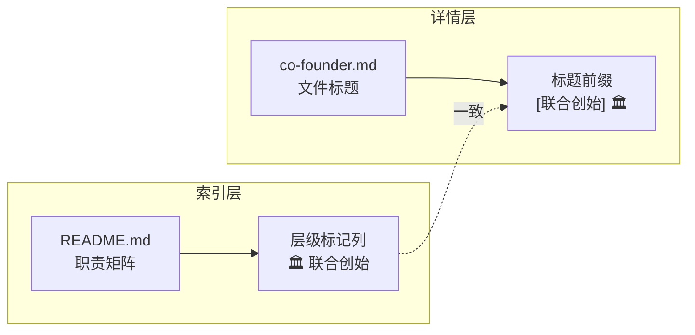

# 四、导出环节与知识萃取

## 4.1 改进建议

| 问题 | 改进措施 | 优先级 | 预期效果 | 状态 |
|------|---------|--------|---------|------|
| 现有角色文件未补充 tier 声明 | 为现有 5 个角色文件显式补充 `tier = "standard"` 声明 | 低 | 提升数据一致性，消除隐式默认 | 已完成 |
| 权限控制为声明式而非执行式 | 开发 frontmatter 权限校验脚本，自动检查 `[permissions]` 表完整性 | 中 | 实现"声明即校验"，增强权限治理技术力 | 已完成 |
| emoji 在部分环境可能丢失 | 在权限控制章节补充文字说明，明确联合创始角色标识不依赖 emoji 单一呈现 | 低 | 确保非 emoji 环境下标记仍可识别 | 已完成 |

## 4.2 行动计划

| 优先级 | 改进项 | 具体措施 | 建议时间 | 状态 |
|--------|--------|---------|---------|------|
| 中 | 权限声明校验脚本 | 在 `.agents/scripts/` 下开发脚本，校验所有角色文件 `[permissions]` 表的 view/manage 字段完整性 | 2026-07-15 | 已完成 |
| 低 | 现有角色文件补充 tier 声明 | 为 5 个现有角色文件 frontmatter 补充 `tier = "standard"` 显式声明 | 2026-07-30 | 已完成 |
| 低 | 角色标记模板化 | 在 `docs/retrospective/templates/` 下创建角色视觉标记设计模板 | 2026-07-30 | 已完成 |

## 4.3 后续优化方向

- **构建完整角色层级体系**：基于 `tier` 字段扩展多层级角色分类，配合不同视觉标记（徽章 + 颜色 + 前缀）形成完整体系
- **权限声明接入校验工具链**：将 `[permissions]` 表校验纳入 CI 综合检查（ci-check.ps1 / ci-check.sh），实现权限声明完整性自动化保障
- **角色标记方案模板化**：将"徽章 + 文字前缀"双要素标记方案萃取为可复用模板，供未来新增特殊角色快速应用

## 4.4 知识萃取

### 模式 1：文档型数据模型零侵入扩展范式

- **模式名称**：文档型数据模型零侵入扩展范式（可选字段 + 默认值）
- **结构**：

| 要素 | 设计原则 | 作用 |
|------|---------|------|
| 新增字段 | 可选声明，不强制现有文件修改 | 实现向后兼容 |
| 默认值 | 现有未声明文件按默认值处理 | 消除隐式空值风险 |
| 索引更新 | 仅新增条目，不修改现有条目 | 保持索引稳定性 |
| 新增文件 | 独立文件承载新对象 | 零侵入既有文件 |

- **适用场景**：任何基于 frontmatter（TOML/YAML）的文档体系扩展，包括角色管理、配置管理、元数据管理
- **复用方式**：设计新字段时设为可选并提供默认值，现有文件零修改，仅新增文件与更新索引
- **来源**：本次联合创始角色 `tier` 字段与 `[permissions]` 表设计
- **关联模块**：`concepts/zero-dependency-principle.md`（零依赖原则的延伸应用）

### 模式 2：视觉标记双点一致原则

- **模式名称**：视觉标记双点一致原则（索引层 + 详情层）
- **结构**：

- **适用场景**：任何需要在索引与详情两处呈现的视觉标识，包括角色标记、状态标记、优先级标记
- **复用方式**：在索引表格与详情标题两处同时应用标记，确保双点一致
- **来源**：本次联合创始角色视觉标记设计（README.md 矩阵 + co-founder.md 标题）
- **关联模块**：`patterns/architecture-patterns/perception-check-report-model.md`（多层呈现的延伸）

### 模式 3：声明式权限治理模式

- **模式名称**：声明式权限治理模式（元数据声明 + 文档说明双层表达）
- **结构**：

| 层次 | 载体 | 受众 | 作用 |
|------|------|------|------|
| 元数据层 | TOML frontmatter `[permissions]` 表 | 机器/工具脚本 | 结构化声明权限边界 |
| 文档层 | README.md 权限控制章节 | 人类协作者 | 可读化呈现权限要求 |

- **适用场景**：任何无运行时环境的文档型管理系统的权限设计，包括角色权限、文档访问控制、配置管理权限
- **复用方式**：在 frontmatter 声明 `view` 与 `manage` 字段，在 README 以表格形式呈现同一信息
- **来源**：本次联合创始角色 `[permissions]` 表与 README.md 权限控制章节设计
- **关联模块**：`concepts/meta-document.md`（元文档概念的权限应用）

---