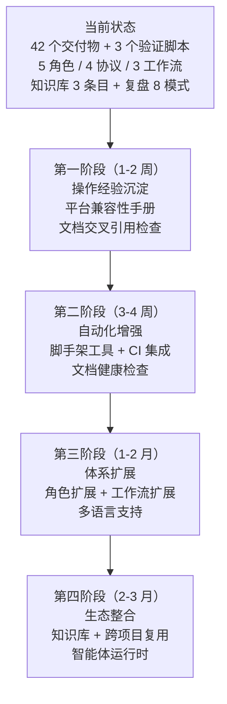

# 四、方法论萃取与改进策略

## 4.1 可复用执行模式

#### 模式 1：并行子代理批量创建模式

**适用场景**：需要创建大量独立文档文件（无依赖关系）。

**执行步骤**：
1. 按功能领域将文件分组（如角色定义、提示词、工具规范、工作流等）
2. 为每个分组分配一个子代理
3. 子代理并行创建文件，各自维护领域上下文
4. 主代理汇总验证

**收益**：上下文隔离 + 效率提升 + 降低单代理上下文窗口溢出风险。

#### 模式 2：Spec → Tasks → Checklist 三层驱动模式

**适用场景**：任何需要"先设计后实施"的 AI 辅助开发任务。

**执行步骤**：
1. 编写 `spec.md`：将用户需求转化为结构化规格（需求 + 场景）
2. 编写 `tasks.md`：将规格分解为可执行任务（主任务 + 子任务 + 依赖关系）
3. 编写 `checklist.md`：将规格转化为验证清单（检查点 + 通过条件）
4. 按 tasks.md 执行实施
5. 按 checklist.md 执行验证

**收益**：需求理解偏差趋近于零 + 验证标准前置 + 实施过程可追溯。

#### 模式 3：多层次依赖管理闭环模式

**适用场景**：需要确保临时依赖不被纳入版本控制的项目。

**执行步骤**：
1. 配置 `.gitignore` 规则（阻止 git 跟踪）
2. 创建 pre-commit hook（阻止误提交）
3. 编写验证脚本（确认规则有效）
4. 建立管理流程文档（指导开发者）

**收益**：从"配置"到"流程"到"验证"的完整闭环，确保零遗漏。

## 4.2 已沉淀的知识资产

| 资产类型 | 资产名称 | 存放位置 | 复用方式 |
|---------|---------|---------|---------|
| 架构决策 | `libs/` → `vendor/` 重命名决策 | `docs/knowledge/decisions/libs-rename-to-vendor.md` | 包含完整决策矩阵，可直接引用 |
| 故障排除 | Move-Item Access Denied 解决方案 | `docs/knowledge/troubleshooting/move-item-access-denied.md` | 包含 3 种替代方案 |
| 操作经验 | PowerShell heredoc 替代方案 | `docs/knowledge/operations/windows-powershell-heredoc.md` | 包含代码示例 |
| 架构模式 | 多智能体并行执行模式 | `docs/retrospective/patterns/architecture-patterns/multi-agent-parallel-execution.md` | 含决策矩阵 |
| 方法论 | Spec-driven 开发流程 | `docs/retrospective/patterns/methodology-patterns/creative-design/spec-driven-development.md` | 含流程图 |
| 代码模式 | Git 忽略规则验证 | `docs/retrospective/patterns/code-patterns/gitignore-validation.md` | 含完整代码 |
| 决策框架 | 目录命名决策矩阵 | `docs/retrospective/frameworks/directory-naming-matrix.md` | 覆盖 7 类目录 |
| 决策框架 | 临时依赖管理决策矩阵 | `docs/retrospective/frameworks/dependency-management-matrix.md` | 含存放/Git/清理策略 |

## 4.3 可复用的工具资产

| 工具 | 路径 | 可复用场景 | 适配方式 |
|------|------|-----------|---------|
| `check-gitignore.py` | `.agents/scripts/check-gitignore.py` | 任何需要验证 `.gitignore` 的项目 | 修改 `REQUIRED_RULES` 和 `TEMP_PATHS` 列表 |
| `check-spec-consistency.py` | `.agents/scripts/check-spec-consistency.py` | 任何采用 spec → tasks → checklist 三文档体系的项目 | 修改 `SPEC_DIRS` 配置 |
| `check-links.py` | `.agents/scripts/check-links.py` | 任何需要验证 Markdown 链接有效性的项目 | 修改 `DOCS_DIR` 配置 |
| pre-commit hook | `.git/hooks/pre-commit` | 任何需要阻止临时依赖提交的项目 | 修改 `FORBIDDEN_PATTERNS` 列表 |
| `.agents/` 目录骨架 | `.agents/` | 任何需要多智能体协作的项目 | 直接复制骨架，按需调整角色定义 |

## 4.4 改进策略与行动指南

### 问题驱动的改进措施

| 问题 | 改进措施 | 优先级 | 负责方 | 建议时间 |
|------|---------|--------|--------|---------|
| Windows 平台兼容性问题（P1-P5） | 建立 `docs/platform-compatibility.md` 平台兼容性手册，记录已验证的命令模式 | 高 | 开发者 | 1 周内 |
| 文档交叉引用缺乏自动化检查 | 开发 `check-cross-refs.py` 脚本，验证 `AGENTS.md` 中所有路径引用的有效性 | 高 | 架构师 | 2 周内 |
| 操作经验未系统化沉淀 | 将本项目的 5 个操作错误整理为知识库条目 | 高 | 开发者 | 1 周内 |
| 需求迭代的规格维护成本高 | 开发 spec → tasks → checklist 变更影响分析工具（✅ 已由 `check-spec-consistency.py` 部分实现） | 中 | 架构师 | ✅ 已完成 |
| `.agents/` 初始化手动操作 | 开发 `scaffold-agents.sh` / `scaffold-agents.ps1` 脚手架脚本 | 中 | 开发者 | 3 周内 |
| CI 集成未完成 | 将验证脚本集成到 CI 流水线中 | 中 | 开发者 | 2 周内 |
| 缺乏文档健康检查 | 开发 `check-docs-health.py` 脚本 | 低 | 开发者 | 1 个月内 |
| 仅支持中文 | 提供英文版本规范文件 | 低 | 架构师 | 1 个月内 |

### 流程优化建议

#### 需求阶段优化

**现状**：3 轮需求迭代，每轮需更新 spec.md、tasks.md、checklist.md。

**建议**：引入"需求冻结"节点，在进入规格设计前明确需求冻结标准（如用户签字确认、需求覆盖检查通过）。此节点后不再接受需求变更，如需变更则走变更流程。

**预期效果**：减少规格维护成本，降低需求变更导致的文档不一致风险。

#### 规格设计阶段优化

**现状**：spec.md → tasks.md → checklist.md 由同一代理编写，缺乏 peer review。

**建议**：引入 peer review 机制，spec.md 编写完成后由架构师或审查者进行 review，确保三者之间的一致性。

**预期效果**：在规格阶段发现并修正不一致，避免实施阶段返工。

#### 实施阶段优化

**现状**：Task 0 的文件系统操作缺乏详细日志。

**建议**：记录操作日志（命令、参数、结果、耗时），便于复盘与经验沉淀。

**预期效果**：操作可追溯，问题可快速定位。

### 中长期优化路线图

### 知识体系持续建设建议

1. **每次项目完成后立即复盘**：遵循"复盘 → 洞察 → 导出"的知识闭环，确保经验不流失。
2. **模式库持续更新**：新发现的模式及时添加到 `docs/retrospective/patterns/` 目录。
3. **知识库定期维护**：每月检查知识条目，更新过时内容，补充遗漏信息。
4. **跨项目复用**：新项目启动时，先查阅知识库和模式库，复用已有资产。

---