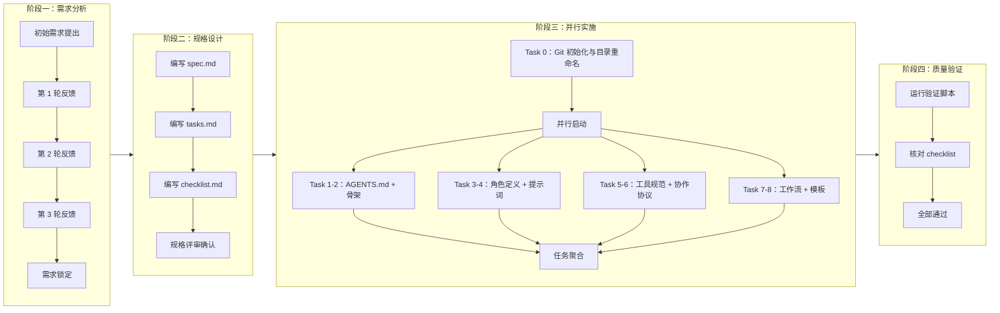
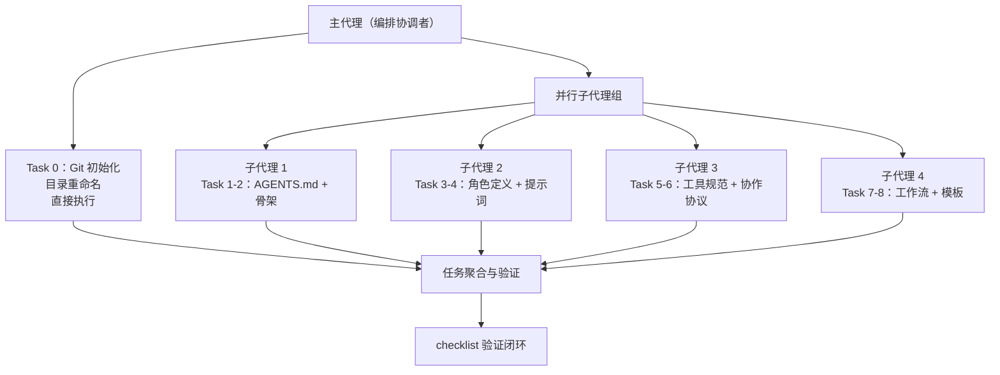

# 二、复盘环节

## 2.1 实施过程回顾

### 完整时间线

### 3 轮需求迭代的演进过程

| 迭代轮次  | 新增需求                             | 影响范围        | 关键决策                                                  |
| ----- | -------------------------------- | ----------- | ----------------------------------------------------- |
| 第 1 轮 | 创建 `AGENTS.md` + `.agents/` 目录   | 核心架构        | 确定"入口 + 容器"的二元架构模式                                    |
| 第 2 轮 | 纳入 Git 版本控制，排除 `libs/` 目录        | 版本控制        | 建立 `.gitignore` 规则体系                                  |
| 第 3 轮 | 重命名 `libs/` → `vendor/`，完善临时依赖管理 | 目录结构 + 流程规范 | 新增 `dependency-management.md` 协议、pre-commit hook、验证脚本 |

## 2.2 关键节点分析

### 2.2.1 需求迭代：3 轮用户反馈如何影响最终方案

3 轮需求迭代体现了渐进式需求澄清的典型模式。初始需求仅聚焦于智能体规范本身（`AGENTS.md` + `.agents/`），随着用户对项目完整性的考虑逐步深入，纳入了 Git 版本控制与临时依赖管理，最终形成了覆盖"规范定义 → 版本控制 → 依赖管理"的完整体系。这一过程确保了最终方案在交付时已充分考虑了工程实践中的各类边界场景。

### 2.2.2 目录重命名：`libs/` → `vendor/` 的决策依据与技术挑战

**决策依据**：`vendor/` 是 Go 语言社区及跨语言项目中被广泛接受的第三方依赖存放目录命名约定，相较于 `libs/`，`vendor/` 具有更强的语义明确性（明确表示"外部引入的依赖"而非"项目自身的库"）。

**技术挑战与解决**：

| 遇到的问题                           | 原因                               | 解决方案                        |
| ------------------------------- | -------------------------------- | --------------------------- |
| `Rename-Item` 报 "Access denied" | 目标目录中的文件被其他进程占用                  | 改用 `Move-Item -Force` 强制移动  |
| `Move-Item` 的 `-NewName` 参数不存在  | PowerShell 版本差异，`-NewName` 非有效参数 | 改用 `-Destination` 参数指定目标路径  |
| `robocopy` 显示 EXTRA 文件          | 目标目录已存在导致差异报告                    | 通过 `Test-Path` 验证实际已成功，排除误报 |
| `cmd /c` 被阻止                    | Windows 安全策略限制                   | 统一改用 PowerShell 原生命令        |

### 2.2.3 Git 配置：`.gitignore` 规则设计、pre-commit hook 方案

**`.gitignore`** **规则设计**：覆盖了 10 类应忽略的路径与文件类型，包括第三方依赖（`vendor/`）、任务中间产物（`.temp/`）、Python 缓存（`__pycache__/`、`*.pyc`）、虚拟环境（`.venv/`、`venv/`）、Node.js 依赖（`node_modules/`）、环境变量（`.env`）、日志（`*.log`）、操作系统文件（`.DS_Store`、`Thumbs.db`）、IDE 文件（`.idea/`）及构建产物（`dist/`、`build/`）。

**pre-commit hook 方案**：在每次提交前自动调用 `check-gitignore.py` 验证脚本，检查暂存区是否包含禁止提交的临时依赖路径，若检测到违规文件则阻止提交并提示修正。

### 2.2.4 并行实施：4 个子代理并行的执行策略与效果

**策略分析**：

- Task 0（Git 初始化与目录重命名）因涉及文件系统操作且可能产生副作用，由主代理直接串行执行，确保环境就绪后再启动并行任务。
- Task 1-8 为纯文档创建任务，相互之间无依赖关系，适合并行执行。
- 4 个子代理同时创建 35 个文件，避免了单代理上下文窗口耗尽的风险，显著提升了执行效率。

### 2.2.5 验证闭环：checklist 驱动的质量保障机制

验证闭环由两层保障构成：

1. **自动化脚本验证**：`check-gitignore.py` 自动检查 `.gitignore` 规则完整性（10 条必需规则）与 `git status` 输出合规性（5 类临时路径）。
2. **人工检查清单核对**：11 个检查类别、60+ 个检查点，逐一核对每个交付物的存在性、完整性与一致性。

两层验证交叉互补，确保零遗漏。

## 2.3 执行情况与结果数据

### 任务执行统计

| 指标    | 数据                             |
| ----- | ------------------------------ |
| 主任务总数 | 9（Task 0-8）                    |
| 子任务总数 | 42                             |
| 完成率   | 100%（42/42）                    |
| 执行模式  | Task 0 串行 + Task 1-8 并行（4 子代理） |

### 任务分布明细

| 任务编号   | 任务名称                                             | 子任务数 | 执行方式    | 状态   |
| ------ | ------------------------------------------------ | ---- | ------- | ---- |
| Task 0 | 初始化 Git、目录重命名、.gitignore 配置、验证脚本、pre-commit hook | 7    | 主代理直接执行 | ✅ 完成 |
| Task 1 | 创建 AGENTS.md 全局契约文件                              | 7    | 子代理并行   | ✅ 完成 |
| Task 2 | 创建 .agents/ 目录骨架与 README.md                      | 2    | 子代理并行   | ✅ 完成 |
| Task 3 | 编写角色定义文件 5 个 + README                            | 6    | 子代理并行   | ✅ 完成 |
| Task 4 | 编写系统提示词与 Few-shot 示例                             | 6    | 子代理并行   | ✅ 完成 |
| Task 5 | 编写工具调用规范                                         | 5    | 子代理并行   | ✅ 完成 |
| Task 6 | 编写协作协议                                           | 5    | 子代理并行   | ✅ 完成 |
| Task 7 | 编写标准工作流                                          | 4    | 子代理并行   | ✅ 完成 |
| Task 8 | 编写模板资产                                           | 3    | 子代理并行   | ✅ 完成 |

### 质量指标

| 指标       | 数据            |
| -------- | ------------- |
| 检查类别数    | 11            |
| 检查点总数    | 60+           |
| 通过率      | 100%（60+/60+） |
| 验证脚本执行结果 | 通过            |
| 零遗漏项     | 确认            |

### 产出统计（按类型）

| 产出类型        | 数量 | 详情                                               |
| ----------- | -- | ------------------------------------------------ |
| 角色定义        | 5  | orchestrator、architect、developer、reviewer、tester |
| 系统提示词       | 5  | 每角色 1 个 system-prompt.md                         |
| Few-shot 示例 | 5  | 每角色 1 个 few-shot.md                              |
| 工具规范        | 4  | 文件操作、代码执行、搜索、通信                                  |
| 协作协议        | 4  | 任务交接、消息传递、冲突解决、临时依赖管理                            |
| 标准工作流       | 3  | 功能开发、代码审查、测试（均含 Mermaid 流程图）                     |
| 模板资产        | 2  | 任务模板、交接模板                                        |
| 说明文档        | 5  | .agents/README + 各子目录 README                     |
| 全局契约        | 1  | AGENTS.md                                        |
| 版本控制        | 2  | .gitignore + pre-commit hook                     |
| 自动化脚本       | 1  | check-gitignore.py                               |

### 角色覆盖矩阵

| 角色           | 定义文件 | 系统提示词 | Few-shot 示例 | 能力边界声明        |
| ------------ | ---- | ----- | ----------- | ------------- |
| orchestrator | ✅    | ✅     | ✅           | AGENTS.md 中定义 |
| architect    | ✅    | ✅     | ✅           | AGENTS.md 中定义 |
| developer    | ✅    | ✅     | ✅           | AGENTS.md 中定义 |
| reviewer     | ✅    | ✅     | ✅           | AGENTS.md 中定义 |
| tester       | ✅    | ✅     | ✅           | AGENTS.md 中定义 |

### 协议覆盖矩阵

| 协议     | 文件                       | 核心内容                       | Mermaid 流程图 |
| ------ | ------------------------ | -------------------------- | ----------- |
| 任务交接   | handoff.md               | YAML 格式、字段定义、交接流程、10 条使用约束 | ✅           |
| 消息传递   | messaging.md             | 消息格式、通信通道、路由规则             | -           |
| 冲突解决   | conflict-resolution.md   | 冲突分类、仲裁流程、升级机制             | -           |
| 临时依赖管理 | dependency-management.md | 存放规范、使用规范、清理机制、禁止提交条款、配套保障 | -           |

### 工作流覆盖矩阵

| 工作流  | 文件                     | 核心内容               | Mermaid 流程图 |
| ---- | ---------------------- | ------------------ | ----------- |
| 功能开发 | feature-development.md | 8 步骤流程、角色参与矩阵、交接协议 | ✅           |
| 代码审查 | code-review\.md        | 6 项检查清单、审查标准、结果处理  | ✅           |
| 测试   | testing.md             | 5 项验收标准、测试报告格式模板   | ✅           |

## 2.4 成功经验

### 2.4.1 Spec-driven 开发流程的有效性

在正式实施前，先编写 `spec.md`（19 个需求、30+ 场景）、`tasks.md`（9 任务/42 子任务）与 `checklist.md`（11 检查类别/60+ 检查点），形成了"规格定义 → 任务分解 → 验证清单"的三层递进结构。这一流程使得实施阶段能够精确执行，避免了需求理解偏差导致的返工。3 轮迭代中，每轮 spec 更新都能精确反映用户意图，实施阶段实现了零返工。

### 2.4.2 并行子代理的高效执行模式

面对 35 个文档文件的大规模创建任务，采用 4 个子代理并行执行的策略，将原本需要串行逐文件创建的过程转化为并行批量产出。这一模式不仅大幅缩短了执行时间，还避免了单代理上下文窗口耗尽的风险，是文档密集型项目中可复用的执行范式。

### 2.4.3 验证闭环的质量保障机制

`check-gitignore.py` 自动化验证脚本与 60+ 检查点的人工核对形成了双重保障。自动化脚本覆盖了可程序化验证的规则（如 `.gitignore` 规则完整性、`git status` 合规性），人工检查清单覆盖了需要语义判断的内容（如文档完整性、角色定义一致性、Mermaid 流程图可渲染性），两者互补，确保了零遗漏的交付质量。

### 2.4.4 迭代式需求澄清的价值

3 轮用户反馈逐步完善了需求范围：从核心的智能体规范体系，到 Git 版本控制集成，再到临时依赖管理的完整闭环。这种渐进式需求澄清避免了"大爆炸式"需求定义带来的风险，每轮反馈都聚焦于当轮增量，使得需求演进过程可控、可追溯。

### 2.4.5 标准化文档体系的可维护性

项目产出的 35 个 `.md` 文件遵循统一的目录结构（按功能分子目录）、统一的命名约定（角色名即目录名）、统一的格式规范（TOML frontmatter + Markdown 正文）。这种标准化使得文档体系易于导航、易于扩展，后续新增角色或协议时可以遵循既有模式无缝集成。

## 2.5 存在问题

### 2.5.1 目录重命名操作受阻（Windows 环境下的文件占用问题）

在 Windows 环境下执行 `libs/` → `vendor/` 目录重命名时，`Rename-Item` 因目标文件被占用而报 "Access denied"。这反映了 Windows 文件锁机制与类 Unix 系统的差异：Windows 下文件被进程打开时默认不允许重命名，而类 Unix 系统通常允许对已打开文件进行重命名操作。

**影响**：增加了操作调试时间，需要多轮尝试不同命令才能找到正确的执行方式。

### 2.5.2 跨平台兼容性不足（chmod 在 Windows 不可用）

在配置 pre-commit hook 时，类 Unix 系统需要 `chmod +x` 赋予可执行权限，但 Windows 下 `chmod` 不可用。实际上，Git for Windows 对 hooks 的执行权限判断与 Unix 不同，不需要可执行位。

**影响**：若未来团队成员在 macOS/Linux 环境下操作，需要额外注意 hooks 权限设置；若脚本中包含平台特定命令，可能在不同环境下执行失败。

### 2.5.3 多轮需求反馈的沟通成本

3 轮需求迭代虽然确保了需求的完整性，但每轮反馈都需要重新更新 `spec.md`、`tasks.md` 与 `checklist.md`。当需求变更涉及多个文件时，确保三者之间的一致性需要额外的人工校验。

**影响**：需求迭代轮次越多，规格文档维护成本越高，需要更高效的变更传播机制。

### 2.5.4 错误处理的经验积累（Move-Item 参数错误、robocopy 误报等）

| 错误类型 | 具体表现                    | 根因                                           |
| ---- | ----------------------- | -------------------------------------------- |
| 参数错误 | `Move-Item -NewName` 无效 | PowerShell 版本差异，`-NewName` 非 Move-Item 的有效参数 |
| 误报   | `robocopy` 显示 EXTRA 文件  | 目标目录已存在导致的差异报告，非实际错误                         |
| 安全阻止 | `cmd /c` 被阻止            | Windows 安全策略限制                               |

**影响**：这些错误在初次遇到时都需要额外的时间定位与解决，且经验未系统化沉淀，后续类似操作可能重复踩坑。

### 2.5.5 文档与代码的一致性维护挑战

`AGENTS.md` 中的角色索引、协议概要、上下文路由表等信息与 `.agents/` 目录下的具体文件内容存在交叉引用关系。当某一方变更时，需要手动确保另一方同步更新，目前缺乏自动化的交叉引用检查机制。

**影响**：随着项目演进，`AGENTS.md` 与 `.agents/` 之间可能出现不一致，导致智能体路由到错误的规范文件或不存在的路径。

---