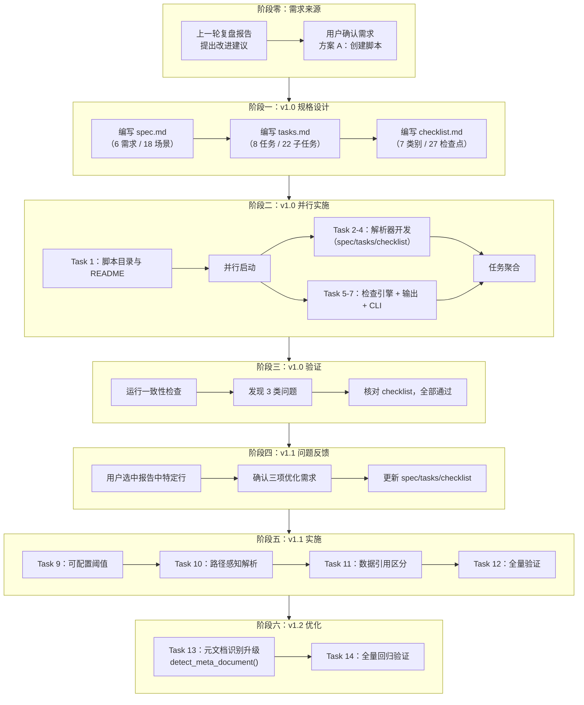

# 执行复盘

## 2.1 实施过程回顾

### 完整时间线

### 三轮迭代的演进过程

| 迭代轮次  | 触发条件                                   | 新增/修改内容                                                                     | 影响范围        | 关键决策                                                  |
| --------- | ------------------------------------------ | --------------------------------------------------------------------------------- | --------------- | --------------------------------------------------------- |
| v1.0      | 复盘报告中的改进建议转化为可执行方案         | 6 个需求、18 个场景、8 个任务、884 行代码                                          | 核心架构        | 确定"解析→检查→输出"的三段式架构                           |
| v1.1      | v1.0 运行后暴露的三类问题                   | 可配置阈值、路径感知解析、数据引用区分；新增 3 个需求、12+ 场景、4 个主任务          | 核心引擎 + 输出 | 每个优化独立设计、独立验证，互不干扰                       |
| v1.2      | v1.1 中关键词检测存在假阳性/假阴性风险       | `detect_meta_document()` 替代 `is_retrospective_context()`；显式标记 + 关键词兜底；新增 2 个主任务、5 个子任务 | 元文档识别引擎 | 显式标记优先，零误判；关键词兜底，向后兼容                 |

## 2.2 关键节点分析

六个关键节点已按v1.0奠基期和v1.1-v1.2迭代优化期拆分为两个原子文件：

| 文件 | 覆盖节点 | 核心主题 |
|------|---------|---------|
| [key-nodes-v1.0.md](key-nodes-v1.0.md) | 2.2.1-2.2.3 | 需求转化→三段式架构→v1.0三类问题暴露 |
| [key-nodes-v1.1-v1.2.md](key-nodes-v1.1-v1.2.md) | 2.2.4-2.2.6 | 三项独立修复→增量+回归验证→元文档识别精确化 |

## 2.3 执行情况与结果数据

### 任务执行统计

| 指标       | v1.0       | v1.1       | v1.2       | 合计         |
| ---------- | ---------- | ---------- | ---------- | ------------ |
| 主任务总数 | 8          | 4          | 2          | 14           |
| 子任务总数 | 22         | 9          | 5          | 36           |
| 完成率     | 100%（22/22） | 100%（9/9） | 100%（5/5） | 100%（36/36） |
| 代码行数   | ~700       | +184       | +66        | ~950         |
| 函数/模块  | 10         | +4         | +2         | 16           |

### 任务分布明细

| 任务编号   | 任务名称                                     | 子任务数 | 执行方式 | 状态   |
| ---------- | -------------------------------------------- | -------- | -------- | ------ |
| Task 1     | 创建脚本目录与 README                        | 2        | 直接执行 | ✅ 完成 |
| Task 2     | 实现 spec.md 解析器                          | 3        | 直接执行 | ✅ 完成 |
| Task 3     | 实现 tasks.md 解析器                         | 2        | 直接执行 | ✅ 完成 |
| Task 4     | 实现 checklist.md 解析器                     | 2        | 直接执行 | ✅ 完成 |
| Task 5     | 实现一致性检查引擎                           | 5        | 直接执行 | ✅ 完成 |
| Task 6     | 实现结构化输出                               | 3        | 直接执行 | ✅ 完成 |
| Task 7     | 实现命令行参数支持                           | 3        | 直接执行 | ✅ 完成 |
| Task 8     | 验证与测试（v1.0）                           | 2        | 直接执行 | ✅ 完成 |
| Task 9     | v1.1 优化 — 可配置语义匹配阈值               | 3        | 直接执行 | ✅ 完成 |
| Task 10    | v1.1 优化 — 路径引用上下文感知解析           | 3        | 直接执行 | ✅ 完成 |
| Task 11    | v1.1 优化 — 自引用/外部引用数据区分          | 3        | 直接执行 | ✅ 完成 |
| Task 12    | v1.1 验证                                   | 2        | 直接执行 | ✅ 完成 |
| Task 13    | v1.2 优化 — 元文档识别升级                  | 5        | 直接执行 | ✅ 完成 |
| Task 14    | v1.2 验证                                   | 3        | 直接执行 | ✅ 完成 |

### 质量指标

| 指标             | v1.0          | v1.1          | v1.2          | 合计          |
| ---------------- | ------------- | ------------- | ------------- | ------------- |
| 检查类别数       | 7             | 3             | 2             | 12            |
| 检查点总数       | 27            | 17            | 10            | 54            |
| 通过率           | 100%（27/27） | 100%（17/17） | 100%（10/10） | 100%（54/54） |
| 支持的 spec 目录 | 4             | 4             | 4             | 4             |

### v1.1 优化效果对比

| 指标                              | v1.0（优化前） | v1.1（优化后） | 变化      |
| --------------------------------- | ------------- | ------------- | --------- |
| create-agents-md-and-config 警告  | 43            | 40            | -3（-7%） |
| retrospective 数据错误            | 4             | 0             | -4（-100%） |
| check-spec-consistency 自身数据错误 | 2             | 0             | -2（-100%） |
| 路径引用误报                      | 若干          | 0             | 消除      |

**关键成果**：数据错误从 6 项归零（100% 消除），警告从 43 降至 40（7% 减少），路径引用误报完全消除。未引入新的错误或警告。

### v1.2 优化效果对比

| 指标                              | v1.1（优化前） | v1.2（优化后） | 变化      |
| --------------------------------- | ------------- | ------------- | --------- |
| 元文档识别方式                    | 纯关键词检测  | 显式标记 + 关键词兜底 | 零误判    |
| 支持关键词数                      | 5             | 14            | +9（+180%） |
| 识别信息维度                      | bool（是/否） | (bool, type, method) | 三维信息  |
| retrospective 显式标记            | 无            | 已添加        | 明确声明  |
| 回归验证（4 spec 目录）            | —             | 行为与 v1.1 一致 | 零回归    |

**关键成果**：元文档识别从"概率性猜测"升级为"确定性声明"，消除假阳性/假阴性风险，同时保持向后兼容。对 4 个 spec 目录回归验证，行为与 v1.1 完全一致，零回归。

## 2.4 成功经验

### 2.4.1 复盘驱动的需求闭环

本项目的需求直接来源于上一轮复盘报告中的改进建议，体现了"复盘→洞察→导出→执行"的完整闭环。这种模式的价值在于：

- **需求有据可查**：每个需求都可以追溯到具体的复盘洞察，而非凭空产生。
- **优先级由分析决定**：复盘报告中的行动计划已按优先级排序，实施时可直接复用。
- **验证有对照基准**：复盘报告中的预期效果（如"降低规格维护的人工成本"）可作为验证标准。

### 2.4.2 零依赖的纯 Python 实现策略

整个脚本仅依赖 Python 标准库（`argparse`、`json`、`re`、`sys`、`pathlib`），无需安装任何第三方包。这一策略的好处：

- **即下即用**：无需 `pip install`，任何有 Python 3.x 的环境均可直接运行。
- **零维护负担**：无第三方依赖版本冲突、安全漏洞、废弃 API 等问题。
- **CI/CD 友好**：集成到 CI 流水线时无需额外安装依赖步骤。

### 2.4.3 正则表达式驱动的 Markdown 解析

解析器使用正则表达式而非第三方 Markdown 解析库（如 `mistune`、`markdown-it-py`）。虽然正则解析 Markdown 的鲁棒性不如专用解析器，但在本项目场景中：

- **结构足够规整**：`spec.md`、`tasks.md`、`checklist.md` 遵循固定的模板格式，正则匹配即可覆盖。
- **性能优势**：正则解析比全量 AST 解析快几个数量级，适合频繁执行的 CI 场景。
- **可读性**：每个正则模式含义明确，易于理解和维护。

### 2.4.4 检查与输出解耦的架构设计

检查引擎函数返回结构化数据（`dict`），输出函数负责渲染。这一设计的优势在 v1.1 优化中得到验证：

- 修改数据一致性检查逻辑（区分自引用/外部引用）时，**无需修改任何输出代码**。
- 新增 JSON 输出模式时，**无需修改任何检查逻辑**。
- 两个维度完全独立演进，符合单一职责原则。

### 2.4.5 增量验证 + 回归验证的双层验证策略

v1.1 的三项优化各自独立验证，全部完成后做回归验证。这一策略避免了"多项优化同时验证，问题难以定位"的困境：

- 优化 1 验证时，可确认警告减少确实来自阈值调整。
- 优化 2 验证时，可确认路径解析修正不引入新的误报。
- 优化 3 验证时，可确认数据错误归零完全是数据引用区分的功劳。
- 回归验证时，可确认三项优化组合后无副作用。

## 2.5 存在问题

### 2.5.1 正则解析的边界 case 脆弱性

当前解析器依赖正则表达式匹配 Markdown 结构，对格式变化敏感：

- 若 `spec.md` 中出现 `### Requirement:` 以外的三级标题（如 `### 设计说明`），解析器不会误匹配（因为正则需要 `Requirement:` 前缀），但若需求标题格式变更（如 `### REQ: XXX`），解析器将完全失效。
- `tasks.md` 解析器依赖 `Task N:` 和 `SubTask N.M:` 的固定命名模式，若任务命名风格变化将失效。
- 数据引用提取的正则 `(\d+)\+?\s*(?:个|条|项|类|份|种|张|个?)\s*([\u4e00-\u9fa5]{2,8})` 覆盖了常见量词，但对"篇"、"组"等量词不支持。

**影响**：规格文档模板格式变更时，脚本可能需要同步更新解析正则。

### 2.5.2 复盘语境检测的误判风险（v1.2 已解决）

~~`is_retrospective_context()` 通过关键词检测判断是否为复盘类 spec，存在两个潜在误判场景：~~

- ~~**假阳性**：非复盘类 spec 中出现了"回顾"一词（如"回顾上一步操作"），将被误判为复盘类，导致数据不一致被降级为警告。~~
- ~~**假阴性**：复盘类 spec 中未使用"复盘"、"回顾"等关键词（如使用"项目总结"、"经验分析"），将不被识别为复盘类，导致外部引用数据被报告为错误。~~

**v1.2 解决方案**：`detect_meta_document()` 替代 `is_retrospective_context()`，实现"显式标记优先 + 关键词兜底"双层策略。显式标记（`<!-- meta_type: retrospective -->`）实现零误判，关键词扩展至 14 个降低假阴性风险。已为 `retrospective-agents-spec-system/spec.md` 添加显式标记。此问题已在 v1.2 中关闭。

### 2.5.3 路径前缀白名单的维护成本

`PROJECT_ROOT_PREFIXES = [".agents/", "vendor/", ".trae/", "docs/"]` 需要与项目目录结构保持同步。若新增一个以项目根目录为基准的顶级目录（如 `tools/`），需手动更新白名单。

**影响**：项目目录结构变更时，若未同步更新白名单，将导致路径解析错误。

### 2.5.4 需求变更检测功能未实现

spec.md 中定义了 `Requirement: 需求变更检测`（支持对比两个版本的 spec.md，通过 git diff 检测变更），但该功能在 v1.0 和 v1.1 中均未实现。当前脚本仅检查"当前状态"的一致性，不检查"变更影响"。

**影响**：用户在修改 spec.md 后，仍需手动判断哪些 tasks.md 和 checklist.md 条目需要同步更新。

### 2.5.5 语义匹配的精度局限

当前语义匹配基于关键词交集，是一种"词袋模型"（bag-of-words），不具备真正的语义理解能力：

- 同义词无法匹配：如"创建"与"生成"、"检查"与"验证"。
- 词序信息丢失：如"需求→任务覆盖"与"任务→需求覆盖"被同等对待。
- 否定语义无法识别：如"不需要"与"需要"如果关键词相同会匹配。

**影响**：在关键词数量较少的中文短文本场景中，匹配精度受限。`--match-threshold` 参数只是降低/提高匹配门槛，并未解决匹配精度本身的问题。