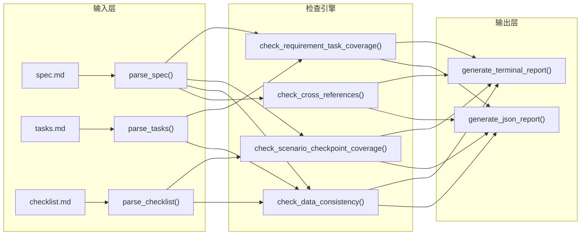

# 关键节点分析 v1.0 奠基期

### 2.2.1 需求来源：从"复盘洞察"到"可执行方案"的转化

本项目的需求不来自于用户直接指令，而来自于上一轮复盘报告中的洞察建议——"开发 `check-spec-consistency.py` 脚本"。用户通过选中报告中特定行确认了方案 A（创建脚本），标志着需求从"建议"转化为"待执行任务"。

这一需求来源模式体现了复盘→洞察→导出的闭环价值：复盘不仅总结过去，更直接驱动了后续改进。

### 2.2.2 v1.0 架构设计：三段式解析→检查→输出

**设计决策**：

- **解析器独立**：三个解析器（`parse_spec`、`parse_tasks`、`parse_checklist`）各自独立，返回统一的 `dict` 结构，便于后续扩展（如新增 `design.md` 解析器）。
- **检查引擎与输出解耦**：检查函数返回结构化数据（`dict`），输出函数负责格式化渲染。这种分离使得 JSON 输出模式与终端彩色输出模式共用同一套检查逻辑。
- **正则驱动的解析策略**：所有解析器使用正则表达式匹配 Markdown 结构（标题层级、列表项、task list），无需引入第三方 Markdown 解析库，保持零依赖。

### 2.2.3 v1.0 运行暴露的三类问题

v1.0 完成后，对 4 个现有 spec 目录执行检查，暴露出三类问题：

| 问题类型              | 具体表现                                                       | 根因分析                                                       | 影响范围            |
| --------------------- | ------------------------------------------------------------- | ------------------------------------------------------------- | ------------------- |
| 语义匹配阈值固定      | `create-agents-md-and-config` 中 43 条需求未覆盖警告            | 固定阈值 2 导致中文短文本（如"需求：角色定义体系" vs "任务：编写角色定义文件"）仅 1 个共同关键词时无法匹配 | 需求→任务覆盖检查    |
| 路径引用基准错误      | spec 中 `protocols/handoff.md` 被解析为项目根目录路径，文件不存在 | 所有相对路径统一以项目根目录为基准解析，忽略了 spec 文档自身的上下文 | 交叉引用有效性检查   |
| 复盘类数据误报        | `retrospective-agents-spec-system` 中 4 条数据不一致错误       | 复盘类 spec 中引用的是被复盘项目的数据（如"39 个交付物"），而非自身数据 | 数据引用一致性检查   |

这三类问题的共同特征是：**v1.0 的检查逻辑过于"一刀切"，缺乏对上下文语义的感知能力**——阈值固定导致匹配僵化，路径基准统一导致误报，数据引用不区分来源导致错误归类。
