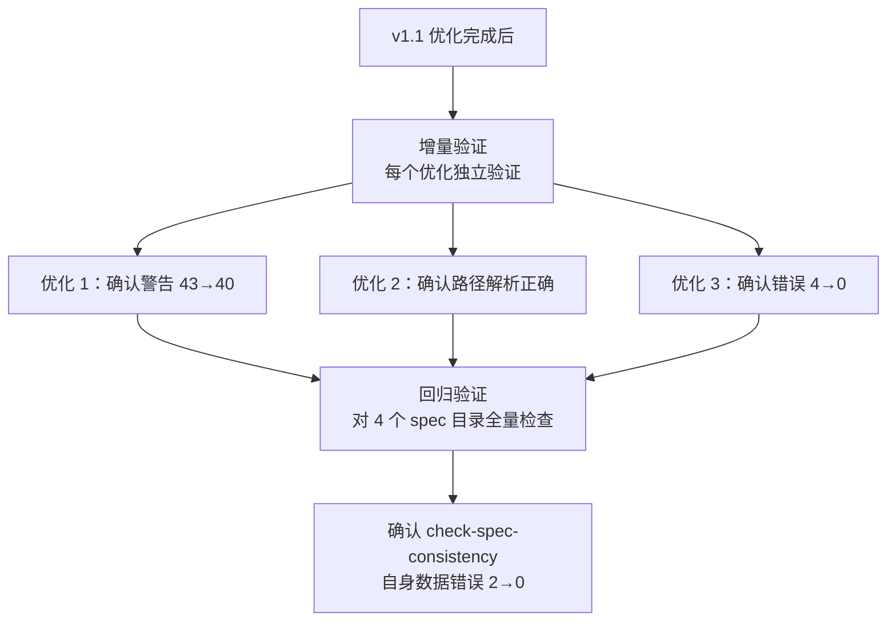

# 关键节点分析 v1.1-v1.2 迭代优化

### 2.2.4 v1.1 优化：三项独立的修复策略

**优化 1：可配置语义匹配阈值**

```python
# 修改前（v1.0）：固定阈值 2
def semantic_match(source_text, target_text, min_matches=2):
    ...
    return len(common) >= min_matches

# 修改后（v1.1）：默认阈值 1，可通过 --match-threshold 调整
def semantic_match(source_text, target_text, min_matches=1):
    ...
    return len(common) >= min_matches
```

**设计考量**：阈值设为 1 而非 0，保留最低限度的语义匹配要求，避免"空关键词"匹配。同时保留 `--match-threshold` 参数，允许用户按需调整为更严格的匹配策略。

**优化 2：路径引用上下文感知解析**

```python
# 以项目根目录为基准解析的路径前缀
PROJECT_ROOT_PREFIXES = [".agents/", "vendor/", ".trae/", "docs/"]

def resolve_path(ref, spec_dir, project_root):
    for prefix in PROJECT_ROOT_PREFIXES:
        if ref.startswith(prefix):
            return project_root / ref  # 项目根目录前缀 → 以根目录解析
    return spec_dir / ref              # 其他相对路径 → 以 spec 所在目录解析
```

**设计考量**：未采用"所有路径都从 spec 目录解析"的简单方案，因为 spec 中确实存在引用项目根目录路径的需求（如 `.agents/protocols/handoff.md`）。通过前缀白名单机制，在两种解析策略之间取得平衡。

**优化 3：自引用/外部引用数据区分**

```python
_RETROSPECTIVE_KEYWORDS = ['复盘', '回顾', '被复盘', 'retrospective', '回顾分析']

def is_retrospective_context(spec_text):
    return any(kw in spec_text for kw in _RETROSPECTIVE_KEYWORDS)

def check_data_consistency(..., is_retrospective=False):
    ...
    if is_retrospective:
        warnings.append(...)  # 外部引用 → 警告
    else:
        inconsistent.append(...)  # 自引用 → 错误
```

**设计考量**：采用关键词检测而非显式标记（如 YAML frontmatter 中的 `type: retrospective`），因为关键词检测对现有 spec 文档零侵入，无需修改已有 spec 文件。后续可演进为显式标记方案。

### 2.2.5 验证策略：增量验证 + 回归验证



验证策略体现了"先局部后整体"的思路：每项优化完成时先做增量验证，全部完成后做回归验证，确保新优化不引入新问题。

### 2.2.6 v1.2 优化：元文档识别从"猜测"到"精确"

v1.1 中，`is_retrospective_context()` 通过关键词检测判断是否为复盘类 spec，存在两个潜在误判场景：

- **假阳性**：非复盘类 spec 中出现"回顾"一词，被误判为复盘类，导致数据不一致被降级为警告。
- **假阴性**：复盘类 spec 使用"项目总结"、"经验分析"等非关键词，不被识别。

v1.2 将识别策略升级为"显式标记优先 + 关键词兜底"双层机制：

```python
# v1.1：纯关键词检测
_RETROSPECTIVE_KEYWORDS = ['复盘', '回顾', '被复盘', 'retrospective', '回顾分析']

def is_retrospective_context(spec_text):
    return any(kw in spec_text for kw in _RETROSPECTIVE_KEYWORDS)

# v1.2：显式标记优先 + 关键词兜底
_META_KEYWORDS = ['复盘', '回顾', '审计', '评审', '评估',
                  '对比分析', '迁移方案', '被复盘', 'retrospective',
                  '回顾分析', 'audit', 'review', 'assessment', 'evaluation']

def detect_meta_document(spec_text):
    # 1. 显式标记优先（零误判）
    m = re.search(r'<!--\s*meta_type:\s*(\w+)\s*-->', spec_text)
    if m:
        return (True, m.group(1), "explicit")
    # 2. 关键词兜底（向后兼容）
    for kw in _META_KEYWORDS:
        if kw in spec_text:
            return (True, "keyword_detected", "keyword")
    return (False, "none", "none")
```

**设计考量**：

- 返回值从 `bool` 扩展为 `(bool, str, str)` 三元组，同时提供"是否为元文档"、"元文档类型"、"检测方法"三个维度信息。
- 关键词从 5 个扩展至 14 个，覆盖审计、评审、评估、对比分析、迁移方案等更广泛的元文档场景。
- 显式标记 `<!-- meta_type: retrospective -->` 采用 HTML 注释格式，对 Markdown 渲染零影响，且不会被普通文本误匹配。
- 为 `retrospective-agents-spec-system/spec.md` 添加显式标记，使该 spec 的元文档属性从"猜测"变为"明确声明"。
