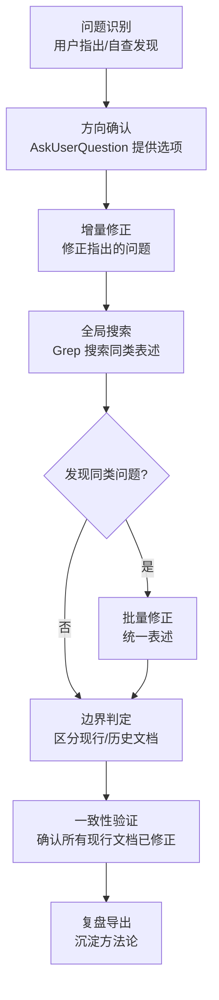

# 洞察萃取

## 3.1 关键发现

1. **技术文档的事实性是不可妥协的底线**

   **支撑事实**：本次修正的 4 处描述中，"30+"数字均无明确出处，"被工具识别与遵循"均存在概念混淆。技术文档与营销文档的本质区别在于：技术文档的每个事实陈述都必须可追溯、可验证。

   **深层含义**：文档质量不仅是"无错别字、链接有效"，更是"事实准确、措辞客观"。文档质量检查应包含事实性验证维度。

2. **"修正一处 → 搜索同类"是文档一致性的核心保障**

   **支撑事实**：本次修正中，用户仅指出 1 处问题，但实际存在 4 处同类问题。通过 Grep 全局搜索，才发现并修正了其余 3 处。

   **深层含义**：文档中的表述往往不是孤立的，同一表述会在多处复用。修正任何一处表述后，必须全局搜索同类问题，否则会破坏一致性。

3. **"基于标准构建"与"被工具识别遵循"是本质不同的概念**

   **支撑事实**：本项目是"基于 AGENTS.md 开放标准构建"的自有规范体系，而被工具识别与遵循的是 AGENTS.md 标准本身。两者是"实现"与"被实现"的关系，不可混为一谈。

   **深层含义**：在描述项目定位时，必须明确区分"项目自身"与"项目所基于的标准"，避免将标准的属性误归为项目的属性。

4. **历史文档是时间快照，不应追溯修改**

   **支撑事实**：task-summaries 与 .trae/specs 下的文档记录的是当时的工作过程与成果，即使其中包含现在看来不恰当的表述，也不应修改。

   **深层含义**：历史文档的价值在于"真实记录当时的状态"，而非"保持与现行文档一致"。修改历史文档会破坏其作为时间快照的参考价值。

## 3.2 规律认知

提炼通用方法论：**事实表述一致性闭环**

**核心要素**：

- **问题识别**：可以是用户指出，也可以是自查发现
- **方向确认**：提供明确选项，避免开放式讨论
- **增量修正**：先修正已识别的问题
- **全局搜索**：使用关键词搜索同类表述
- **边界判定**：区分现行文档（修正）与历史文档（保留）
- **一致性验证**：确认所有现行文档已统一

**适用场景**：任何涉及多处表述的文档修正任务，包括但不限于：事实性修正、命名规范统一、术语一致性调整。

## 3.3 潜在机会

1. **文档事实性检查工具**：可开发自动化工具，扫描文档中的数字声明（如"30+"、"100+"），检查是否有出处标注。

2. **表述一致性检查工具**：可扩展 check-links.py，增加"表述一致性检查"功能，扫描同一表述在不同文件中的用法是否一致。

3. **文档质量维度扩展**：现有文档质量检查主要关注"链接有效性"与"路径有效性"，可扩展"事实准确性"与"措辞客观性"维度。