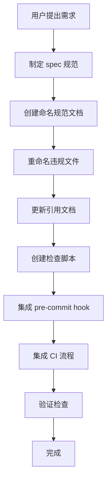

# 二、复盘环节

## 2.1 实施过程回顾

## 2.2 关键节点分析

| 关键节点 | 决策依据 | 技术挑战 | 解决方案 |
|---------|---------|---------|---------|
| 规范制定 | 解决中英文混合命名问题 | 需要定义清晰的规则 | 参考行业最佳实践，制定 kebab-case 规范 |
| 文件重命名 | 修复现有违规文件 | 需同步更新所有引用 | 使用 Grep 搜索所有引用并逐一更新 |
| 检查脚本 | 防止未来违规 | 需要覆盖多种违规场景 | 实现非 ASCII 字符检测、Windows 保留名称检查等 |
| CI 集成 | 自动化验证 | 需要无缝集成到现有流程 | 修改 ci-check.ps1 添加新检查步骤 |

## 2.3 执行情况与结果数据

| 指标 | 目标 | 实际完成 |
|------|------|---------|
| 规范文档创建 | 1 份 | ✅ 1 份 |
| 违规文件修复 | 1 个 | ✅ 1 个 |
| 引用更新数量 | 6 处 | ✅ 6 处 |
| 检查脚本创建 | 1 个 | ✅ 1 个 |
| 验证通过 | 全部通过 | ✅ 全部通过 |

## 2.4 成功经验

1. **规范先行**：先制定明确的规范文档，再进行实施，确保所有操作有章可循
2. **全局搜索引用**：使用 Grep 工具全面搜索所有引用，避免遗漏
3. **自动化检查**：创建检查脚本并集成到 CI，从根本上防止问题复发
4. **验证闭环**：实施完成后运行检查脚本验证，确保效果

## 2.5 存在问题

1. **跨平台兼容考虑不足**：脚本开发初期未考虑 Windows 特殊文件名限制
2. **规范文档层级问题**：spec.md 和 rules/file-naming-convention.md 内容有重复
3. **缺少版本控制**：规范文档未建立版本更新机制

---