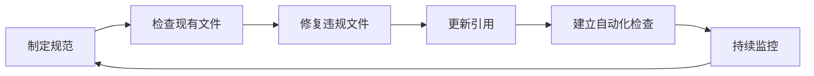

# 三、洞察环节

## 3.1 关键发现

1. **现象**：单一文件名混合中英文会导致跨平台问题和搜索不一致
   **深层洞察**：文件名是系统最基础的标识，必须保持纯粹性和一致性，中英文混合本质上是命名空间的冲突

2. **现象**：通过自动化脚本 + pre-commit hook + CI 三重保障，有效防止违规
   **深层洞察**：治理规则的执行必须从"人工审查"向"自动化拦截"转变，单一环节的检查无法完全杜绝问题

3. **现象**：重命名后需要同步更新多个引用文档
   **深层洞察**：文件命名是网状依赖的起点，任何命名变更都会引发级联更新，需要建立变更追踪机制

## 3.2 规律认知

**命名治理闭环模型**：

**核心原则**：
- **预防优于修复**：通过自动化检查在提交阶段拦截违规
- **规范即代码**：将命名规范作为可执行的规则，而非纯文档
- **变更即传播**：任何命名变更必须同步更新所有引用

## 3.3 潜在机会

1. **跨项目复用**：命名规范可作为模板推广到其他项目
2. **扩展检查范围**：当前脚本仅检查文件名，可扩展至目录命名、变量命名等
3. **智能修复**：开发自动修复功能，对部分违规（如空格）自动转换
4. **规范版本化**：建立规范更新流程和版本历史

---