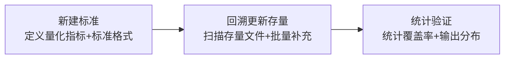
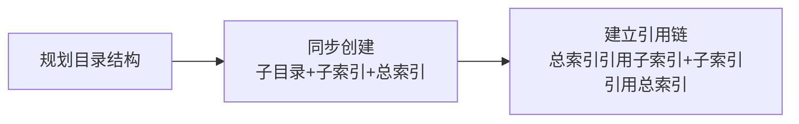

# 三、洞察萃取

## 3.1 洞察提炼

### 洞察 1：总索引缺失是系统性遗漏

**现象**：patterns 目录长期无 README.md 总索引，本次创建补全。

**深层洞察**：建立目录体系时应遵循「总索引优先」原则，总索引应与子目录同步创建，而非事后补全。

**可复用价值**：建立总索引优先原则模式。

### 洞察 2：标准建立 = 新建 + 回溯更新

**现象**：本次仅更新 6 个新模式文件，存量模式文件尚未补充量化字段。

**深层洞察**：建立新标准后，必须回溯更新存量数据，否则统计数据不完整。**标准建立不仅是新建，还需回溯更新**。

**可复用价值**：建立标准建立+回溯更新模式。

### 洞察 3：frontmatter 字段标准化是自动化前提

**现象**：统一 frontmatter 格式后，可编写脚本自动统计模式库成熟度分布。

**深层洞察**：标准化格式是自动化统计的前提，格式统一后可实现：
- 自动统计各成熟度等级模式数量
- 自动识别待升级模式
- 自动生成成熟度分布报告

**可复用价值**：为后续自动化脚本奠定基础。

### 洞察 4：成熟度升级路径是动态过程

**现象**：L1→L2→L3→L4 的升级路径需要持续追踪验证次数和复用次数。

**深层洞察**：成熟度不是静态标签，而是动态升级过程。建议在复盘报告中增加「模式成熟度更新」章节，持续追踪。

**可复用价值**：建立成熟度持续追踪机制。

## 3.2 可复用模式萃取

### 模式 1：标准建立+回溯更新（standard-creation-with-backfill）

| 属性 | 值 |
|------|-----|
| 类型 | 方法论模式 |
| 成熟度 | L1 实验性 |
| 适用场景 | 建立新的 frontmatter 字段标准、建立新的分类体系 |

**核心规则**：建立新标准后，必须回溯更新存量数据，否则统计数据不完整。

**操作流程**：

### 模式 2：总索引优先原则（total-index-first）

| 属性 | 值 |
|------|-----|
| 类型 | 架构模式 |
| 成熟度 | L1 实验性 |
| 适用场景 | 新建多层级目录体系 |

**核心规则**：建立目录体系时，总索引文件应与子目录同步创建，而非事后补全。

**操作流程**：

---