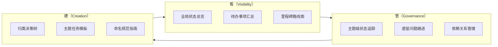

# 洞察萃取

## 3.1 关键发现

### 3.1.1 三层结构覆盖完整生命周期

构建任务看板体系时，发现单一层级的看板无法同时满足"看全局状态"和"指导新建 spec"两个需求。三层结构形成完整闭环：

| 层级 | 回答的问题 | 服务的场景 |
|---|---|---|
| 全局看板 | "项目整体进度如何？下一步做什么？" | 项目管理、优先级决策 |
| 主题看板 | "这个主题内有哪些 spec？状态如何？" | 主题级进度追踪、遗留跟进 |
| 主题模板 | "如何在这个主题下新建 spec？" | 新 spec 创建、任务编写 |

**关键洞察**：看板系统设计必须覆盖"看→管→建"三个动作，缺一不可。只看不管=信息摆设，只管不看=盲目执行，只建不看=无序扩张。

### 3.1.2 状态可视化暴露了隐藏的阻塞

在统计 spec 完成度时，发现 29 个 spec 中有 3 个存在未完成项，其中 2 个 spec 的 tasks.md 完全没有任务条目。这些阻塞在分类前是隐藏的（散落在各自目录中），通过看板聚合后才暴露：

| 隐藏问题 | 发现方式 | 暴露后的价值 |
|---|---|---|
| spec-standards-enhancement 有 3 个待办 | Grep 统计 `- [x]` 和 `- [ ]` | 明确了具体待办内容和优先级 |
| 2 个 spec 无 tasks.md | 完成度统计时发现 0% | 识别出阻塞原因和前置条件 |

**关键洞察**：状态聚合本身就是一种诊断工具。分散的状态信息一旦聚合可视化，会自然暴露异常（0% 完成率、长期进行中等），这些异常往往是项目健康度的关键信号。

### 3.1.3 归类决策树降低分类认知负担

7 个主题的边界虽然明确，但新建 spec 时仍需要判断归属。通过 Mermaid 决策树将判断流程显式化：

```
新 Spec → 从零创建核心基础设施？ → 是 → core-foundation
                                    → 否 → 角色扩展或治理规则？ → 是 → roles-governance
                                    → 否 → ...
```

**关键洞察**：分类系统的可用性取决于"新成员能否快速正确分类"。显式决策树比"理解边界定义后自行判断"更可靠，因为它将隐性知识转化为显式流程。

### 3.1.4 模板收尾任务形成自维护闭环

每个主题模板的最后一个任务统一要求"在主题 README.md 中登记完成状态"，这一设计使看板具备自我维护能力：

```
使用模板创建新 spec → 执行任务 → 最后一步更新主题看板 → 全局看板同步
```

**关键洞察**：文档体系的可持续性取决于"维护动作是否嵌入工作流"。如果维护是额外动作（如"记得更新看板"），很容易被遗忘；如果维护是工作流的最后一步（如 Task N+1），则自然完成。

## 3.2 规律认知

### 3.2.1 看板体系的"看-管-建"三动作模型

从本次实践中提炼出看板体系的通用模型：



**规律**：任何文档/任务管理体系的完整设计都应覆盖这三个动作。缺少"看"则不透明，缺少"管"则失控，缺少"建"则无法持续扩展。

### 3.2.2 需求澄清的递进式策略

两次 AskUserQuestion 的成功应用，提炼出需求澄清的递进式策略：

| 澄清轮次 | 目标 | 问题特征 | 示例 |
|---|---|---|---|
| 第一轮 | 确定方案规模 | 选项互斥、影响范围大 | "三层 vs 单层" |
| 第二轮 | 确定实施细节 | 选项互补、影响实施方式 | "静态 vs 动态"、"立即 vs 仅记录" |

**规律**：需求澄清应"先粗后细"。第一轮确定方向后，用户对方案有了更清晰的认识，第二轮的问题更容易回答。避免一次性问太多导致决策疲劳。

### 3.2.3 并行创建的前提条件判断

本次成功并行创建了 16 个文件，前提是判断了文件间的依赖关系：

| 条件 | 是否可并行 | 示例 |
|---|---|---|
| 文件间无内容引用 | ✅ 可并行 | 7 个主题 README 互相独立 |
| 文件间有引用但被引用方已存在 | ✅ 可并行 | 主题 README 引用根目录 README（已先创建） |
| 文件间有双向引用 | ❌ 需串行 | 根目录 README 引用主题 README（需先创建主题 README） |

**规律**：并行创建的前提不是"文件间完全无关系"，而是"被依赖方先创建"。先创建被引用的基础文件，再并行创建引用方。

## 3.3 可复用模式

### 模式 1：三层看板体系架构

```yaml
模式名称: 三层看板体系架构
成熟度: L3（已验证可复用）
适用场景: 任何需要"状态追踪+创建指导"的文档/任务管理体系
结构:
  - 第一层_全局看板:
      位置: 根目录 README
      内容: [状态总览表, 待办汇总, 里程碑路线图, 跨主题依赖图, 归类决策树]
  - 第二层_主题看板:
      位置: 各主题目录 README
      内容: [主题状态表, 主题路线图, 遗留跟进, 边界判定, 新增指南]
  - 第三层_创建模板:
      位置: 模板目录
      内容: [Task 0 前置验证, Task 1-N 核心实施, Task N+1 验证收尾, 依赖说明]
闭环机制: 模板收尾任务要求更新主题看板，主题看板汇总到全局看板
```

**复用条件**：
- 文档/任务数量 ≥ 10（少量文档无需三层结构）
- 存在明确的主题分类
- 需要支持持续新增（非一次性项目）

### 模式 2：递进式需求澄清

```yaml
模式名称: 递进式需求澄清
成熟度: L2（已验证有效，待更多场景验证）
适用场景: 方案有多种实施路径，需要用户决策
流程:
  - 第一轮: 确定方案规模/方向（选项互斥）
  - 第二轮: 确定实施细节/约束（选项互补）
原则:
  - 先粗后细: 第一轮定方向，第二轮定细节
  - 选项互斥: 第一轮选项不能同时选择
  - 附带推荐: 每个选项附带说明，降低理解成本
工具: AskUserQuestion（支持多选/单选、附带说明）
```

**复用条件**：
- 方案有 2 种以上实施路径
- 用户对方案细节可能有偏好
- 细节选择会影响实施方式

### 模式 3：Mermaid 图表的分层可视化

```yaml
模式名称: Mermaid 分层可视化
成熟度: L3（已验证可复用）
适用场景: 复杂关系结构需要可视化表达
分层策略:
  - 时间维度: timeline（里程碑路线图）
  - 决策维度: flowchart 决策树（归类判断）
  - 依赖维度: flowchart 依赖图（前置关系）
  - 流程维度: flowchart 路线图（执行顺序）
原则:
  - 一图一义: 每个图表只表达一种关系类型
  - 分层独立: 不同层级的图表分开绘制，不混合
  - 状态标注: 用颜色/填充区分状态（✅完成/🔧进行中/📋待启动）
```

**复用条件**：
- 系统包含多种关系类型（时间、依赖、决策、流程）
- 单一图表无法清晰表达所有关系
- 读者需要快速理解不同维度的信息

### 模式 4：模板收尾任务的自维护闭环

```yaml
模式名称: 模板收尾自维护闭环
成熟度: L2（已验证有效，待长期使用验证）
适用场景: 任何需要持续更新索引/看板的模板体系
实现方式:
  - 模板最后一个任务: "在对应索引/看板中登记完成状态"
  - 子任务: "更新主题看板状态表"
  - 子任务: "更新全局看板统计"
闭环路径: 使用模板创建 → 执行任务 → 最后一步更新看板 → 看板自动同步
价值: 将"额外维护动作"转化为"工作流内置步骤"，避免看板失同步
```

**复用条件**：
- 模板用于持续创建新内容
- 新内容需要在索引/看板中登记
- 维护动作容易被遗忘

## 3.4 潜在机会

### 3.4.1 动态状态统计脚本

当前静态手动维护状态，未来可开发 PowerShell 脚本自动扫描所有 tasks.md，统计 `- [x]` 和 `- [ ]` 数量，自动生成状态总览表。这将消除手动维护成本，但需要权衡"引入脚本依赖"与"维护成本"的取舍。

### 3.4.2 主题模板的参数化生成

7 个主题模板的结构高度相似，未来可设计参数化模板生成器：输入主题名称和特色检查项，自动生成完整的 tasks.md 模板。这将降低模板维护成本，但需要先积累更多主题的使用反馈。

### 3.4.3 看板与 CI 的集成

未来可将看板的状态统计集成到 CI 检查流程：每次 PR 合并后自动更新看板状态，或在看板与实际状态不一致时发出警告。这将实现看板的实时性，但需要投入脚本开发成本。

### 3.4.4 跨项目看板复用

三层看板体系架构（模式 1）具有通用性，可复用到其他需要"状态追踪+创建指导"的项目中。特别是 SpecWeave 的 .agents/ 目录、docs/ 目录等，都可应用相同的三层结构。
