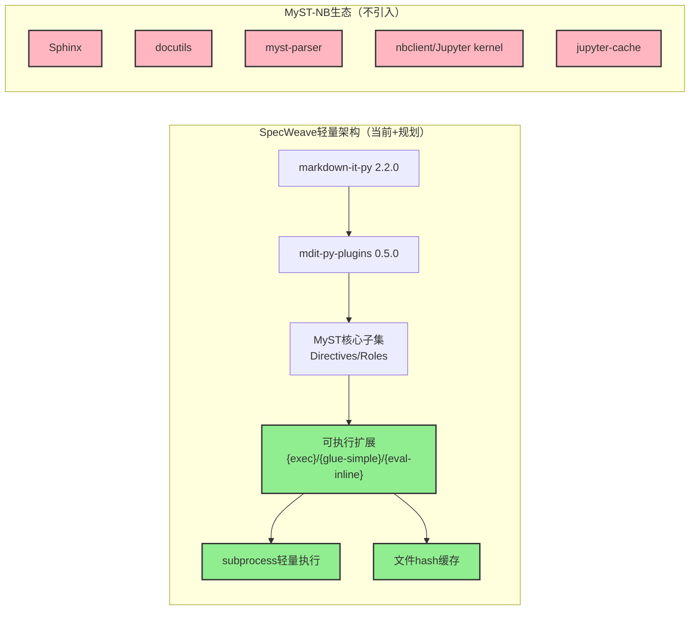

## 5. 架构兼容性分析

### 5.1 mdit-py-plugins生态兼容性

当前项目依赖：
- **markdown-it-py 2.2.0**：CommonMark解析引擎，提供插件化架构
- **mdit-py-plugins 0.5.0**：官方插件集合，包含colon_fence、front_matter、tasklists等

**插件可用性评估：**

| 插件 | 当前状态 | 价值评估 | 建议 |
|---|---|---|---|
| `front_matter_plugin` | 已启用 | 解析YAML frontmatter，核心依赖 | 保持启用 |
| `tasklists_plugin` | 已启用 | 支持任务列表`- [ ]`，SKILL文档可能使用 | 保持启用 |
| `colon_fence_plugin` | 未启用 | 支持`:::`冒号围栏，MyST核心特性 | **推荐启用**（平衡方案） |
| `dollarmath_plugin` | 未启用 | 支持`$...$`数学公式 | 低优先级，按需启用 |
| `amsmath_plugin` | 未启用 | 更复杂的数学公式支持 | 不建议，非核心场景 |
| `container_plugin` | 未启用 | 通用容器块（类似:::{name}） | 可替代colon_fence部分功能，但colon_fence更标准 |
| `deflist_plugin` | 未启用 | 定义列表 | 低优先级，表格已可替代 |

**colon_fence插件技术细节：**

mdit-py-plugins 0.5.0中的`colon_fence`插件实现了与反引号围栏对称的冒号围栏解析：
- 起始`:::`+可选信息字符串，结束`:::`
- 支持可变长度（3-7个冒号），与反引号围栏嵌套规则一致
- 生成的token类型为`fence`，与反引号围栏相同，仅`markup`字段为`:::`而非`` ``` ``
- 这意味着现有的fence处理逻辑可以复用，只需在识别Directive时同时检查两种markup

**架构影响评估：**

启用colon_fence对现有架构的冲击极小：
1. 插件在解析器初始化时注册（第171-172行附近添加一行）
2. 现有fence处理逻辑（第377-421行）只需修改围栏标记的判断条件，从"检查是否为`` ``` ``"改为"检查是否为`` ``` ``或`:::`"
3. token结构保持一致，下游处理逻辑（_parse_directive_content、接口提取等）无需感知围栏类型差异
4. 性能影响可忽略，colon_fence插件经过优化，仅在遇到`:::`时触发

这是一个风险极低、收益明确的架构变更。

### 5.2 关于"不引入完整myst-parser"决策的评估

项目现有决策是"不引入完整myst-parser"，本报告对此决策持支持态度，但需说明其权衡：

**支持该决策的理由：**

1. **依赖轻量化**：markdown-it-py（约2000行代码）+ mdit-py-plugins（约1500行代码）总代码量远小于myst-parser（约10000+行）+ 其依赖链，更易审计和定制
2. **领域聚焦**：Agent Spec不需要MyST的全部特性（如学术引用、Sphinx互操作、复杂数学），用不上的能力就是负担
3. **性能可控**：当前解析器针对Spec场景优化，性能优先；引入myst-parser会带来不必要的性能开销
4. **AST稳定性**：自定义解析器完全控制AST结构，下游代码生成器、验证器可以依赖稳定的输出；myst-parser的AST可能随版本变化
5. **调试友好**：代码量小意味着出问题时更容易定位和修复，不需要深入理解myst-parser的复杂内部机制

**该决策的代价：**

1. **特性缺口需自行实现**：Roles解析、YAML选项等特性需要自己开发，而不是直接复用myst-parser
2. **生态兼容性有限**：无法直接使用myst-parser生态的第三方扩展
3. **标准对齐成本**：若MyST标准演进，自行跟进需要投入人力
4. **潜在重复劳动**：部分基础功能（如嵌套解析）需要重新发明轮子

**决策结论：** 在SpecWeave当前阶段（66份文档，Directive使用率0%，项目聚焦Agent Spec领域），不引入完整myst-parser的决策是合理的，符合YAGNI（You Ain't Gonna Need It）原则。但若未来出现以下情况，应重新评估：
- 文档量增长到500+份，且MyST特性需求显著增加
- 需要与Sphinx/Jupyter Book/MyST生态工具深度集成
- 团队有充足的基础设施人力投入
- 自定义维护成本超过myst-parser的学习和适配成本

建议采用"观察+准备"策略：保持当前架构，但在代码结构上做好与myst-parser兼容的准备（如封装解析器入口、AST访问层抽象），若未来需要切换，降低迁移成本。

### 5.3 MyST-NB架构依赖分析与决策

#### 5.3.1 MyST-NB作为Sphinx扩展的架构特征

MyST-NB是Executable Books项目开发的Sphinx/docutils扩展，不同于基于markdown-it-py的轻量解析，MyST-NB的架构建立在完整的Sphinx生态之上：

**MyST-NB核心依赖链：**

| 依赖包 | 作用 | 代码量级估计 |
|---|---|---|
| Sphinx | 文档构建引擎，提供docutils AST、扩展机制、构建流水线 | ~50,000+行 |
| docutils | 底层文档处理框架，定义reST/MyST的节点模型 | ~30,000+行 |
| myst-parser | Sphinx的MyST Markdown解析器 | ~10,000+行 |
| nbclient | Jupyter notebook执行客户端，管理kernel生命周期 | ~5,000+行 |
| nbformat | Jupyter notebook格式处理 | ~3,000+行 |
| jupyter-cache | Notebook执行结果缓存，避免重复执行 | ~4,000+行 |
| ipykernel/ipython | Python Jupyter kernel（如需执行Python代码） | ~20,000+行 |

**依赖总计：** 直接和间接依赖超过30+个Python包，总代码量12万行以上，这还不包括各语言Jupyter kernel的依赖。

#### 5.3.2 与当前轻量架构的冲突点

MyST-NB的重依赖架构与SpecWeave当前的轻量解析器架构存在根本性冲突：

1. **架构范式冲突**：MyST-NB面向"文档构建"范式（Sphinx build流程），而SpecWeave当前面向"运行时解析"范式（Agent实时读取文档获取结构化信息）
2. **依赖重量冲突**：当前markdown-it-py + mdit-py-plugins总代码量约3500行，引入MyST-NB会增加约30倍依赖重量
3. **执行模型冲突**：MyST-NB依赖Jupyter kernel（长驻进程、通信协议），而SpecWeave需要轻量、快速、隔离的代码执行
4. **缓存机制冲突**：jupyter-cache设计为跨构建会话缓存notebook执行结果，而SpecWeave可能需要更简单的文件hash缓存
5. **格式复杂度冲突**：text-based notebook的`+++`分隔符、frontmatter kernelspec等增加了格式复杂度，SpecWeave不需要完整notebook语义

#### 5.3.3 "灵感借鉴而非直接引入"策略

鉴于上述冲突，本报告建议采取"**灵感借鉴而非直接引入**"的策略：

**不引入的内容：**
- ❌ 不引入Sphinx/docutils/myst-parser完整生态
- ❌ 不引入Jupyter kernel/nbclient执行模型
- ❌ 不引入jupyter-cache复杂缓存机制
- ❌ 不引入完整notebook格式（.ipynb/text-based mystnb格式）

**借鉴思想并自建轻量实现：**
- ✅ 借鉴`{code-cell}`概念，实现精简版`{exec}`指令（基于subprocess而非Jupyter kernel）
- ✅ 借鉴`glue`变量绑定机制，实现`{glue-simple}`（基于Python exec()的轻量变量替换）
- ✅ 借鉴`inline eval`概念，实现`{eval-inline}`内联表达式评估
- ✅ 借鉴执行缓存思想，实现简单的文件hash缓存（无需数据库）
- ✅ 借鉴hiding选项（remove-input/remove-output）思想，支持代码/输出可见性控制

**轻量实现的架构定位：**



**图5-1：MyST-NB借鉴策略架构图**

绿色部分为在当前架构基础上新增的轻量可执行扩展，红色部分为不引入的MyST-NB重依赖生态。具体轻量实现方案详见[第12章](12-myst-nb-executable-docs.md)。

### 5.4 三类Profile配置建议

为平衡不同使用场景的需求，建议在解析器中引入Profile配置概念，类似myst-parser的配置预设：

**Profile 1: Lite（轻量模式）**
- 目标：保持最大兼容性，最高性能，用于CI快速校验、批量处理等场景
- 启用特性：
  - YAML/TOML frontmatter
  - 反引号围栏Directive
  - `:key: value`选项格式
  - 核心Admonitions（note/warning/tip/important）
  - 核心自定义指令（interface/param/response）
- 禁用特性：colon_fence、Roles、YAML选项块、嵌套Directive
- 性能：基准性能的98%+

**Profile 2: Standard（标准模式，推荐默认）**
- 目标：日常Spec开发的推荐配置，平衡功能与性能
- 启用特性：
  - Lite模式全部特性
  - colon_fence双围栏支持
  - 全部Admonitions类型
  - 核心Roles（abbr/literal/type/param-ref/strong）
  - 自定义指令（deprecated/since）
  -  Directive嵌套（限2层）
- 禁用特性：通用YAML选项块、math公式、include指令、UI组件类指令、可执行扩展
- 性能：基准性能的95%左右

**Profile 3: Full（完整模式）**
- 目标：高级文档场景，支持所有特性，用于文档渲染、导出等非性能敏感场景
- 启用特性：
  - Standard模式全部特性
  - YAML选项块（为自定义指令）
  - 所有标准Roles（ref/doc/link等）
  - Directive嵌套（限3层）
  -  UI组件类指令（card/dropdown，渲染层支持）
- 禁用特性：include、toc、cite、math等非核心特性
- 性能：基准性能的90%左右

**Profile 4: Executable（可执行模式，新增）**
- 目标：可执行文档场景，支持{exec}/{glue-simple}/{eval-inline}，用于文档验证、测试生成、动态数据展示
- 启用特性：
  - Full模式全部特性
  - {exec}可执行代码块指令
  - {glue-simple}变量绑定
  - {eval-inline}内联表达式评估
  - 文件hash执行缓存
  - raises-exception/remove-input/remove-output标签
- 禁用特性：跨notebook引用、复杂figure绑定
- 性能：基准性能的75-80%左右（执行代码有额外开销）

**Profile选择指引：**
- 开发时实时预览：Standard
- CI快速校验：Lite
- 文档站点构建/导出：Full
- IDE语法检查：Lite（快速反馈）
- 文档示例验证/测试用例执行：Executable
- 性能基准测试文档：Executable + 缓存启用

### 5.5 代码生成器增强点

Directive/Roles系统的引入将显著增强代码生成器的能力，可生成的产物包括：

1. **类型定义生成**：从`{param}`指令的`:type:`选项和`{type}` Role直接生成TypeScript/Python/Go类型定义
2. **API客户端SDK生成**：从`{interface}`指令块生成完整的API请求/响应代码
3. **Mock数据生成**：从参数schema生成符合约束的Mock数据
4. **文档站点生成**：Admonitions、card、dropdown等指令可直接映射为UI组件，生成美观的文档站点
5. **OpenAPI/Schema导出**：结构化的Directive可导出为OpenAPI 3.0、JSON Schema等标准格式

**代码生成器需增强的点：**
- 支持从Directive AST而非表格结构提取数据
- 处理Roles的语义信息（如`{type}``string`中的类型名称）
- 利用YAML选项块中的元数据（如示例值、校验规则）
- 支持Directive嵌套生成嵌套结构（如对象内的字段）

### 5.6 验证器增强点

结构化语义标记的引入使更强大的文档验证成为可能：

1. **引用完整性校验**：`{ref}`/`{param-ref}`引用的目标是否存在
2. **类型一致性校验**：`{type}`标记的类型是否在已知类型集合中
3. **参数完整性校验**：`{interface}`是否有对应的`{param}`/`{response}`
4. **版本一致性校验**：`{since}`/`{deprecated}`版本号是否符合语义化版本规范
5. **交叉文档一致性**：跨文档引用的接口/参数定义是否一致
6. **围栏平衡校验**：Directive围栏是否正确闭合，嵌套层级是否合法
7. **选项schema校验**：指令的选项是否符合该指令的schema（如`{param}`必须有:type:）

---
