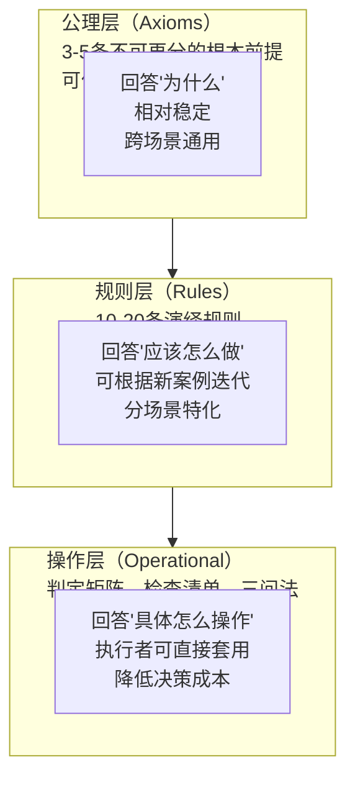

# 洞察萃取 - 第一性原理公理化模式拆分任务

## 1. 核心洞察

### 1.1 洞察1：第一性原理是模式重构的利器，但需匹配问题复杂度

**洞察内容**：
第一性原理六步分析法在解决"经验归纳模式边界模糊、粒度不当"这类方法论问题时效果显著，但分析成本较高（本次产出635行分析报告），不适合所有类型的模式沉淀任务。

**适用场景判断**：
- ✅ 推荐使用：治理策略类模式、跨场景通用原则、已有2+验证案例但边界模糊的模式
- ⚠️ 谨慎使用：单一具体场景的操作模式、首次沉淀的L1实验模式、紧急修复类任务
- ❌ 不推荐：简单的语法规范、纯格式约定、已有明确数学/逻辑定义的规则

**触发信号**：
当出现以下信号时，考虑使用第一性原理进行公理化重构：
1. 模式文件标题中出现"/"、"与"、"和"等连接词合并多个概念
2. 同一模式在export-suggestions或project_memory中出现多个命名变体
3. 不同执行者对同一判定问题给出不一致的答案
4. 新增案例时反复修改模式定义，无法稳定下来

### 1.2 洞察2："公理→规则→操作层"三层架构是治理类模式的理想结构

**洞察内容**：
治理策略类模式（如引用验证、关联建立、质量验收）采用"公理层→规则层→操作层"三层架构，相比"检查清单式"单层结构具有显著优势：



**三层架构的优势**：
1. **稳定性与灵活性平衡**：公理层保持稳定，规则层和操作层可根据新案例迭代，不需要每次重构都推翻基础
2. **可解释性**：执行者遇到疑问时可追溯到公理层理解"为什么要有这条规则"
3. **可迁移性**：公理层可跨场景复用（如A1目的公理、A3双向闭环公理可能适用于其他类型的双向关联），规则层和操作层场景特化
4. **验收标准清晰**：操作层的检查清单可直接作为质量验收标准，无需额外解读

### 1.3 洞察3：模式粒度诊断的四层推理链可复用

**洞察内容**：
从本次任务中萃取的"症状→中层问题→结构问题→根因"四层诊断推理链，可复用于其他模式粒度问题的诊断：

| 诊断层 | 典型表现 | 提问方式 |
|--------|---------|---------|
| Layer 1: 症状层 | 重复条目、命名不一致、状态不同步、链接断链 | 表面上出现了什么问题？ |
| Layer 2: 流程层 | 状态同步遗漏、更新顺序错误、索引未更新 | 为什么会出现这个具体错误？流程上哪里断了？ |
| Layer 3: 结构层 | 模式粒度不当、抽象层级混淆、职责不单一 | 为什么流程会断？是不是模式/文件本身的结构有问题？ |
| Layer 4: 根因层 | 经验归纳基础、缺乏公理化定义、边界模糊 | 为什么结构会有问题？是不是底层方法论就不对？ |

**使用方法**：
当发现模式库中的问题（如重复、不一致、应用困难）时，不要停在Layer 1修复症状，持续追问"为什么"直到Layer 4根因层。大多数"小问题"背后都有模式结构或方法论层面的根因。

### 1.4 洞察4：通用原则+场景特化是模式演进的自然方向

**洞察内容**：
当一个模式从L1升级到L2、验证案例增多时，自然会出现"通用部分"和"场景特化部分"的分离需求。强行将二者合并在一个文件中会导致：
1. 模式文件越来越长，维护成本上升
2. 通用原则被场景细节淹没，难以在其他场景复用
3. 场景特化规则不够深入，因为要照顾通用性而做妥协

**两层架构的组织方式**：
```
通用原则模式（如spec-reference-validation.md）
├── 核心机制（通用四步验证法）
├── 通用反模式
├── 通用检查清单
└── 场景特化索引 → 指向各场景的特化模式
    ├── command-knowledge-link.md（指令集↔知识库场景）
    ├── cross-wiki-reference-directory-first.md（跨Wiki场景）
    └── spec-workflow/spec-reference-validation-pattern.md（Spec阶段场景）
```

**何时考虑拆分**：
- 一个模式的验证场景≥3个时
- 模式文件超过200行时
- 不同场景的规则差异较大，无法用"通用+例外"组织时
- 出现重复条目或命名不一致等粒度问题信号时

---

## 2. 改进行动项

### 2.1 主任务行动项

| ID | 行动项 | 优先级 | 责任方 | 状态 | 验收标准 |
|----|--------|--------|--------|------|---------|
| ACT-001 | 积累第3+个指令集↔知识库关联案例时，用本框架验证并迭代规则 | 中 | 方法论维护者 | ⏳ 待执行 | 新增关联后用R13验收清单验证，根据反馈调整A4信噪比阈值和R8链接数量指导 |
| ACT-002 | 未来遇到其他模式粒度问题时，尝试使用四层诊断推理链 | 中 | 所有模式维护者 | ⏳ 待执行 | 诊断时至少追问4层为什么，不停留在症状修复 |
| ACT-003 | 评估"公理→规则→操作层"三层架构是否可推广到其他治理类模式 | 低 | 方法论研究者 | ⏳ 待执行 | 选取1-2个其他治理模式（如原子提交、链接检查）试点三层架构重构，评估效果 |
| ACT-004 | 验证A1/A3/A4/A5公理在其他双向关联场景（如Skill↔知识库、指令集↔复盘模式）的通用性 | 低 | 研究者 | ⏳ 待执行 | 在其他关联场景应用时检验公理适用性，记录需要调整的地方 |

### 2.2 补充复盘行动项（分析报告位置修正）

| ID | 行动项 | 优先级 | 责任方 | 状态 | 验收标准 |
|----|--------|--------|--------|------|---------|
| ACT-005 | 将"交付物位置验证"加入Spec收尾检查清单，并在spec-reference-validation.md或相关规范中补充.trae/specs/与docs/的职责边界说明 | 高 | 方法论维护者 | ✅ 已完成（commit 798bf264） | 规范文档中有明确的目录边界定义，Spec checklist包含交付物位置验证项 |
| ACT-006 | 未来执行Spec任务时，在收尾阶段严格执行"交付物归档三查"（位置验证→引用更新→链接验证） | 高 | 所有执行者 | ⏳ 持续执行 | 任务完成后.trae/specs/下无交付物文件，check-links100%通过 |
