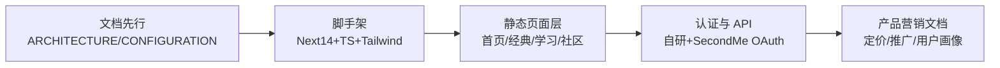

# 道德经+AI知识库（tao-ai-knowledge）— 全面复盘分析报告

> **项目名称**：道德经+AI知识库（`tao-ai-knowledge`）
> **复盘日期**：2026-08-07
> **项目周期**：2026-03-27（架构/配置文档标注时间）— 2026-08-07
> **报告类型**：项目全面复盘（里程碑）
> **方法论**：七概念方法论 R→I→E→C（复盘→洞察→萃取→导出）
> **复盘对象**：`d:\spaces\chaos\libs\tests\Claw\tao-ai-knowledge`

---

## 一、项目概述

### 1.1 项目背景

一个融合《帛书版道德经》智慧与 AI 技术的知识库平台，定位为「道亦有道」AI 编程变现知识专栏的承载产品，技术栈为 Next.js 14 (App Router) + TypeScript + Tailwind + Supabase。项目状态标注为「🚧 开发中 - 基础框架已搭建完成」。

### 1.2 项目目标

- 提供帛书版《道德经》81 章经典解读内容
- 承载「道亦有道」AI 编程变现实战专栏
- 构建学习中心、社区、搜索、用户认证等平台能力
- 面向程序员、转型探索者、知识 IP 追求者三类用户

### 1.3 交付物清单

| 交付物 | 位置 | 状态 |
|--------|------|------|
| 首页 | `src/app/page.tsx` | ✅ 已实现（静态） |
| 经典解读列表/详情 | `src/app/classic/*` | ✅ 已实现（占位内容） |
| 学习中心 | `src/app/learn/page.tsx` | ✅ 已实现（静态） |
| 社区 | `src/app/community/page.tsx` | ✅ 已实现（静态 mock） |
| 登录/注册 | `src/app/login|register/*` | ✅ 已实现 |
| 认证 API | `src/app/api/auth/*` | ✅ 已实现（9 个路由之一） |
| 搜索 API | `src/app/api/search/route.ts` | ✅ 已实现（mock 数据） |
| 健康检查 | `src/app/api/health/route.ts` | ✅ 已实现 |
| 产品文档 | `products/ai-programming-monetization/*` | ✅ 已实现（7 个文件） |
| 架构/配置文档 | `ARCHITECTURE.md` / `CONFIGURATION.md` | ✅ 已实现 |

---

## 二、复盘环节

### 2.1 实施过程回顾

项目实际演进路径为「**文档先行 → 脚手架 → 静态页面 → 认证骨架 → 营销文档**」，而核心内容数据层（81 章内容）始终处于占位状态。

### 2.2 关键节点分析

- **技术选型决策**：选定 Next.js 14 App Router + Supabase。但架构文档声称的 Prisma、Algolia、Zustand 客户端搜索等多数未落地。
- **认证决策**：实际采用「自研 Supabase REST + SecondMe OAuth」双轨，`next-auth` 依赖虽已安装但从未使用。
- **内容策略决策**：以营销/变现为导向先做卖点文档，内容生产滞后。

### 2.3 执行情况与结果数据（经命令验证）

| 指标 | 数值 | 验证命令 |
|------|------|---------|
| src 下 ts/tsx 文件数 | 30 | `Get-ChildItem -Recurse src -Include *.ts,*.tsx` |
| API 路由数 | 9 | `Get-ChildItem -Recurse src\app\api -Filter route.ts` |
| 页面目录数 | 6 | `Get-ChildItem src\app -Directory` |
| 根目录 md 文档 | 4 | `Get-ChildItem *.md` |
| products 目录文件 | 7 | `Get-ChildItem products -Recurse -File` |
| 测试文件数 | 0 | `Get-ChildItem -Include *.test.*,*.spec.*` |
| jest 配置 | 不存在 | `Test-Path jest.config.js` |
| 安装 jest | 否 | `Test-Path node_modules\jest` |
| 安装 next-auth | 是（未使用） | `Test-Path node_modules\next-auth` |
| 安装 prisma | 否 | `Test-Path node_modules\@prisma` |
| 安装 algoliasearch | 否 | `Test-Path node_modules\algoliasearch` |
| 81 章真实原文 | 仅 4 章（1/8/42/81） | 代码阅读 `getChapterContent()` |
| git 仓库 | 否（非 git 仓库） | `git status` 返回 fatal |

### 2.4 成功经验

- **营销文档完整度高**：`products/ai-programming-monetization/` 含产品设计、定价三档（¥399/999/2999）、推广计划、用户画像、12 章大纲，变现定位清晰，可迁移复用到同类内容产品。
- **技术栈主流且选型克制**：Next.js 14 + App Router + Supabase + Tailwind 组合成熟，静态页面渲染流畅，页面间导航完整（面包屑、上下章跳转、404 兜底）。
- **SecondMe OAuth 完整闭环**：redirect→callback→token 交换→user info→cookie 会话全流程实现，状态参数（state）、错误码映射、cookie 安全属性设置均有处理。

### 2.5 存在问题（含根因）

| 问题 | 根因分析 | 影响 |
|------|---------|------|
| 文档与实现严重脱节 | 规划先行但未回校，"设计蓝图"停留在纸面 | 误导接手者，评估偏差 |
| 核心内容（81 章）为占位符 | 重营销轻内容生产 | 无法真正满足知识库定位 |
| 搜索/社区/学习均为 mock 数据 | 数据层未接入 | 功能不可用，无真实价值 |
| 真实 Supabase 密钥硬编码进 `.env.example` | 为"开箱即用"牺牲安全 | 密钥泄露风险 |
| 测试基础设施"纸面化" | package.json 声明 jest，但未安装、无配置、无用例 | CI 质量门虚设 |
| 认证双轨并存且 me 接口硬编码未认证 | 技术选型中途变更未收敛 | 维护成本与逻辑缺陷 |

---

## 三、洞察环节

> 完整四元组洞察见 [insight-extraction.md](insight-extraction.md)

三条核心洞察概览：
1. **文档-实现断层**：技术蓝图（Prisma/Algolia/route groups）与仓库实际实现差异巨大，文档描述的功能多数为占位。
2. **认证体系双轨 + 密钥治理失守**：next-auth 已装未用，自研+SecondMe 双轨并存，且真实 service role key 硬编码进示例文件。
3. **重包装轻内核**：变现营销文档远超实际可运行功能，内容数据层空虚。

---

## 四、导出环节

> 完整行动清单见 [export-suggestions.md](export-suggestions.md)

### 4.1 改进建议

| 问题 | 改进措施 | 优先级 | 预期效果 | 状态 |
|------|---------|--------|---------|------|
| 密钥泄露 | 轮换 Supabase 密钥，`.env.example` 改纯占位符 | 高 | 消除泄露风险 | 待规划 |
| 内容空虚 | 补齐 81 章真实原文或接入数据源 | 高 | 达成知识库定位 | 待规划 |
| 测试纸面化 | 安装 jest 或移除声明，落地首个测试用例 | 中 | 质量门可用 | 待规划 |
| 文档脱节 | 以实现为唯一事实源重构 README/ARCHITECTURE | 中 | 文档可信 | 待规划 |
| 认证双轨 | 收敛为单一认证栈，修复 me 接口 | 中 | 降低维护成本 | 待规划 |
| 非 git 仓库 | 初始化 git 仓库并建立提交规范 | 高 | 可追溯可回滚 | 待规划 |

### 4.2 模式成熟度更新

| 模式 ID | 成熟度 | 触发原因 | 更新时间 |
|---------|--------|---------|---------|
| doc-impl-alignment-audit | L1-draft | 单案例待验证 | 2026-08-07 |
| env-placeholder-hygiene | L1-draft | 单案例待验证 | 2026-08-07 |

---

> **报告编制**：本文档基于对 `tao-ai-knowledge` 全仓库的代码、文档、依赖、运行配置实证核验编制，数据均经命令验证，遵循「事实→分析→洞察→建议」逻辑结构。
