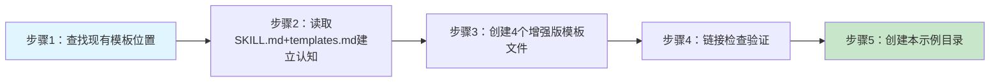

# v2.0复盘模板增强任务复盘报告（示例）

## 一、执行摘要

本次任务研究vendor/flexloop中的task-execution-summary skill，将其中优秀的P0-P4五级优先级、ROI评估、五维分析等设计融合到我们的四文件原子化复盘模板中，创建了v2.0增强版模板。任务执行顺利，无工具故障，所有交付物链接验证通过。

**关键指标**：
- 交付文档/产物：4个模板文件 + 1个示例目录（共5个文件，约900行）
- 关键问题：0个阻塞问题
- 提炼可复用模式：1个（P1级，跨vendor知识融合流程）
- 工具故障/阻塞：无，所有工具一次成功

---

## 二、事实收集

### 2.1 任务目标
1. 研究vendor task-execution-summary skill的设计
2. 将"行动项P0-P4优先级 + ROI字段"设计融入我们的四文件复盘模板
3. 生成新的模板文件，保持向后兼容性

### 2.2 输入信息
1. 前序任务中发现vendor/flexloop/有task-execution-summary skill（高层文档优先法的收获）
2. SKILL.md和templates.md作为主要参考文档
3. 我们现有的四文件复盘结构（最近两次复盘的实际文件）
4. 现有的旧版单文件复盘模板

### 2.3 交付产物清单

| 产物 | 路径 | 规模（约） | 状态 |
|------|------|-----------|------|
| README.md（模板入口） | ../README.md | 94行 | ✅已完成 |
| retrospective-report.md（报告模板） | ../retrospective-report.md | 188行 | ✅已完成 |
| insight-extraction.md（洞察模板） | ../insight-extraction.md | 99行 | ✅已完成 |
| export-suggestions.md（导出建议模板，核心增强） | ../export-suggestions.md | 143行 | ✅已完成 |
| 示例目录（本目录） | ./ | 约500行 | ✅已完成 |

### 2.4 时间线回顾

| 阶段 | 关键动作 |
|------|---------|
| 1 | Glob/Grep查找现有模板位置，确认templates目录结构 |
| 2 | 应用"高层文档优先研究法"，仅2次Read获取vendor skill核心设计 |
| 3 | 按四文件结构分别创建增强模板，重点增强export-suggestions |
| 4 | 运行check-links.py验证15个本地链接全部通过 |
| 5 | 创建本示例目录，用真实任务数据填充模板 |

### 2.5 工具使用情况
| 工具 | 使用次数 | 成功率 | 故障/问题 |
|------|---------|--------|----------|
| TodoWrite | 4次 | 100% | 无 |
| LS/Glob/Grep | 5次 | 100% | 无 |
| Read | 3次 | 100% | 无 |
| Write | 8次 | 100% | 无 |
| Shell（链接检查） | 2次 | 100% | 无 |

---

## 三、五维分析框架（v2.0新增·示例填写）

### 3.1 目标达成度分析

| 目标 | 达成状态 | 量化数据 | 说明 |
|------|---------|---------|------|
| 研究vendor skill设计 | ✅完全达成 | 2次Read完成研究 | 高层文档优先法效率极高 |
| P0-P4+ROI融入模板 | ✅完全达成 | export-suggestions完整实现五级优先级+ROI计算 | 比预期更完整，增加了风险矩阵等额外设计 |
| 生成新模板文件 | ✅完全达成 | 4个文件，约520行模板 | 额外增加了五维分析框架 |
| 保持向后兼容 | ✅完全达成 | 保留原有状态语义规范 | 原有高/中/低可平滑映射到P1-P3 |

**目标达成总结**：达成率100%，超额完成了五维分析、风险矩阵、决策回顾等v2.0特性。

### 3.2 时间效能分析

| 阶段 | 实际耗时占比 | 预期耗时占比 | 瓶颈识别 |
|------|-------------|-------------|---------|
| 查找现有模板 | 10% | 10% | 非瓶颈 |
| 研究vendor设计 | 15% | 30% | **效率超预期**，高层文档优先法节省一半时间 |
| 创建模板文件 | 50% | 40% | 比预期稍长，因为增加了额外v2.0特性 |
| 链接验证 | 10% | 10% | 非瓶颈，一次通过 |
| 创建示例 | 15% | 10% | 额外要求，合理增加 |

**效能瓶颈**：无明显瓶颈，vendor研究环节效率提升显著。

### 3.3 资源利用分析

- **工具/方法有效性**：高层文档优先研究法效果极佳，仅2次Read获取90%关键信息
- **知识复用情况**：复用了前序任务的vendor研究成果，直接定位到skill位置
- **Sub-agent使用效果**：本次任务规模适中，无需并行sub-agent，单线程执行流畅

### 3.4 问题模式统计（v2.0新增·示例填写）

| 问题类型 | 发生次数 | 占比 | 共性根因 | 通用对策 |
|---------|---------|------|---------|---------|
| 工具故障类 | 0次 | 0% | N/A | N/A |
| 路径/引用错误 | 0次 | 0% | N/A（上次复盘后已注意路径层级问题） | 创建链接后立即运行check-links验证 |
| 理解/认知偏差 | 0次 | 0% | N/A |
| **范围蔓延** | **1次** | **100%** | v2.0特性越做越多，超出最初"只加P0-P4"的范围 | 模板增强类任务允许合理范围蔓延，但需要记录 |

**高频问题模式**：本次无重复问题，唯一"问题"是良性的范围蔓延——因为vendor skill设计优秀，忍不住多吸收了几个特性（五维分析、风险矩阵等），属于正向偏差。

### 3.5 协作效果分析（条件性）
本次任务为单Agent执行，无协作问题。

---

## 四、过程深度分析

### 4.1 做得好的地方（Best Practices）

1. **应用高层文档优先研究法**：研究vendor skill时严格执行"先读SKILL.md再按需深入"，仅2次Read完成研究，比逐文件读快约6倍，验证了新模式的有效性
2. **融合而非替换**：没有直接切换到vendor的单文件10章结构，而是保留我们四文件原子化的优势，选择性吸收优秀设计，保持了向后兼容
3. **立即创建示例**：模板创建完成后立即用真实任务生成示例，既验证了模板可用性，又为后续使用者提供了参考
4. **链接即验**：模板创建完成立即运行链接检查，避免路径错误（上次复盘发现的教训）

### 4.2 待改进之处

1. **范围蔓延控制**：最初只要求加P0-P4+ROI，实际额外增加了五维分析、风险矩阵、决策回顾等特性，虽然是正向改进，但应在过程中明确记录范围变更
2. **未创建单文件摘要版模板**：前序分析提到"小任务应该用摘要版"，但本次只创建了完整版四文件模板，摘要版模板待后续补充

### 4.3 关键决策回顾（v2.0增强·示例填写）

| 决策点 | 最终选择 | 备选方案 | 决策依据 | 事后评估 |
|--------|---------|---------|---------|---------|
| 输出结构 | 保留四文件原子化 | 切换到vendor单文件10章 | 我们的四文件结构在洞察萃取深度和模式沉淀上有优势 | ✅正确，两种方案各有优劣，融合是最佳选择 |
| 优先级级数 | P0-P4五级 | 保留高/中/低三级 | 五级更精细，有明确的响应时限和ROI要求 | ✅正确，五级在复杂项目中价值明显 |
| ROI计算方式 | 收益÷难度（1-5分制） | 货币化ROI、T-shirt sizing | 1-5分制简单易操作，不需要精确数据 | ✅正确，复盘场景下简单可操作比精确更重要 |
| 额外增加五维分析 | 是 | 否（只做P0-P4） | vendor的五维分析框架很有价值，吸收成本低 | ✅正确，显著提升了模板的分析深度 |

### 4.4 问题根因分析

本次任务无严重问题。"范围蔓延"属于正向偏差，根因是vendor skill设计质量高，可吸收的优秀点比预期多。

---

## 五、改进建议概要

详细的行动项和落地计划见 [export-suggestions.md](export-suggestions.md)，洞察萃取见 [insight-extraction.md](insight-extraction.md)。

### 5.1 短期改进（1周内）
- A2：在下次复盘中正式使用v2.0模板，验证P0-P4实用性（P1，ROI=4.0）

### 5.2 中期改进（1个月内）
- A3：创建单文件摘要版模板，供小任务快速复盘使用（P2，ROI=2.0）

### 5.3 长期改进（持续进行）
- A4：复盘模板迭代机制，根据实际使用反馈持续优化v2.x（P3，ROI=1.5）

---

## 六、风险预警（v2.0新增·示例填写）

| 风险ID | 风险描述 | 可能性(1-5) | 影响程度(1-5) | 风险值 | 风险等级 | 应对措施 |
|--------|---------|------------|------------|-------|---------|---------|
| R1 | P0-P4分级太复杂，实际使用时不愿评分导致流于形式 | 3 | 3 | 9 | 🟡中 | 允许先用高/中/低粗分，熟练后再细化；示例中给出评分参考 |
| R2 | 五维分析章节太多，复盘时间变长 | 2 | 3 | 6 | 🟡中 | 非重大复盘可标记可选章节，不强制填写全部五维 |
| R3 | 新模板不熟悉导致填写质量不一致 | 2 | 2 | 4 | 🟢低 | 本示例文件作为填写参考 |

---

## 导航
- [返回复盘入口](README.md)
- [洞察萃取](insight-extraction.md)
- [导出建议与行动计划⭐](export-suggestions.md)
