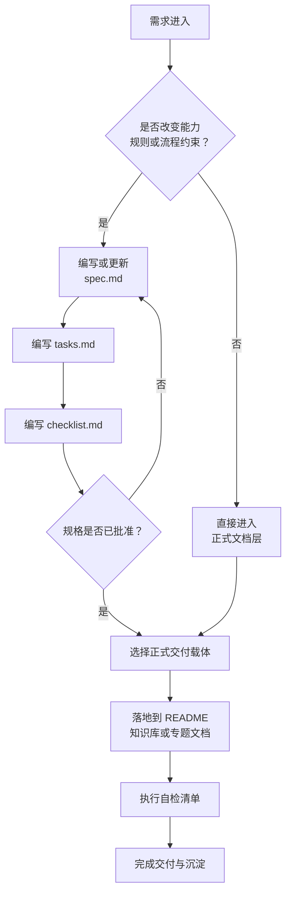

> **来源**：从 ACT-001 模板包设计、现有 `spec` 工作流与 `docs/retrospective/templates/` 既有模板风格综合整理

# Spec 知识交付指南

## 一、模板用途

本指南用于回答一个高频问题：`spec` 已经写完后，什么时候应该继续走 `/spec`，什么时候应该转入正式文档、知识库或交付说明层。它适用于将规格设计阶段的产物，进一步整理为可阅读、可执行、可验收、可沉淀的正式文档包，避免把“设计约束”与“知识交付”混写在同一层。

---

## 二、适用场景

- **已有 spec，准备进入交付层**：`spec.md`、`tasks.md`、`checklist.md` 已明确，需要补一份“如何从 spec 落到正式文档”的说明。
- **需要给执行者或协作者交接**：需要让后续执行者快速判断该看哪个模板、按什么顺序推进、最终沉淀到哪里。
- **需要把 spec 成果转为知识资产**：例如沉淀到 `docs/knowledge/`、`docs/retrospective/`、目录 README 或专题说明文档。
- **需要统一说明模板包用法**：希望把 `spec-template.md`、`tasks-template.md`、`checklist-template.md` 与交付指南放在一个清晰闭环里说明。

## 三、不适用场景

- **尚未明确需求边界**：如果问题还停留在“要不要做、为什么做、做什么”的设计阶段，应先写 `spec.md`，而不是直接写交付指南。
- **只是新增一篇普通知识笔记**：若没有对应 `spec`，也不存在从规格到正式交付的转换动作，可直接写目标文档。
- **只是做结构性搬运或原子化拆分**：如果任务本质是文档重组、迁移、改名、断链修复，应走文档重构流程，而不是使用本指南。
- **只是一次性口头说明**：若无需长期复用、无需模板化、无需沉淀为规范资产，则不必额外创建本类文档。

---

## 四、是否需要 `/spec`

### 判断原则

- **需要 `/spec`**：当任务会新增、修改或删除项目的能力、规则、流程、结构约束时，必须先形成正式规格。
- **不需要 `/spec`**：当任务只是把既有 `spec` 翻译、整理、汇总、导出为面向执行者或读者的正式文档，而不改变原有约束时，可直接进入交付层。

### 快速判断表

| 问题 | 如果答案是“是” | 结论 |
|------|----------------|------|
| 是否新增能力、规则、流程或目录约束？ | 需要定义新要求 | 先 `/spec` |
| 是否会影响 `.agents/`、`AGENTS.md`、`.trae/specs/` 或正式执行规则？ | 需要可追溯变更 | 先 `/spec` |
| 是否只是解释、整理、导出已批准的 spec 内容？ | 不改变原始约束 | 可直接写正式文档 |
| 是否只是补一份交接、使用说明或知识沉淀？ | 重点在交付表达 | 一般不必新开 `/spec` |

### 经验法则

- **设计层问题**：为什么做、做什么、影响什么、要求是什么，归 `spec`。
- **交付层问题**：怎么用、给谁看、落到哪里、如何验收沉淀，归正式文档。

---

## 五、七大主题速查

当你判断“这件事需要 `/spec`”时，可按下表快速选择 `.trae/specs/` 主题目录：

| 主题目录 | 适用问题 | 典型关键词 |
|------|------|------|
| `core-foundation/` | 从零创建核心系统、基础设施、基础目录 | 创建、初始化、核心系统 |
| `roles-governance/` | 角色扩展、权限标记、治理规则、同步机制 | 角色、治理、权限、规则 |
| `standards-tools/` | 标准规范、检查工具、自动化脚本、环境适配 | 标准、工具、检查、CI |
| `readme-branding/` | README 演进、品牌定位、对外展示文案 | README、品牌、定位、展示 |
| `docs-restructure/` | 既有文档的结构重组、原子化、去重、改名 | 重构、原子化、重组、去重 |
| `retrospectives-insights/` | 复盘分析、问题诊断、经验萃取、洞察沉淀 | 复盘、洞察、经验、分析 |
| `migration-archival/` | 外部迁移、历史归档、跨目录内容引入 | 迁移、归档、外部内容 |

> 如果你的任务不改变规则，只是说明“已有 spec 该如何落为正式文档”，通常不需要再新建 `.trae/specs/` 条目，而是直接使用本指南进入交付阶段。

---

## 六、模板包组成

本模板包建议由以下四个文件协同组成：

| 文件 | 作用 | 产出层级 |
|------|------|------|
| `spec-template.md` | 定义 Why、What Changes、Impact 与 Requirements | 设计层 |
| `tasks-template.md` | 将规格拆为可执行任务与依赖关系 | 执行层 |
| `checklist-template.md` | 将验收条件整理为可核对清单 | 验证层 |
| `spec-knowledge-delivery-guide.md` | 说明何时结束 spec、如何进入正式文档与知识沉淀 | 交付层 |

### 推荐使用顺序

1. 先用 `spec-template.md` 明确变更边界。
2. 再用 `tasks-template.md` 拆解执行步骤。
3. 然后用 `checklist-template.md` 约束验收标准。
4. 最后用本指南决定正式文档落点与知识沉淀方式。

---

## 七、Mermaid 流程

---

## 八、从 spec 到正式文档闭环

### 步骤 1：确认 spec 是否已经稳定

- `spec.md` 中的 Why、What Changes、Impact 已经明确。
- `tasks.md` 已能支撑执行，不再停留在方向性描述。
- `checklist.md` 已具备基本验收标准。

### 步骤 2：确认是否还需要继续走 `/spec`

- 如果要补充新的规则、约束、影响范围，回到 `spec` 层处理。
- 如果只是把已确认内容整理给读者、执行者或知识库使用，进入正式文档层。

### 步骤 3：选择正式文档落点

- **项目入口说明**：落到 `README.md` 或目录级 README。
- **操作说明/最佳实践**：落到 `docs/knowledge/`。
- **复盘、模式、模板、方法论**：落到 `docs/retrospective/`。
- **阶段性交付说明**：可作为专题文档单独存放于 `docs/` 对应目录。

### 步骤 4：保持“规格层”和“交付层”职责分离

- `spec` 负责定义“应该做什么”。
- `tasks/checklist` 负责定义“怎么执行、怎么验收”。
- 正式文档负责定义“如何被理解、被使用、被复用”。

### 步骤 5：完成知识沉淀

- 在目标目录中写成最终读者可消费的文档。
- 补齐必要链接与索引入口。
- 确保未来读者不需要回读完整 `spec` 也能理解交付结果。

---

## 九、自检清单

- [ ] 已确认当前任务是否真的需要 `/spec`，没有把交付问题误写成设计问题
- [ ] 已确认 `spec.md`、`tasks.md`、`checklist.md` 的职责边界，没有内容重复
- [ ] 已根据七大主题速查判断是否需要新建或更新 `.trae/specs/` 条目
- [ ] 已明确正式文档的最终落点是 `README`、`docs/knowledge/`、`docs/retrospective/` 还是其他 `docs/` 子目录
- [ ] 已用 Mermaid 或清晰步骤说明从 spec 到正式文档的闭环过程
- [ ] 已确保正式文档面向读者可直接使用，而不是仅对 spec 作者自己可读
- [ ] 已检查是否需要同步更新目录索引、导航或相关说明文档

---

## 十、关联模块

- `templates/spec-template.md` — 规格设计模板
- `templates/tasks-template.md` — 任务拆解模板
- `templates/checklist-template.md` — 验收检查模板
- `.trae/specs/README.md` — 七大主题归类与 spec 决策入口
- `docs/retrospective/README.md` — 模板、模式与知识沉淀入口
