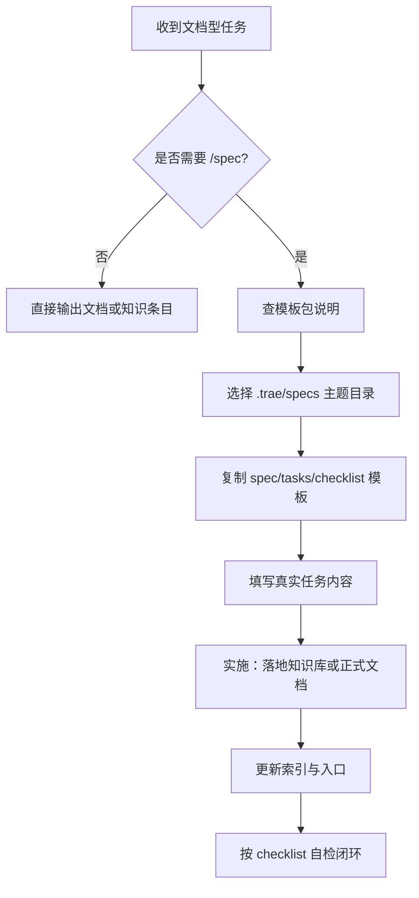

# ACT-001 完整模板包 Implementation Plan

> **For agentic workers:** REQUIRED SUB-SKILL: Use superpowers:subagent-driven-development (recommended) or superpowers:executing-plans to implement this plan task-by-task. Steps use checkbox (`- [ ]`) syntax for tracking.

**Goal:** 为“规格前置知识交付模式”落地一套可直接复用的完整模板包，新增使用说明并把它接入现有复盘模板索引。

**Architecture:** 复用现有 `spec-template.md`、`tasks-template.md`、`checklist-template.md` 作为模板层，不新增重复模板文件；新增 `spec-knowledge-delivery-guide.md` 作为统一入口说明层，并在 `docs/retrospective/README.md` 中登记入口，使执行者能从“是否需要 /spec”一路走到“正式文档落地与自检闭环”。

**Tech Stack:** Markdown、Mermaid、现有文档目录与索引体系

---

## 文件结构

### 新增文件

- `docs/retrospective/templates/spec-knowledge-delivery-guide.md`
  - 统一说明何时使用 `/spec`、如何选择 `.trae/specs` 主题目录、如何复用模板、如何完成知识库落地与自检闭环

### 修改文件

- `docs/retrospective/README.md`
  - 在模板目录树与模板说明区登记新指南文件

### 保持不变但被复用的文件

- `docs/retrospective/templates/spec-template.md`
- `docs/retrospective/templates/tasks-template.md`
- `docs/retrospective/templates/checklist-template.md`
- `.trae/specs/README.md`

### 验证文件

- `docs/retrospective/templates/spec-knowledge-delivery-guide.md`
- `docs/retrospective/README.md`

---

### Task 1: 创建模板包使用说明

**Files:**
- Create: `docs/retrospective/templates/spec-knowledge-delivery-guide.md`
- Reference: `docs/retrospective/templates/spec-template.md`
- Reference: `docs/retrospective/templates/tasks-template.md`
- Reference: `docs/retrospective/templates/checklist-template.md`
- Reference: `.trae/specs/README.md`

- [ ] **Step 1: 新建指南文件骨架**

```markdown
> **用途**：将现有 `spec-template.md`、`tasks-template.md`、`checklist-template.md` 组织成一套“完整模板包”，用于文档型 / 知识型 / 路径型任务的规格前置交付。

# 规格前置知识交付模板包指南

## 一、适用场景

## 二、不适用场景

## 三、如何判断是否需要 `/spec`

## 四、如何选择 `.trae/specs` 主题目录

## 五、模板包组成

## 六、典型执行流程

## 七、从 spec 到正式文档的落地闭环

## 八、自检清单
```

- [ ] **Step 2: 填写“适用 / 不适用场景”章节**

```markdown
## 一、适用场景

以下任务建议走 `/spec`：

- 需要交付“可执行路径”“操作指南”“闭环方案”“规范文档”
- 需要同时产出 `spec.md / tasks.md / checklist.md`
- 需要先界定边界、依赖、验收标准，再进入文档落地
- 需要后续沉淀为知识库资产，而不是一次性回答

## 二、不适用场景

以下任务通常不需要走 `/spec`：

- 纯问答或单次解释
- 轻量文案润色
- 已有明确目标文件、无需额外拆解的简单修改
- 临时分析且不要求形成可复用资产
```

- [ ] **Step 3: 填写“主题选择”速查表**

```markdown
## 四、如何选择 `.trae/specs` 主题目录

| 主题目录 | 适用问题 |
|---|---|
| `core-foundation/` | 系统底座、核心能力、基础设施建设 |
| `roles-governance/` | 角色、流程、治理、责任边界 |
| `standards-tools/` | 规范、标准、检查工具、流程工具 |
| `readme-branding/` | README、品牌表达、对外入口叙事 |
| `docs-restructure/` | 文档重构、原子化、结构调整 |
| `retrospectives-insights/` | 复盘、洞察、萃取、分析报告 |
| `migration-archival/` | 迁移、归档、搬迁、接管旧资产 |
```

- [ ] **Step 4: 填写“模板包组成”与模板链接**

```markdown
## 五、模板包组成

- [spec-template.md](spec-template.md) — 定义 Why / What Changes / Impact / Requirements
- [tasks-template.md](tasks-template.md) — 定义任务拆解、依赖关系、完成状态
- [checklist-template.md](checklist-template.md) — 定义交付验收与自检项
- 本文档 — 作为统一入口，说明何时使用、如何分类、如何落地
```

- [ ] **Step 5: 填写“典型执行流程”并加入 Mermaid 图**

````markdown
## 六、典型执行流程


````

- [ ] **Step 6: 填写“从 spec 到正式文档的落地闭环”**

```markdown
## 七、从 spec 到正式文档的落地闭环

1. 在 `.trae/specs/<theme>/<change-id>/` 创建 `spec.md`
2. 基于 `tasks-template.md` 写出任务与依赖
3. 基于 `checklist-template.md` 写出验收项
4. 按 spec 落地正式文档到 `docs/knowledge/` 或目标目录
5. 更新对应索引文件
6. 对照 checklist 完成自检
```

- [ ] **Step 7: 填写“自检清单”**

```markdown
## 八、自检清单

- [ ] 是否明确判断该任务需要 `/spec`
- [ ] 是否选择了正确的 `.trae/specs` 主题目录
- [ ] 是否同时产出了 `spec.md / tasks.md / checklist.md`
- [ ] 是否已落地正式文档而不只停留在 spec
- [ ] 是否已更新索引入口
- [ ] 是否已完成交付闭环自检
```

- [ ] **Step 8: 运行文档诊断**

Run: `GetDiagnostics(file:///d:/AI/docs/retrospective/templates/spec-knowledge-delivery-guide.md)`
Expected: 无诊断错误

---

### Task 2: 将模板包指南接入复盘模板索引

**Files:**
- Modify: `docs/retrospective/README.md`
- Reference: `docs/retrospective/templates/spec-knowledge-delivery-guide.md`

- [ ] **Step 1: 在目录树中加入新文件**

```markdown
├── templates/                         ← 可复用模板
│   ├── spec-template.md               · spec.md 规格文档模板
│   ├── tasks-template.md              · tasks.md 任务清单模板
│   ├── checklist-template.md          · checklist.md 检查清单模板
│   ├── spec-knowledge-delivery-guide.md · 规格前置知识交付模板包指南
│   ├── retrospective-report-template.md · 复盘报告模板
│   └── directory-readme-template.md    · 目录索引 README 模板
```

- [ ] **Step 2: 在模板说明章节加入新条目**

```markdown
### [templates/](templates/)
存放可复用的文档模板，涵盖规格文档、任务清单、检查清单、复盘报告、目录索引与规格前置知识交付指南，可直接用于新项目初始化。

- [spec-template.md](templates/spec-template.md) — `spec.md` 规格文档模板，包含 Why、What Changes、Impact、ADDED/MODIFIED/REMOVED Requirements 标准结构
- [tasks-template.md](templates/tasks-template.md) — `tasks.md` 任务清单模板，包含主任务、子任务与依赖关系声明
- [checklist-template.md](templates/checklist-template.md) — `checklist.md` 检查清单模板，支持按类别分组
- [spec-knowledge-delivery-guide.md](templates/spec-knowledge-delivery-guide.md) — 规格前置知识交付模板包指南，说明何时使用 `/spec`、如何选择主题目录、如何完成从 spec 到正式文档的闭环
- [retrospective-report-template.md](templates/retrospective-report-template.md) — 项目复盘报告模板，遵循"事实 → 分析 → 洞察 → 建议"逻辑结构
- [directory-readme-template.md](templates/directory-readme-template.md) — 目录索引 README 模板，适用于模块化文档体系的根目录索引文件
```

- [ ] **Step 3: 运行文档诊断**

Run: `GetDiagnostics(file:///d:/AI/docs/retrospective/README.md)`
Expected: 无诊断错误

---

### Task 3: 做结构验证与场景走读

**Files:**
- Verify: `docs/retrospective/templates/spec-knowledge-delivery-guide.md`
- Verify: `docs/retrospective/README.md`
- Reference: `.trae/specs/README.md`
- Reference: `docs/knowledge/README.md`

- [ ] **Step 1: 验证新指南中的关键链接与路径**

Run: `python .agents/scripts/check-links.py --path docs/retrospective/templates`
Expected: `docs/retrospective/templates/` 下 Markdown 文件无断链；随后人工确认 `spec-knowledge-delivery-guide.md` 中引用的关键路径（`.trae/specs/README.md`、`docs/knowledge/`、`docs/retrospective/`）存在

- [ ] **Step 2: 按一个真实场景走读一次**

```markdown
走读场景：用户要求“产出一份可执行的技术路径或操作指南，并要求独立验证”

预期判断路径：
1. 该任务需要 `/spec`
2. 根据主题选择表进入 `.trae/specs/standards-tools/` 或其他对应目录
3. 复制 `spec-template.md / tasks-template.md / checklist-template.md`
4. 填写真实任务内容
5. 最终落地到 `docs/knowledge/` 或目标文档目录
```

- [ ] **Step 3: 记录场景验证结果并确认验收标准全部覆盖**

```markdown
- [ ] 能判断是否需要 `/spec`
- [ ] 能选对主题目录
- [ ] 能找到 3 个基础模板
- [ ] 能理解正式文档落地位置
- [ ] 能理解索引更新与自检闭环
```

- [ ] **Step 4: 再次运行诊断作为收尾检查**

Run: `GetDiagnostics(file:///d:/AI/docs/retrospective/templates/spec-knowledge-delivery-guide.md)`
Expected: 无诊断错误

Run: `GetDiagnostics(file:///d:/AI/docs/retrospective/README.md)`
Expected: 无诊断错误

---

## 自检结论

### Spec 覆盖

- 设计文档要求新增一份说明层文档：由 Task 1 覆盖
- 设计文档要求将模板包接入现有体系：由 Task 2 覆盖
- 设计文档要求验证结构与场景：由 Task 3 覆盖

### 占位符扫描

- 计划未使用 `TODO`、`TBD`、`后续补充` 等占位词
- 所有变更文件路径已明确
- 所有核心文档内容均给出可直接粘贴的 Markdown 片段

### 类型与命名一致性

- 设计文档中的新增文件名 `spec-knowledge-delivery-guide.md` 与计划一致
- 模板层、说明层、主题目录、知识库落地等术语前后一致
