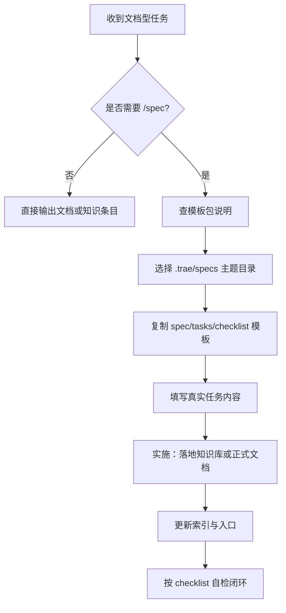

# ACT-001 完整模板包设计文档

## 1. 背景

本轮复盘已识别出一个高复用价值的行动项：将“规格前置知识交付模式”整理为可复用模板。当前项目内虽然已经同时存在：

- `.trae/specs/` 下的真实 spec 实例
- `docs/retrospective/templates/` 下的 `spec-template.md`、`tasks-template.md`、`checklist-template.md`
- `.agents/templates/theme-templates/` 下的主题任务模板

但这些资产分散在不同层级，适合“知道体系的人”使用，不适合在新任务开始时快速判断“什么时候该走 `/spec`、该选哪个主题、该复用哪些模板、如何从 spec 落到知识库/文档产物”。

因此，本设计文档定义一套“完整模板包”，目标不是重造模板，而是把现有模板整理成一条低摩擦、可直接复制执行的知识交付路径。

## 2. 目标与非目标

### 2.1 目标

本设计要交付一套适用于“文档型 / 知识型 / 路径型”任务的完整模板包，满足以下目标：

1. 用户或执行者可以快速判断一个任务是否应走 `/spec`
2. 执行者可以明确该任务应归入 `.trae/specs/` 的哪个主题目录
3. 执行者可以直接拿到 `spec.md / tasks.md / checklist.md` 的复用模板
4. 执行者可以理解如何从 spec 继续落到知识库文档、索引更新和自检闭环

### 2.2 非目标

本次不包含以下内容：

- 不新增自动化脚手架脚本
- 不改写 `.trae/specs/README.md` 的主题归类规则
- 不替换现有 `docs/retrospective/templates/` 中已存在的基础模板
- 不直接落地模式库文件，本次只交付模板包与使用说明

## 3. 方案选择

本次确认采用“方案 B：模板包 + 主题映射”。

### 3.1 备选方案

#### 方案 A：轻量模板包

仅整理 `spec.md / tasks.md / checklist.md` 模板与一个简单说明。

优点：

- 最小交付，变更小
- 最快可上线

缺点：

- 仍然无法解决“模板放哪、主题怎么选、如何落地”的关键问题

#### 方案 B：模板包 + 主题映射（推荐）

在轻量模板包基础上，补充“何时使用 `/spec`、如何选择 `.trae/specs` 七大主题、如何从 spec 落到知识库文档”的说明。

优点：

- 既保留轻量性，也解决真实使用门槛
- 最契合当前项目已有规范体系
- 对后续同类任务复用价值最大

缺点：

- 文档范围略大于纯模板文件

#### 方案 C：模板包 + 自动脚手架预留

在方案 B 基础上，进一步定义未来脚本如何一键生成模板目录。

优点：

- 为未来自动化留接口

缺点：

- 当前没有立即执行价值，容易过度设计

### 3.2 推荐理由

采用方案 B 的理由是：当前主要问题不是“没有模板”，而是“模板资产分散、使用路径不清”。因此最有效的动作不是继续增加模板数量，而是把已有模板通过一套明确入口重新组织起来。

## 4. 模板包设计

### 4.1 目录放置

模板包采用“双层结构”：

- **模板层**：放在 `docs/retrospective/templates/`
- **说明层**：新增一份模板包使用说明，放在 `docs/retrospective/templates/`，作为统一入口

不把模板包放进 `.trae/specs/`，原因是 `.trae/specs/` 存放的应是具体任务实例，而不是通用模板说明。

### 4.2 组成清单

完整模板包包含以下 4 类内容：

1. `spec-template.md`
   - 定义 Why / What Changes / Impact / Requirements 的骨架
2. `tasks-template.md`
   - 定义任务、子任务、依赖关系、完成状态的骨架
3. `checklist-template.md`
   - 定义交付验收与自检项
4. `spec-knowledge-delivery-guide.md`（新增）
   - 定义模板包使用场景、主题归类方法、典型执行流程、落地路径

### 4.3 使用说明的核心内容

`spec-knowledge-delivery-guide.md` 至少应包含：

- 什么类型的任务应该走 `/spec`
- 什么类型的任务不需要走 `/spec`
- `.trae/specs/` 七大主题的选型速查
- 如何从模板复制到真实 spec 目录
- 如何从 spec 落到知识库文档或其他正式文档
- 完成后如何做索引更新与自检

## 5. 典型使用流

模板包的目标工作流如下：

该流程的核心不是“复制文件”，而是让执行者在最开始就有稳定判断路径，避免随手创建 spec 或遗漏知识库落地步骤。

## 6. 边界与兼容性

### 6.1 与现有体系的关系

该模板包必须兼容以下现有资产：

- `.trae/specs/README.md` 的主题归类规则
- `docs/retrospective/templates/` 的基础模板
- `.agents/templates/theme-templates/` 的主题任务模板
- `docs/knowledge/README.md` 与 `docs/retrospective/README.md` 的索引体系

### 6.2 兼容策略

- 说明文档只做“入口组织”，不重写现有规范
- 对已有模板采用“引用 + 使用建议”的方式，而不是复制多份
- 如果某类任务已经有主题专用模板，使用说明里优先引导到主题模板，而不是让执行者只用通用模板

## 7. 错误处理与风险控制

### 7.1 风险 1：模板包与现有规范重复

控制策略：

- 明确模板包定位为“入口导航 + 使用骨架”
- 不与 `.trae/specs/README.md` 抢主题归类职责

### 7.2 风险 2：说明文档过长，反而增加理解成本

控制策略：

- 使用“适用场景 -> 主题选择 -> 使用步骤 -> 交付闭环”的固定结构
- 优先提供速查表，而不是长篇叙述

### 7.3 风险 3：模板包只讲 spec，不讲落地

控制策略：

- 把“知识库落地、索引更新、自检闭环”列为模板包必备章节
- 防止执行者把 `/spec` 当成最终交付，而不是中间治理层

## 8. 验收标准

模板包实施完成后，应满足以下验收标准：

1. 执行者能够在一个入口文档中看懂是否需要 `/spec`
2. 执行者能够根据说明正确选择 `.trae/specs/` 的主题目录
3. 执行者能够直接找到并复用 `spec.md / tasks.md / checklist.md`
4. 执行者能够依据说明完成“spec -> 正式文档 -> 索引 -> 自检”的闭环
5. 模板包不引入与现有规范冲突或重复维护负担

## 9. 测试与验证

本设计实施后建议进行两类验证：

### 9.1 结构验证

- 检查新增说明文档路径是否正确
- 检查与现有模板的相互引用是否有效
- 检查说明文档中提到的关键目录与文件是否存在

### 9.2 场景验证

用一个真实的“文档型任务”模拟走读一次：

- 是否能判断该任务需要 `/spec`
- 是否能顺利选到主题目录
- 是否能顺利从模板复制并填写
- 是否能顺利落到知识库文档并完成自检

## 10. 实施范围判断

该设计范围适合单次实施，不需要拆分成多个子项目。原因是本次只涉及：

- 一个新增说明文档
- 对现有模板的组织与引用
- 可能的模板微调或补充

它不涉及脚本自动化、命令系统重构或大规模文档迁移，因此范围可控。
