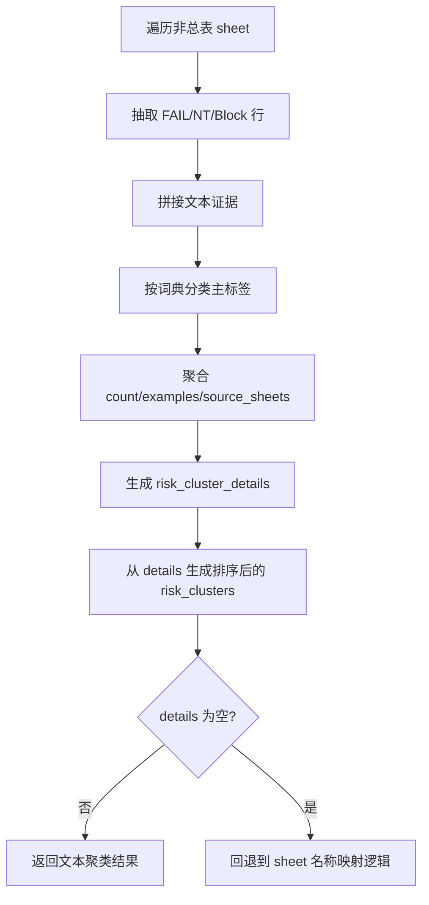

# ACT-002 风险语义聚类增强设计文档

## 1. 背景

当前 `.agents/scripts/analyze-xlsx-test-report.py` 已能完成 `.xlsx` 测试报告的总表识别、状态统计、Markdown 报告导出与发布判断摘要输出，但 `risk_clusters` 仍主要依赖工作表名称映射，例如：

- `音频专项` -> `音频`
- `WiFi穿墙测试` -> `弱网`
- `升级测试` -> `升级稳定性`

这类做法适合第一阶段最小闭环，但无法利用 `FAIL / NT / Block` 行中的问题描述文本，导致跨 sheet 的系统性风险主线仍不够准确。例如“拉流卡顿”“异常重启”“底噪明显”等问题，应该能从文本层直接归入稳定的风险类别，而不是只依赖 sheet 标题。

因此，本轮增强目标是：在保持现有输出兼容的前提下，引入**规则关键词驱动的风险语义聚类**，让脚本能基于高风险行文本生成更可信的 `risk_clusters`，并补充 `risk_cluster_details` 作为证据层。

## 2. 目标与非目标

### 2.1 目标

本轮增强需要满足以下目标：

1. 从 `FAIL / NT / Block` 行中提取问题描述文本
2. 基于固定规则词典，将问题描述归类到稳定风险标签
3. 在 `context` 中新增 `risk_cluster_details`
4. 继续保留 `risk_clusters`，但改为基于文本命中的聚类结果排序生成
5. 当未命中文本规则时，回退到现有 sheet 名称映射，保证兼容性

### 2.2 非目标

本轮明确不做以下内容：

- 不引入 LLM 或外部语义模型
- 不做自动发现新标签
- 不改总表指标提取逻辑
- 不改发布判断口径
- 不新增 CLI 参数
- 不修改现有 Markdown 模板结构

## 3. 方案选择

### 3.1 备选方案

#### 方案 A：纯关键词聚类

做法：

- 只扫描 `FAIL / NT / Block` 行文本
- 用固定词典直接映射到风险标签

优点：

- 简单、稳定、好测

缺点：

- 一旦文本未命中规则，可能完全丢失风险标签

#### 方案 B：关键词聚类 + sheet 名称回退

做法：

- 优先使用问题描述文本做关键词聚类
- 若完全未命中，再回退到现有 `sheet.title -> label` 逻辑

优点：

- 兼容现有行为
- 不容易出现风险标签空白

缺点：

- 仍然缺少“命中证据”层，输出解释性有限

#### 方案 C：关键词聚类 + 证据计数 + sheet 名称回退（推荐）

做法：

- 从高风险状态行提取文本证据
- 用固定词典聚类到 6 类稳定风险标签
- 为每个标签记录命中次数、示例短语、来源 sheet
- 在完全未命中文本时回退到现有逻辑

优点：

- 保持行为稳定
- 输出可解释
- 后续可直接被 Markdown 报告与一页式摘要消费

缺点：

- 比纯标签方案稍重，但范围仍可控

### 3.2 推荐理由

采用方案 C。当前最需要补的不是“更智能的模型”，而是“更可信的证据层”。只要把问题描述文本真正利用起来，并保留现有回退逻辑，就能在不扩大系统复杂度的前提下显著提升分析质量。

## 4. 文件范围与职责边界

本轮仅修改 2 个文件，保持范围收敛。

### 4.1 修改文件

- `.agents/scripts/analyze-xlsx-test-report.py`
  - 增加风险文本提取、关键词分类、聚类细节生成与旧逻辑回退
- `.agents/scripts/tests/test_analyze_xlsx_test_report.py`
  - 增加词典分类、聚类细节、端到端上下文字段增强测试

### 4.2 不修改文件

- `docs/retrospective/templates/xlsx-test-report-template.md`
- `docs/retrospective/templates/release-gate-summary-template.md`

原因：

- 这轮优先修正“数据更准”，不先动模板
- 现有模板已能继续消费 `risk_clusters`
- `risk_cluster_details` 先作为上下文增强字段沉淀，为下一轮模板增强预留空间

## 5. 数据模型设计

### 5.1 兼容字段：`risk_clusters`

保持现有字段存在，类型仍为 `list[str]`，但语义升级为：

- 基于文本命中的风险标签排序结果
- 若文本未命中，回退到 sheet 名称映射结果

示例：

```python
["弱网", "预览稳定性", "音频"]
```

### 5.2 新增字段：`risk_cluster_details`

新增字段用于保存证据层，结构如下：

```python
[
    {
        "label": "音频",
        "count": 4,
        "examples": ["底噪明显", "回声轻微", "啸叫"],
        "source_sheets": ["06音频专项测试"],
    },
    {
        "label": "弱网",
        "count": 3,
        "examples": ["拉流卡顿", "重连失败"],
        "source_sheets": ["WiFi穿墙测试", "预览稳定性"],
    },
]
```

字段含义：

- `label`：风险标签
- `count`：命中次数
- `examples`：代表性问题短语，最多保留 3 条
- `source_sheets`：命中来源页，去重后排序

## 6. 规则词典设计

本轮固定 6 类风险标签，不再扩张：

- `音频`
- `预览稳定性`
- `重启恢复`
- `存储回放`
- `弱网`
- `升级稳定性`

### 6.1 关键词词典

建议词典如下：

- `音频`
  - `底噪` `回声` `啸叫` `破音` `吞字` `无声` `杂音`
- `预览稳定性`
  - `卡顿` `丢帧` `花屏` `黑屏` `拉流失败` `延迟` `不同步`
- `重启恢复`
  - `重启` `死机` `崩溃` `异常恢复` `软启` `断电恢复`
- `存储回放`
  - `TF卡` `录像` `回放` `录制` `文件损坏` `卡录`
- `弱网`
  - `弱网` `穿墙` `丢包` `重连` `断流` `网络异常`
- `升级稳定性`
  - `升级失败` `升级后` `版本回退` `升级重启`

### 6.2 命中策略

采用最简单、最稳定的子串命中：

1. 把高风险行的文本列合并成一个字符串
2. 按优先级顺序扫描词典
3. 一条问题默认只归属第一个命中的主标签，避免重复计数

推荐优先级：

1. `重启恢复`
2. `预览稳定性`
3. `弱网`
4. `存储回放`
5. `音频`
6. `升级稳定性`

这样可以减少“同一问题被多标签重复统计”的膨胀风险。

## 7. 处理流程设计

在现有 `extract_report_context()` 中，风险聚类部分调整为以下流程：



## 8. 脚本改动点

建议在 `.agents/scripts/analyze-xlsx-test-report.py` 中新增或增强以下函数：

### 8.1 `extract_risk_rows(sheet)`

职责：

- 只提取包含 `FAIL / NT / Block` 的行
- 返回结构化结果，至少包含：
  - `sheet`
  - `status`
  - `text`

### 8.2 `classify_risk_text(text)`

职责：

- 根据规则词典将问题文本归到固定风险标签
- 未命中时返回 `None`

### 8.3 `build_risk_cluster_details(workbook, overview_sheet)`

职责：

- 聚合所有命中的风险文本
- 输出 `count / examples / source_sheets`

### 8.4 `build_risk_clusters(workbook, overview_sheet)`

职责：

- 优先消费 `risk_cluster_details`
- 输出排序后的标签列表
- 若 `details` 为空，则回退到现有 sheet 名称映射结果

### 8.5 `extract_report_context(input_path)`

职责：

- 在已有字段基础上新增 `risk_cluster_details`
- 保持 `risk_clusters` 向后兼容

## 9. 测试策略

本轮只补 3 组测试，覆盖核心行为。

### 9.1 词典分类测试

目标：

- 验证 `classify_risk_text()` 能正确映射主标签

建议覆盖：

- `底噪明显` -> `音频`
- `拉流卡顿` -> `预览稳定性`
- `异常重启后黑屏` -> `重启恢复`
- `TF卡录像文件损坏` -> `存储回放`
- `弱网重连失败` -> `弱网`

### 9.2 聚类细节测试

目标：

- 构造多 sheet 工作簿，验证 `build_risk_cluster_details()` 输出：
  - `label`
  - `count`
  - `examples`
  - `source_sheets`

### 9.3 端到端上下文测试

目标：

- 验证 `extract_report_context()` 输出中：
  - `risk_cluster_details` 存在
  - `risk_clusters` 优先来自文本命中，而不是单纯依赖 sheet 名

## 10. 验收标准

满足以下全部条件即可验收：

1. `risk_clusters` 继续存在，且行为兼容
2. 新增 `risk_cluster_details`
3. 文本命中时，`risk_clusters` 按证据强度排序
4. 文本未命中时，能回退到既有 sheet 名称映射
5. `.agents/scripts/tests/test_analyze_xlsx_test_report.py` 全部通过

## 11. 兼容性与边界

- 这轮只增强上下文质量，不修改 CLI 参数
- 这轮不修改模板，因此不会影响已有 Markdown 输出结构
- 后续若要让摘要模板展示“Top 风险 + 证据”，可直接消费 `risk_cluster_details`
- 词典是规则驱动的，后续可按真实样本逐步扩充，但不改变当前架构
