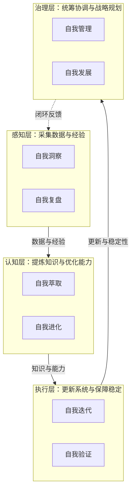
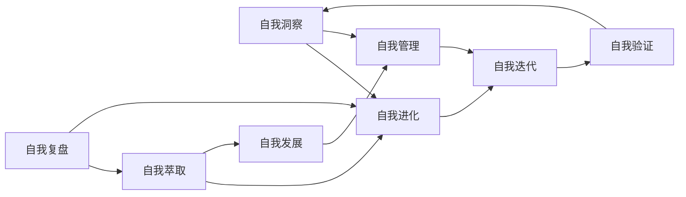

# 自我演进模块索引

本目录存放从 [README.md](../../README.md) 系统规划章节提取的 8 个自我演进子智能体（模块）定义。这些模块构成"感知→认知→执行→治理"四层闭环体系，驱动智能体规范体系的自我演进与生态发展。

## 整体架构

## 模块清单

| 模块 | 所属层级 | 职责 | 时间节点 | 定义文件 |
|------|---------|------|---------|---------|
| 自我洞察 | 感知层 | 数据分析与问题诊断，实时监控与异常预警 | M3-M5 | [self-insight.md](self-insight.md) |
| 自我复盘 | 感知层 | 自动执行项目复盘，提炼经验教训与知识资产 | M2-M4 | [self-retrospective.md](self-retrospective.md) |
| 自我萃取 | 认知层 | 萃取可复用模式、模板与方法论，形成知识资产库 | M3-M5 | [self-extraction.md](self-extraction.md) |
| 自我进化 | 认知层 | 基于数据反馈的进化模型，适应环境变化并提升性能 | M2-M5 | [self-evolution.md](self-evolution.md) |
| 自我迭代 | 执行层 | 可配置迭代策略，实现系统功能自动更新与回滚 | M1-M2 | [self-iteration.md](self-iteration.md) |
| 自我验证 | 执行层 | 自动化测试与验证框架，确保变更稳定性与可靠性 | M1-M3 | [self-verification.md](self-verification.md) |
| 自我管理 | 治理层 | 统筹协调各模块运行，管理资源分配与冲突解决 | M1-M3 | [self-management.md](self-management.md) |
| 自我发展 | 治理层 | 基于战略目标规划系统能力演进，驱动生态建设 | M4-M7 | [self-development.md](self-development.md) |

## 文件命名规范

- 统一采用 `self-<功能>.md` 格式，与 `.agents/roles/` 角色文件命名风格一致。
- 每个文件包含 TOML frontmatter（id/domain/layer/source/bindings）与结构化 Markdown 正文。
- `source` 字段标注信息提取来源（README.md 对应章节）。

## 与核心角色的关系

本目录的 8 个自我演进模块属于系统规划层面的能力单元，与 [.agents/roles/](../roles/) 中的 5 个核心协作角色（orchestrator/architect/developer/reviewer/tester）职责分离：

- **核心角色**：面向多智能体协作开发的具体任务执行与交付。
- **自我演进模块**：面向规范体系自身的感知、认知、执行与治理闭环，驱动体系自我演进。

## 数据流向

