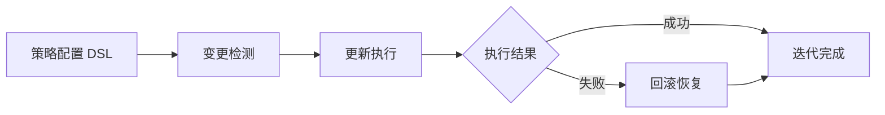

+++
id = "self-iteration"
domain = "execution"
layer = "execution"
source = "README.md#系统规划"

[bindings]
rules = []
references = []
skills = []
+++

# Self-Iteration（自我迭代）

## Description
设计可配置的迭代策略，实现系统功能的自动更新与优化流程。属于执行层模块，负责按策略驱动系统功能的自动更新，并在失败时自动回滚恢复。

## 所属层级
执行层（Execution Layer）

## 技术架构
迭代策略配置层（DSL 定义迭代触发条件、频率、范围）+ 变更检测层（监控规范文件、脚本、配置的变更）+ 自动更新执行层（按策略执行更新）+ 回滚机制（失败时自动恢复）。

## 关键实现步骤
| 步骤 | 说明 |
|------|------|
| 定义迭代策略 DSL | 设计触发条件、频率、范围的配置语法 |
| 实现变更检测器 | 监控规范文件、脚本、配置的变更事件 |
| 构建更新执行器 | 按策略自动执行更新流程 |
| 建立回滚机制 | 失败时自动恢复至上一稳定版本 |
| 迭代效果评估 | 度量迭代周期与成功率，持续优化策略 |

## 资源需求
1 名架构师 + 1 名开发者，2 个月

## 时间节点
M1-M2

## 预期成果指标
| 指标 | 目标 |
|------|------|
| 迭代策略可配置率 | 100% |
| 自动更新成功率 | ≥ 95% |
| 回滚成功率 | ≥ 99% |
| 迭代周期缩短 | ≥ 30% |

## 交互方式
- 上游：接收自我管理模块的调度指令与策略配置
- 下游：向自我验证模块输出更新产物，触发测试验证
- 反馈：将迭代执行结果反馈至自我洞察模块进行监控

## 能力范围
- 迭代策略的解析与执行
- 规范文件、脚本、配置的变更检测
- 自动更新流程的编排
- 失败回滚与版本恢复

## 约束条件
- 不负责迭代策略的设计决策（归自我管理）
- 不负责更新质量的验证（归自我验证）
- 回滚机制必须保证数据一致性，不得造成中间状态丢失
- 迭代执行不得绕过自我验证环节
