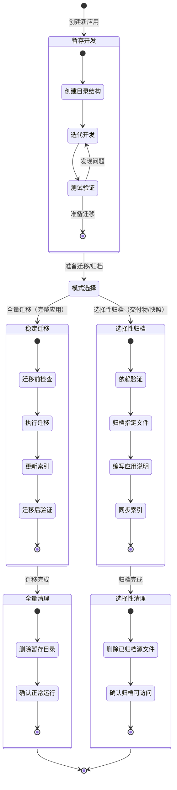
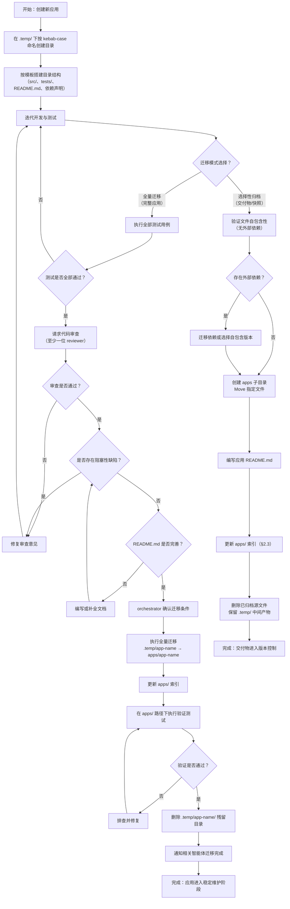

# 应用开发生命周期规范

本协议定义了新应用从创建到稳定的完整生命周期，规范 `.temp/` 暂存开发到 `apps/` 稳定迁移的流程，确保应用开发过程有序、可追溯、可验证。

## 生命周期阶段

新应用的开发经历三个有序阶段，每个阶段有明确的进入条件、执行规范与退出标准。



### 阶段一：暂存开发（`.temp/`）

新应用在 `d:\AI\.temp\<app-name>\` 中创建并开发。此阶段允许频繁修改、重构，不要求代码审查，主要聚焦于快速迭代与功能验证。

#### 命名规范

应用名称使用小写字母与连字符（kebab-case）格式。示例：

- `user-manager`
- `data-pipeline`
- `api-gateway`

禁止使用空格、大写字母、下划线或其他特殊字符作为应用名称。

#### 目录结构模板

```
.temp/<app-name>/
├── src/                  # 源代码
├── tests/                # 测试用例
├── README.md             # 应用说明文档
├── requirements.txt      # Python 依赖声明（Python 项目）
├── package.json          # Node.js 依赖声明（Node.js 项目）
├── go.mod                # Go 模块定义（Go 项目）
├── Cargo.toml            # Rust 依赖声明（Rust 项目）
└── pyproject.toml        # Python 项目配置（PDM/Poetry 项目）
```

模板设计原则：

1. 根据应用技术栈选择对应的依赖声明文件，不必同时包含所有类型的声明文件。
2. `src/` 目录存放源代码，按模块或功能划分子目录。
3. `tests/` 目录存放测试用例，目录结构应与 `src/` 保持对应。
4. `README.md` 在开发初期即可创建，随开发进度逐步完善。
5. 应用的临时依赖（如 `node_modules/`、`.venv/`、`__pycache__/`）不列入上述模板，其管理遵循 [dependency-management.md](./dependency-management.md) 的禁止提交条款与清理机制。

#### 暂存阶段规则

1. 暂存阶段的应用不受代码审查约束，但鼓励开发者在完成重要模块后自行检查。
2. 暂存阶段的应用由负责开发的智能体修改，其他智能体不应干预。
3. `.temp/` 目录下的应用不列入 `apps/` 索引，不对外发布，不作为其他应用的依赖目标。

### 阶段二：稳定迁移（→ `apps/`）

当暂存开发阶段的应用满足迁移条件时，由开发者或编排协调者（orchestrator）发起迁移，将应用从 `.temp/` 目录整体迁移至 `apps/` 目录。

> **迁移模式选择**：阶段二分为两种迁移模式——**全量迁移**（§2.1，默认模式）与**选择性归档**（§2.2，适用于参赛交付物、阶段性成果等场景）。两种模式共享流程骨架（检查→迁移→索引→验证→清理），但质量门禁与迁移范围不同。选择模式后按对应子节执行。

#### 2.1 全量迁移（默认模式）

全量迁移适用于完整应用开发完成后的正式迁移，将 `.temp/<app-name>/` 整个目录迁移至 `apps/<app-name>/`。

##### 迁移条件

全量迁移必须同时满足以下全部条件：

| 序号 | 条件 | 验证方式 | 负责角色 |
|---|---|---|---|
| 1 | 核心功能实现完毕并通过测试 | 执行全部测试用例，通过率 100% | tester |
| 2 | 代码审查通过 | 至少一位 reviewer 审查通过，无未解决的审查意见 | reviewer |
| 3 | 无阻塞性缺陷 | 无 P0/P1 级别缺陷，已知问题已记录且不影响核心功能 | tester、reviewer |
| 4 | 文档已编写 | README.md 包含应用简介、安装步骤、使用说明与依赖列表 | developer |

##### 迁移操作

1. **迁移前检查**：由编排协调者确认四项迁移条件全部满足。
2. **执行迁移**：将 `.temp/<app-name>/` 整体移动或复制至 `apps/<app-name>/`。推荐使用移动操作以避免重复文件残留。
3. **更新索引**：运行 `python .agents/scripts/generate-apps-index.py` 自动更新 `apps/README.md` 中的应用清单表。脚本会扫描 `apps/` 下所有子目录，从各应用的 README.md 提取标题与描述，自动生成索引表。
4. **迁移后验证**：在 `apps/<app-name>/` 路径下执行测试用例与功能验证，确保应用可正常运行。

迁移操作推荐由编排协调者统一执行，或在编排协调者确认后由开发者自行执行。

#### 2.2 选择性归档

选择性归档适用于**参赛交付物、阶段性成果快照、临时演示版本**等非完整应用场景。与全量迁移的区别在于：仅归档指定的已定稿交付物（而非整个开发目录），跳过质量门禁（交付物本身即为验收标准），保留 `.temp/` 下的中间产物。

##### 适用条件

满足以下任一条件即可使用选择性归档：

| 序号 | 条件 | 示例 |
|---|---|---|
| 1 | 归档对象为参赛交付物 | HTML Demo + 报名帖 Markdown |
| 2 | 仅需归档特定版本快照 | 阶段性演示版、评审版 |
| 3 | `.temp/` 下仍有未完成开发的中间产物需保留 | 开发目录含多版本 HTML、规格草稿等 |

##### 归档操作（5 步法）

1. **规范读取**：读取本协议与 `apps/README.md`，建立上下文。
2. **依赖验证**：验证待归档文件的自包含性（HTML 无外部 CSS/JS 引用，Markdown 无本地图片缺失），推荐使用正则 `(href|src)=["']\.agents|\.css|\.js["']` 检测 HTML 外部依赖。若存在依赖，须一并迁移依赖文件或选择自包含版本。
3. **目录创建与文件迁移**：按 kebab-case 命名在 `apps/` 下创建子目录，使用 Move 操作将指定文件迁移至目标目录。
4. **应用说明编写**：编写 `apps/<app-name>/README.md`，至少包含项目定位、目录内容、使用方式与来源说明。
5. **索引同步**：运行 `python .agents/scripts/generate-apps-index.py` 自动更新 `apps/README.md` §2.3 应用清单。若为首个应用，脚本会自动在已有表格中追加条目，无需手动建立章节。

##### 清理规则

- 已迁移的源文件从 `.temp/` 中删除（Move 操作自动完成）
- `.temp/` 下未归档的中间产物保留不动，后续可继续开发或另行归档
- 不执行全量迁移的「删除整个暂存目录」操作

### 阶段三：清理

迁移/归档完成并验证通过后，须清理暂存目录中的残留文件。清理方式因迁移模式不同而异。

#### 全量迁移清理

1. **删除暂存目录**：删除 `.temp/<app-name>/` 整个目录及其内容。
2. **确认正常运行**：再次确认 `apps/<app-name>/` 可正常运行，路径引用无残留指向 `.temp/`。
3. **通知相关方**：通过 [messaging.md](./messaging.md) 定义的消息协议（`status_update` 类型）通知相关智能体应用已正式迁移，后续开发应在 `apps/` 下进行。

#### 选择性归档清理

1. **删除已归档源文件**：仅删除已 Move 至 `apps/` 的源文件，`.temp/` 下未归档的中间产物保留。
2. **确认归档可访问**：确认 `apps/<app-name>/` 中的文件可正常打开（HTML 无断链、Markdown 可渲染）。
3. **不执行全量删除**：不删除整个 `.temp/<app-name>/` 目录，保留中间产物供后续开发或另行归档。

## 与 dependency-management.md 的关系

本协议与 [dependency-management.md](./dependency-management.md) 的关系如下：

| 维度 | dependency-management.md | 本协议 |
|---|---|---|
| 管理范围 | `.temp/` 下所有中间产物的通用规范（缓存、日志、输出） | `.temp/` 中**应用开发**场景的专用规范 |
| 目录约束 | 定义 `.temp/cache/`、`.temp/logs/`、`.temp/output/` 的子目录结构 | 定义 `.temp/<app-name>/` 的应用目录结构与生命周期 |
| 清理机制 | 定义缓存过期、日志轮转、任务完成后清空的通用策略 | 定义应用迁移后的专属清理流程（删除 `.temp/<app-name>/`） |
| 依赖管理 | 禁止 `node_modules/`、`.venv/` 等临时依赖提交 | 引用并沿用 dependency-management.md 的禁止提交条款与清理机制 |

简言之，dependency-management.md 是 `.temp/` 的**通用管理章程**，本协议是基于其之上的**应用开发专项规则**。应用在暂存开发期间的临时依赖管理仍遵循 dependency-management.md 的规定，本协议不作重复约定。

## 使用流程示例

以下流程图展示了从创建应用到迁移完成的完整过程：



## 使用约束

1. **禁止直接开发**：禁止直接在 `apps/` 目录下启动新应用开发，所有新应用必须经过 `.temp/` 暂存阶段后方可迁移至 `apps/`。
2. **禁止逆向迁移**：应用迁移至 `apps/` 后，禁止再次移回 `.temp/` 目录；如需重大重构，应在 `apps/` 下创建分支或新版本目录。
3. **迁移通知**：执行迁移操作时，须通过 [messaging.md](./messaging.md) 定义的消息协议通知相关智能体，类型为 `status_update`，至少发送给 orchestrator 与负责开发的智能体。选择性归档场景可省略通知步骤。
4. **迁移验证**：迁移后须在 `apps/<app-name>/` 路径下执行至少一次完整的功能验证，确保路径变更未导致引用错误或硬编码路径失效。选择性归档至少验证归档文件可正常打开。
5. **暂存命名唯一**：`.temp/` 下的应用名称须唯一，不得与已有暂存应用重名，也不得与 `apps/` 下的现有应用重名。
6. **目录结构合规**：全量迁移的应用目录结构须遵循本协议定义的模板，缺少必要文件（如 README.md、依赖声明文件）的应用不得发起迁移。选择性归档不受此约束，但必须包含 README.md。
7. **依赖管理遵循**：暂存开发期间的临时依赖管理严格遵循 [dependency-management.md](./dependency-management.md) 的禁止提交条款与清理机制。
8. **索引同步**：迁移完成后运行 `python .agents/scripts/generate-apps-index.py` 自动更新 `apps/README.md` 索引，确保应用清单与实际目录保持一致。
9. **冲突规避**：若 `.temp/<app-name>/` 与 `apps/<app-name>/` 目标位置存在同名冲突，迁移前须由编排协调者协调解决（如合并、更名或评估替换）。
10. **归档而非删除**：废弃的暂存应用建议先归档至 `.temp/_archived/` 再评估是否删除，避免误删有价值的代码。最终保留或删除由编排协调者决策。
11. **迁移失败回退**：若迁移后验证（阶段二第 4 步）失败，按以下流程处理：
    - **轻度问题**（路径引用错误、配置遗漏等可原地修复的问题）：在 `apps/<app-name>/` 下直接修复，重新验证通过后继续清理阶段。
    - **重度问题**（核心功能异常、环境不兼容等不可快速修复的问题）：执行回退——删除 `apps/<app-name>/` 中已迁移的内容，应用返回 `.temp/<app-name>/` 继续开发。回退后须更新 `apps/` 索引，移除未通过验证的应用条目。回退决策由编排协调者确认，回退操作须记录原因与时间戳。
    - **验证**：回退后须在 `.temp/<app-name>/` 下重新执行功能验证，确保回退操作未引入新的问题。
12. **选择性归档的门禁豁免**：选择性归档场景跳过全量迁移的四项质量门禁（测试通过/审查通过/无缺陷/文档完善），但必须执行依赖验证（§2.2 步骤 2）与索引同步（§2.2 步骤 5）。
