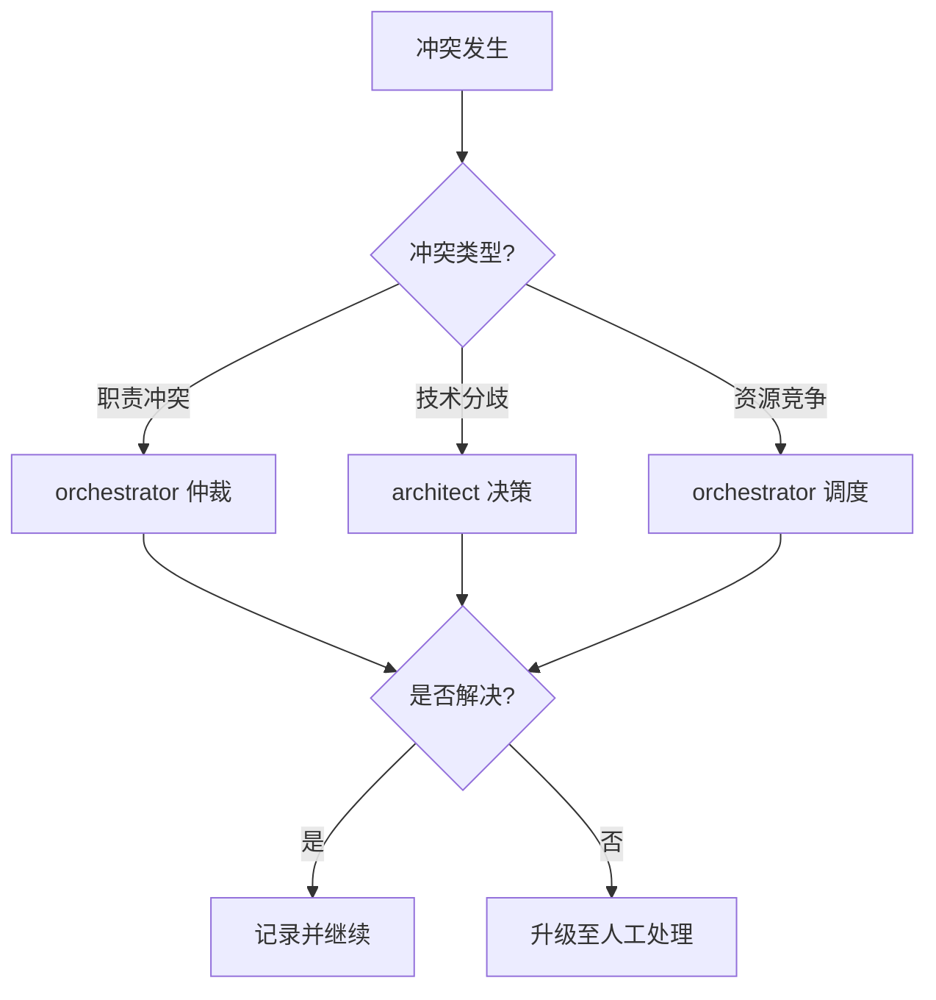

# 冲突解决协议

本协议定义了多智能体协作过程中可能出现的冲突类型、解决方式、升级路径以及仲裁规则，确保冲突能够被及时识别、合理解决并完整记录，避免协作过程陷入僵局。

## 冲突类型

| 类型 | 说明 | 解决方式 |
|---|---|---|
| 职责冲突 | 角色间职责重叠，多个智能体对同一任务或资源主张所有权 | 由 orchestrator 仲裁，明确职责归属 |
| 技术分歧 | 技术方案不一致，智能体间对架构设计、实现方式、技术选型存在不同意见 | 由 architect 决策，基于项目规范与最佳实践 |
| 资源竞争 | 共享资源争用，多个智能体同时需要访问或修改同一文件、目录或环境 | 由 orchestrator 调度，安排串行访问或资源隔离 |

## 升级路径

## 仲裁规则

### 1. 职责冲突仲裁规则

- **优先级原则**：任务分配以 orchestrator 的初始分配为准，后续智能体不得自行认领已分配任务。
- **能力匹配原则**：当职责重叠涉及能力差异时，优先分配给能力更匹配的智能体。
- **负载均衡原则**：当能力相当时，优先分配给当前负载较低的智能体。
- **历史归属原则**：若任务为此前某智能体工作的延续，优先分配给原智能体以保证上下文连续性。

### 2. 技术分歧仲裁规则

- **规范优先原则**：若项目已有相关技术规范或约定，以规范为准。
- **最佳实践原则**：若无明确规范，以行业最佳实践与项目既有模式为准。
- **可维护性原则**：方案选择应优先考虑代码可读性、可测试性与可维护性。
- **最小变更原则**：在功能等价前提下，优先选择变更范围更小的方案。
- **architect 终裁原则**：技术分歧最终由 architect 决策，其他智能体应尊重并执行决策结果。

### 3. 资源竞争仲裁规则

- **串行访问原则**：对同一文件的写操作应串行执行，避免并发冲突。
- **优先级调度原则**：高优先级任务的资源访问请求优先处理。
- **锁机制原则**：长时间占用资源（如构建、测试）应通过状态同步机制告知其他智能体。
- **资源隔离原则**：当资源竞争频繁时，应考虑将任务拆分至不同目录或分支独立执行。

### 4. 通用仲裁规则

- **及时报告原则**：冲突发生后，相关智能体应立即通过 `conflict_report` 类型消息报告，不得拖延。
- **客观陈述原则**：冲突报告应客观陈述事实与影响，避免主观情绪表达。
- **尊重裁决原则**：仲裁结果一旦作出，相关智能体应无条件执行，不得消极抵抗。
- **记录留存原则**：所有冲突报告与仲裁结果应留存记录，便于复盘与流程优化。
- **升级机制原则**：当一级仲裁无法解决冲突时，应升级至人工处理，由项目维护者最终裁决。
