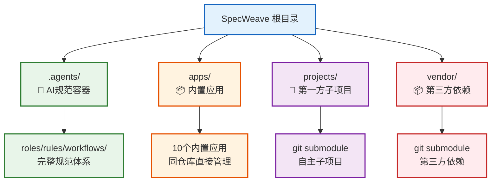
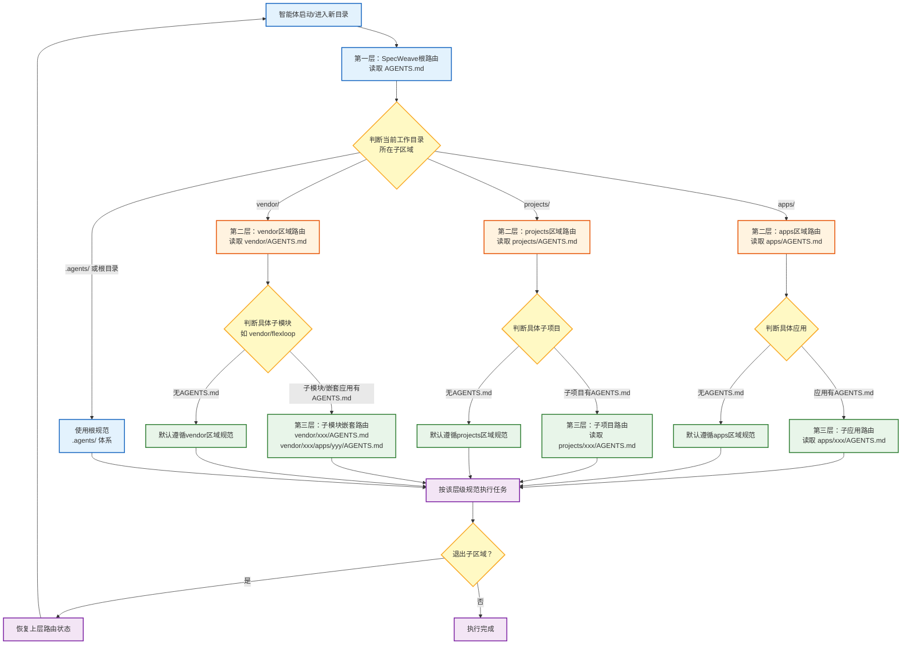

# 四区域路由体系架构规范

本规范定义了 SpecWeave 工作区四大顶层区域的架构设计、路由协议、对称结构要求和操作标准，是智能体上下文路由和区域治理的权威依据。

## 1. 架构概述

### 1.1 设计哲学

四区域路由体系建立在四个核心架构原则之上：

| 原则 | 核心陈述 | 目标 |
|------|---------|------|
| **架构对称性** | 所有同构子区域必须遵循相同的结构模式，即使某些区域当前不需要完整能力 | 消除结构性技术债务，保证可预测性 |
| **显式默认** | 每个区域必须显式声明默认行为（权限、约束、路由），即使是"无特殊约束" | 消除猜测和隐式约定依赖 |
| **数据驱动路由** | 路由判断从声明式路由表派生，而非硬编码条件分支 | 可扩展、易维护、符合开闭原则 |
| **渐进式披露** | 入口文件精简，只做路由和边界声明，详细规范按需扩展 | 轻量入口、重规范、平滑扩展 |

### 1.2 四大顶层区域定义



| 目录 | 用途 | 管理方式 | 版本控制 | 是否可直接修改 | AGENTS.md入口 |
|---|---|---|---|---|---|
| `.agents/` | AI 智能体规范容器（roles/rules/workflows/protocols等） | 主权区直接维护 | 直接纳入版本控制 | ✅ 可修改 | [.agents/README.md](../README.md) |
| `apps/` | 主仓库内置应用开发工作空间 | 同仓库直接管理（非 git submodule） | 直接纳入版本控制 | ✅ 可修改 | [apps/AGENTS.md](../../apps/AGENTS.md) |
| `projects/` | 第一方自有子项目 | git submodule 管理 | 通过 gitlink 追踪 | ❌ 不可直接修改（走子项目流程） | [projects/AGENTS.md](../../projects/AGENTS.md) |
| `vendor/` | 第三方依赖 | git submodule 管理 | 通过 gitlink 追踪 | ❌ 禁止本地修改 | [vendor/AGENTS.md](../../vendor/AGENTS.md) |

### 1.3 区域本质区别

| 维度 | .agents/ | apps/ | projects/ | vendor/ |
|------|----------|-------|-----------|---------|
| **性质** | 规范元数据 | 内置产品应用 | 第一方子项目 | 第三方依赖 |
| **修改权限** | 自由修改 | 自由修改 | 子项目流程 | 禁止修改 |
| **版本独立性** | 与主仓库同版本 | 与主仓库同版本 | 独立版本（gitlink） | 独立版本（gitlink） |
| **规范体系** | 完整规范体系 | 入口+按需扩展 | 自主规范 | 自主规范 |
| **典型内容** | 规则、角色、脚本 | 可运行应用 | 第一方开源/闭源项目 | 第三方库/工具 |

---

## 2. 三层路由协议

### 2.1 路由层级定义

| 层级 | 位置 | 职责 | 核心内容 |
|------|------|------|----------|
| **第一层：根路由** | 项目根目录 `AGENTS.md` | 判断工作目录所在子区域，分发到对应区域入口 | 启动协议、四区域对比表、子区域路由判断逻辑 |
| **第二层：区域路由** | `<region>/AGENTS.md` | 区域边界声明、子模块路由表、跨子模块调用规范 | 区域性质说明、子模块路由表、边界声明、默认规范指引 |
| **第三层：子模块路由** | `<region>/<submodule>/AGENTS.md` | 该子模块的完整规范体系入口 | （可选）roles/rules/workflows/skills 等完整规范 |

### 2.2 路由流程图



### 2.3 路由判断核心规则

1. **遍历顺序固定**：按 `apps → projects → vendor` 顺序检查，顺序本身是约定的一部分
2. **最长前缀匹配**：优先匹配更深层的路由（嵌套优先原则）
3. **状态恢复**：退出子区域后必须恢复上层路由状态，避免路由状态污染
4. **默认行为**：子模块没有自己的 AGENTS.md 时，默认遵循上一层规范（不是报错）
5. **单一事实来源**：路由判断逻辑只从路由表数据派生，不硬编码任何特定区域名称
6. **跨区域边界**：从一个区域进入另一个区域时，必须重新执行路由判断流程

### 2.4 启动协议中的路由判断实现

根 AGENTS.md 启动协议步骤 2.1：

```markdown
> **步骤 2.1**（子区域嵌套·条件触发）：按以下顺序判断工作目录所在区域，进入对应区域的 AGENTS.md 路由体系，遵循"嵌套优先"规则；退出子区域后恢复 SpecWeave 路由：
>   - 若在 `apps/` 内 → 读取 [apps/AGENTS.md](apps/AGENTS.md)（应用区入口路由），再按其「应用路由表」进入对应应用
>   - 若在 `projects/` 内 → 读取 [projects/AGENTS.md](projects/AGENTS.md)（第一方子项目入口路由），再按其「子项目路由表」进入对应子项目
>   - 若在 `vendor/` 内 → 读取 [vendor/AGENTS.md](vendor/AGENTS.md)（第三方依赖入口路由），再按其「子模块路由表」进入对应子模块（`vendor/flexloop/AGENTS.md` → `vendor/flexloop/apps/chaos/AGENTS.md`）
>   - 三层路由体系：SpecWeave（主权区）→ 子区域（apps/projects/vendor）→ 子应用/子项目/子模块
```

### 2.5 异常处理

| 异常场景 | 处理方式 |
|---------|---------|
| 子区域内孤儿目录（不在路由表中） | 查阅区域 README.md 确认是否为新增内容；若非新增，回退上层路由提示路径可能有误 |
| 路由表无匹配子模块 | 确认是否需要走新增/引入流程；更新路由表后重试 |
| 子模块未初始化（submodule 空目录） | 运行 `git submodule update --init <path>` 初始化；gitlink 损坏则回退 |
| 子模块无 AGENTS.md | 默认遵循上一层区域规范，继续执行 |
| 跨边界修改禁止区域 | 运行 `check-vendor.py --deep` 检测；按子模块流程回退，禁止直接修改 |

---

## 3. 对称目录结构规范

### 3.1 最小结构模板

所有顶层区域必须满足以下最小结构：

```
<region>/
├── AGENTS.md              # ✅ 必需：区域入口路由
├── .agents/
│   └── README.md          # ✅ 必需：元数据容器说明（即使内容极简）
└── README.md              # ⭐ 建议：区域概览，包含智能体入口引用
```

### 3.2 AGENTS.md 最小内容要求

每个区域的 AGENTS.md 必须包含以下核心章节：

```markdown
---
title: <区域名称> 入口路由
---
# <区域名称>

## 区域性质
<!-- 一句话说明该区域与其他区域的本质区别、管理方式、是否可直接修改 -->

## <子模块>路由表
| 名称 | AGENTS.md 入口 | .agents/ | 说明 |
|------|---------------|:---:|------|
| xxx | [xxx/AGENTS.md](xxx/AGENTS.md) | ✅/❌ | 说明 |
| yyy | —（遵循本层规范） | ❌ | 暂无独立规范 |

## 边界声明
<!-- 默认行为、权限约束、与其他区域的交互规则 -->
```

**apps/ 区域路由表示例**：
```markdown
| 应用 | AGENTS.md 入口 | .agents/ | 说明 |
|------|---------------|:---:|------|
| docker-ssh-dind | [docker-ssh-dind/AGENTS.md](docker-ssh-dind/AGENTS.md) | ✅ 有 | Docker SSH DinD 环境 |
| zhujian-wudao | [zhujian-wudao/AGENTS.md](zhujian-wudao/AGENTS.md) | ✅ 有 | 竹简悟道——道家哲学AI洞察项目 |
| ai-code-assistant | —（遵循根规范） | ❌ 无 | AI 代码助手 Web 应用 |
```

### 3.3 .agents/README.md 最小内容要求

```markdown
# <区域名称> 元数据容器

本目录是 <区域名称> 区域的规范元数据容器。

| 维度 | 本目录 | 子模块 .agents/ |
|------|--------|----------------|
| 归属 | 上层区域主权 | 子模块自有 |
| 版本管理 | 直接纳入上层版本控制 | 按子模块管理方式 |
| 内容 | 元数据/索引/路由 | 完整规范体系（rules/roles/skills 等） |
| 可修改 | ✅ 可直接修改 | ✅ 按子模块规范修改 |
```

### 3.4 README.md 入口引用要求

区域 README.md 顶部建议添加智能体入口引用：

```markdown
> **AI 智能体入口**：[AGENTS.md](AGENTS.md) — <区域>智能体路由与资产索引，.agents/ 目录为元数据容器。
```

---

## 4. 入口对比表规范

### 4.1 设计原则

**原则1：行是实体，列是维度**
- 每行：一个同构实体
- 每列：一个关键对比维度（选最容易出错的维度）

**原则2：单元格简洁**
- 用 ✅/❌ 图标 + 短语，禁止长段落
- 关键约束用加粗或图标突出
- 单元格控制在15字以内

**原则3：边界维度优先**
- 权限类维度（"是否可修改"）必须包含
- 最后一列必须是入口链接，形成导航闭环

**原则4：放置位置**
- 对比表放在入口文档"第一眼"位置（启动协议之后、详细内容之前）

### 4.2 标准列维度参考

| 场景 | 推荐列维度 |
|------|---------|
| **目录/区域对比** | 目录名、用途、管理方式、版本控制、是否可修改、入口链接 |
| **角色权限对比** | 角色、查看权限、编辑权限、审批权限、管理权限、文档链接 |
| **多环境对比** | 环境、用途、数据来源、部署方式、访问权限、配置入口 |
| **子模块路由表** | 名称、AGENTS.md入口、.agents/状态、说明 |

---

## 5. 新增顶层区域 SOP

当需要在项目根目录新增第五个顶层区域时，必须严格按照以下对称检查表执行：

### 5.1 对称检查表（10项检查）

| # | 检查项 | 必需/建议 | 验证方法 |
|---|--------|----------|---------|
| 1 | 该区域是否有自己的 AGENTS.md 入口文件？ | 必需 | 文件存在且包含3个核心章节 |
| 2 | AGENTS.md 是否包含「区域性质」章节？ | 必需 | 明确管理方式、修改权限、与其他区域的区别 |
| 3 | AGENTS.md 是否包含「子模块路由表」？ | 必需 | 表格存在，即使暂无子模块也要占位 |
| 4 | AGENTS.md 是否包含「边界声明」？ | 必需 | 明确默认行为和跨区域交互规则 |
| 5 | 该区域是否有 .agents/README.md 元数据容器？ | 必需 | 文件存在，包含归属关系对比表 |
| 6 | 根 AGENTS.md 四区域对比表是否已更新？ | 必需 | 添加一行，保持对称 |
| 7 | 根 AGENTS.md 启动协议步骤 2.1 是否已更新？ | 必需 | 在固定判断顺序中加入该区域 |
| 8 | context-routing.md 是否已注册该区域入口？ | 必需 | 在常规任务路由中添加入口路由项 |
| 9 | 该区域 README.md 是否包含智能体入口引用？ | 建议 | 顶部有「AI 智能体入口」指向 AGENTS.md |
| 10 | 是否已从其他区域视角验证路由可达？ | 建议 | 从其他区域进入该区域路径正确 |

### 5.2 新增区域操作步骤

```
步骤1：创建目录结构
  mkdir <new-region>/
  mkdir <new-region>/.agents/

步骤2：创建最小入口文件
  复制 AGENTS.md 模板，填充区域性质、路由表、边界声明
  创建 .agents/README.md 元数据容器文档
  在 README.md 顶部添加入口引用

步骤3：更新根路由
  在根 AGENTS.md 对比表添加一行
  在启动协议步骤2.1添加判断分支
  在 context-routing.md 注册该区域入口

步骤4：验证
  10项对称检查表逐项确认
  从其他区域路径测试路由可达
  运行链接检查确认所有新链接有效
```

---

## 6. 反模式警示

| 反模式 | 后果 | 正确做法 |
|--------|------|---------|
| "这个区域简单，先不加AGENTS.md" | 第一个例外产生，不对称开始累积，未来重构成本非线性增长 | 即使50行的最小AGENTS.md也要先建立 |
| `if (vendor) { ... } else if (projects) { ... }` 硬编码路由 | 新增区域时O(N)改动，违反开闭原则 | 遍历固定顺序的路由表，数据驱动 |
| 只给"重要"区域建立入口，"次要"区域不管 | 路由逻辑特殊化，维护成本指数上升 | 所有同构区域一视同仁，都有最小入口 |
| 在README段落中描述区域差异 | 信息密度低，关键约束不醒目，无法导航 | 用高密度对比表，最后一列入口链接 |
| 子模块没有AGENTS.md时报错 | 简单子模块被强制要求完整规范，过度设计 | 默认遵循上一层规范，AGENTS.md是可选增强 |
| 新增区域时忘记更新根对比表 | 全局边界视图缺失，架构对称被破坏 | 按10项检查表逐项执行，不跳步 |
| 单元格写长段落描述 | 对比表失去高密度优势 | 单元格短语+图标，详细说明在表格外补充 |
| 退出子区域后不恢复路由状态 | 路由状态污染，后续任务使用错误规范 | 显式记录路由栈，退出时逐层恢复 |

---

## 7. 渐进式扩展路径

区域规范体系不是一步到位的，而是按阶段渐进扩展：

```
阶段0：目录创建（必须）
  └── 立即建立最小AGENTS.md + .agents/README.md（对称占位）
  └── 更新根路由表和启动协议

阶段1：子模块加入（按需）
  └── 在区域路由表中注册子模块
  └── 子模块如有需要建立自己的AGENTS.md（第三层路由）

阶段2：规范扩展（按需）
  └── 根据需要在.agents/下添加rules/roles/skills等
  └── 不需要的区域保持最小结构即可

阶段3：成熟稳定（可选）
  └── 规范体系完整，可作为其他区域的参考模板
```

**关键原则**：阶段0是强制的（保证架构对称），阶段1-3是按需扩展的（避免过度设计）。

---

## 8. 关联模式与参考文档

### 8.1 可复用模式文档

| 模式 | 位置 | 说明 |
|------|------|------|
| 三层路由协议 | [patterns/architecture-patterns/three-layer-routing-protocol.md](../docs/retrospective/patterns/architecture-patterns/three-layer-routing-protocol.md) | 路由设计详细规范与验证案例 |
| 对称目录结构设计 | [patterns/methodology-patterns/governance-strategy/symmetric-directory-structure.md](../docs/retrospective/patterns/methodology-patterns/governance-strategy/symmetric-directory-structure.md) | 最小结构模板与对称检查表 |
| 入口对比表模式 | [patterns/methodology-patterns/document-architecture/entry-comparison-table.md](../docs/retrospective/patterns/methodology-patterns/document-architecture/entry-comparison-table.md) | 高密度对比表设计原则 |
| 三层入口设计 | [patterns/architecture-patterns/triple-entry-design.md](../docs/retrospective/patterns/architecture-patterns/triple-entry-design.md) | AGENTS.md/README.md/workspace.yaml 三入口分离 |

### 8.2 区域入口文件

| 区域 | 入口文件 |
|------|---------|
| 根契约 | [AGENTS.md](../../AGENTS.md) |
| .agents/ 规范容器 | [.agents/README.md](../README.md) |
| apps/ 区域 | [apps/AGENTS.md](../../apps/AGENTS.md) |
| projects/ 区域 | [projects/AGENTS.md](../../projects/AGENTS.md) |
| vendor/ 区域 | [vendor/AGENTS.md](../../vendor/AGENTS.md) |

### 8.3 验证来源

- [四区域路由体系建立复盘报告](../docs/retrospective/reports/project-governance/documentation-governance/retrospective-establish-four-region-routing-system-20260724/README.md)
- [上下文路由表](context-routing.md)
