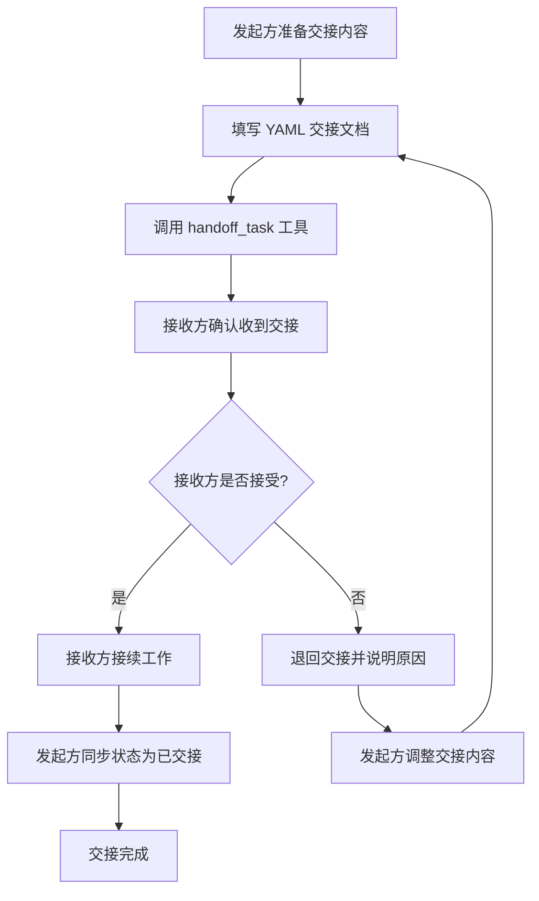

# 任务交接协议

本协议定义了智能体之间进行任务交接时的标准格式、字段定义、交接流程以及使用约束，确保任务在不同智能体之间传递时上下文完整、可追溯、可接续。

## 交接格式

任务交接采用 YAML 格式，所有字段使用字符串类型，便于序列化与解析。

```yaml
handoff:
  from: "orchestrator"
  to: "developer"
  task_context: "任务描述与背景"
  completed_work: "已完成的工作列表"
  pending_items: "待办事项列表"
  risks: "风险提示"
  timestamp: "2026-06-23T10:00:00Z"
```

## 字段定义

| 字段名 | 类型 | 是否必填 | 说明 |
|---|---|---|---|
| from | string | 是 | 交接发起方智能体标识，如 orchestrator、developer、reviewer 等 |
| to | string | 是 | 交接接收方智能体标识 |
| task_context | string | 是 | 任务上下文与背景描述，包含任务目标、相关需求、约束条件等 |
| completed_work | string | 是 | 已完成的工作列表，描述已完成的步骤、产出物及关键决策 |
| pending_items | string | 是 | 待办事项列表，描述尚未完成的工作及建议的处理方式 |
| risks | string | 否 | 风险提示，包含已知风险、潜在问题及缓解措施 |
| timestamp | string | 是 | 交接时间戳，采用 ISO 8601 格式（如 2026-06-23T10:00:00Z），时区为 UTC |

## 交接流程



## 使用约束

1. **完整性要求**：交接文档必须完整填写 `from`、`to`、`task_context`、`completed_work`、`pending_items`、`timestamp` 字段，`risks` 字段在无风险时应填写 "无"。
2. **上下文充分**：`task_context` 应提供足够的背景信息，使接收方无需额外询问即可理解任务目标与约束。
3. **已完成工作详尽**：`completed_work` 应列出所有已完成步骤与产出物，包括修改的文件路径、关键决策及原因。
4. **待办事项明确**：`pending_items` 应明确列出尚未完成的工作，并提供建议的处理方式或注意事项。
5. **风险提示前置**：已知风险必须在 `risks` 字段中明确说明，包括技术风险、依赖风险、时间风险等。
6. **时间戳统一**：`timestamp` 必须使用 ISO 8601 格式，时区统一为 UTC，便于跨时区协作。
7. **交接确认机制**：接收方收到交接后必须明确确认（接受或退回），禁止默认接受。
8. **单向交接**：一次交接只能指定一个接收方，多接收方场景应由 orchestrator 协调分别交接。
9. **交接记录留存**：所有交接记录应留存备查，便于任务追溯与复盘。
10. **禁止隐式交接**：禁止通过非标准方式（如口头沟通、临时文件）进行任务交接，必须使用本协议定义的格式与 `handoff_task` 工具。
