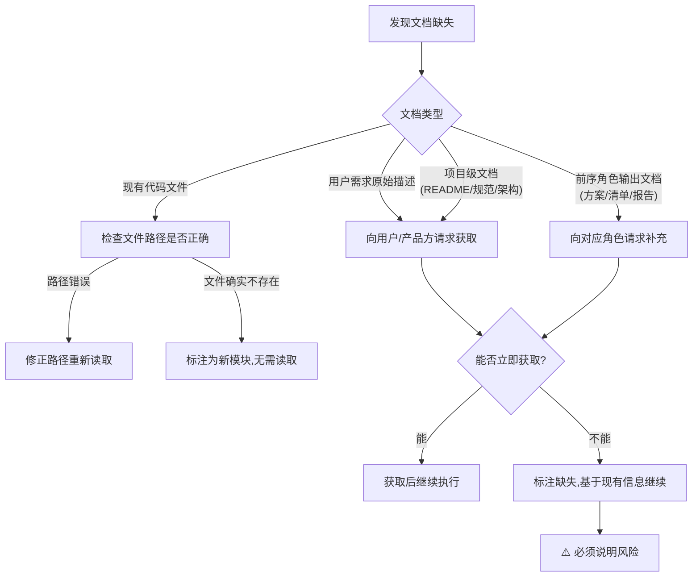

# 前置文档强制读取协议

本协议定义各角色在开始工作前必须读取的前置文档清单、读取确认机制、文档缺失处理规则以及新会话强制重载要求。所有智能体在执行任何开发任务前必须遵守本协议，确保"不读完文档不许动手"。

## 核心原则

> AI的上下文窗口是有限的，但项目文档是持久的。每开一个新会话，AI的记忆就清零了——如果不重新读取前置文档，它就会基于"想象中的项目"而不是"真实的项目"来工作。
> 强制读取不是不信任AI，而是给它一个准确的起点。

---

## 前置文档清单

各角色在进入对应阶段前，必须读取以下文档：

### 按阶段×角色的必读文档矩阵

| 阶段 | 负责角色 | 必须读取的前置文档 |
|------|---------|-------------------|
| ①需求接收 | orchestrator | 1. 用户需求原始描述<br>2. 项目 [README.md](../../README.md)<br>3. 相关历史 spec（`.trae/specs/` 下关联主题） |
| ②方案设计 | architect | 1. 任务分解清单（orchestrator输出）<br>2. 项目技术栈文档<br>3. 现有架构文档（`.agents/` 下的模块定义）<br>4. 开发规范（[docs/development-standards.md](../../docs/development-standards.md)） |
| ③任务分配 | orchestrator | 1. 技术方案文档（architect输出）<br>2. 角色能力矩阵（[.agents/roles/README.md](../roles/README.md)） |
| ④代码实现 | developer | 1. 技术方案文档（architect输出）<br>2. 任务分解清单（orchestrator输出）<br>3. 开发规范（[docs/development-standards.md](../../docs/development-standards.md)）<br>4. 相关模块现有代码（必须实际读取文件内容） |
| ⑤测试编写 | tester | 1. 需求文档（原始需求+验收标准）<br>2. 技术方案文档（architect输出）<br>3. 代码实现（developer提交的PR）<br>4. 测试规范（[.agents/workflows/testing.md](../workflows/testing.md)） |
| ⑥代码审查 | reviewer | 1. 需求文档（原始需求+验收标准）<br>2. 技术方案文档（architect输出）<br>3. 代码实现（developer提交的PR）<br>4. 测试报告（tester输出）<br>5. 审查checklist |
| ⑦合并代码 | orchestrator | 1. 审查通过报告（reviewer输出）<br>2. CI检查结果 |
| ⑧完成确认 | orchestrator | 1. 合并结果<br>2. 测试报告<br>3. 验收标准清单（需求阶段定义） |

### 功能演进场景的补充读取

| 变更类型 | 额外必读文档 |
|---------|------------|
| 功能扩展 | 1. 待扩展功能的原始需求文档<br>2. 待扩展功能的技术方案<br>3. 待扩展功能的现有代码实现 |
| 功能重构 | 1. 待重构功能的全部历史文档（需求+方案+测试）<br>2. 影响范围内所有模块的代码<br>3. 相关历史BUG修复记录 |

---

## 读取确认机制

### 确认输出格式

角色开始执行任务时，必须在输出中显式确认已读取所有前置文档，格式为：

```
📋 前置文档确认：已读取 [文档1]、[文档2]、[文档3]
```

### 确认规则

1. **逐项列举**：必须逐项列出已读取的文档名称，不得笼统地说"已读取所有文档"
2. **精确路径**：文档引用必须使用可点击链接格式，指向具体文件路径
3. **首次输出确认**：确认信息必须在该阶段的首次输出中出现，不得延后
4. **不可省略**：即使文档很长或之前读过，在新阶段开始时仍须重新确认

### 正确示例

developer开始编码时的输出：

```
📋 前置文档确认：已读取 [技术方案文档](.agents/specs/xxx.md)、[任务分解清单](.temp/tasks.md)、[开发规范](docs/development-standards.md)、[auth模块现有代码](apps/zhujian-wudao/src/auth.js)

开始实现用户认证模块，按照方案的分层架构进行编码……
```

### 错误示例

❌ "已了解需求，开始编码"——未列举读取了哪些文档
❌ "按照方案来做"——未确认具体读取了哪个方案文档
❌ 直接开始写代码，没有任何确认——完全跳过了读取确认

---

## 文档缺失处理

如果前置文档清单中的某项文档不存在或无法获取，按以下规则处理：

### 处理流程



### 缺失标注格式

当文档确实无法获取时，必须标注：

```
📋 前置文档确认：已读取 [文档1]、[文档2]
⚠️ 文档缺失：[文档3] 无法获取，原因：[具体原因]
风险说明：基于现有信息继续执行，可能存在[具体风险描述]
```

### 不允许的做法

- ❌ 静默跳过缺失文档，假装已读取
- ❌ 文档未获取就开始执行，不说明任何风险
- ❌ 用模糊表述掩盖缺失，如"部分文档已读取"

---

## 新会话强制重载

### 规则

当智能体在**新会话**中继续之前的任务时，必须**重新读取**所有相关前置文档。

### 原因

- AI在新会话中不保留前一会话的记忆
- 即使前一会话已经读过文档，新会话中必须重新读取才能建立上下文
- 依赖"前一会话记忆"是不可靠的，可能导致基于过时或错误信息工作

### 重载确认格式

新会话开始时，必须输出：

```
📋 新会话上下文重建：已重新读取 [文档1]、[文档2]、[文档3]
当前进度：[当前处于哪个阶段/任务完成到哪一步]
待办事项：[接下来要做什么]
```

### 适用场景

- 用户开启新对话，要求继续之前的开发任务
- 会话中断后恢复执行
- 智能体被重新激活继续未完成任务

---

## 协议使用示例

### 完整场景：developer收到任务分配后的读取确认

```
📋 前置文档确认：已读取 [技术方案文档](../.temp/feature-auth/spec.md)、[任务分解清单](../.temp/feature-auth/tasks.md)、[开发规范](docs/development-standards.md)、[auth模块现有代码](apps/myapp/src/auth/)

当前为④代码实现阶段，按照方案实现JWT认证中间件：
1. 首先实现token签发功能
2. 然后实现token验证中间件
3. 最后编写单元测试
```

### 完整场景：新会话恢复任务

```
📋 新会话上下文重建：已重新读取 [竹简悟道项目README](apps/zhujian-wudao/README.md)、[技术方案](.temp/zhujian/spec.md)、[任务清单](.temp/zhujian/tasks.md)、[已有代码](apps/zhujian-wudao/src/)

当前进度：④代码实现阶段，对话核心逻辑已完成，待实现竹简渲染模块
待办事项：继续实现竹简渲染模块 → 编写单元测试 → 提交PR
```

---

## 日志输出规范

前置文档读取过程中的关键事件必须输出结构化日志，格式与阶段守卫日志（[SG-LOG]）保持一致，使用`[PDR-LOG]`前缀标识。

### 日志事件类型

| event值 | 级别 | 触发时机 |
|---------|------|---------|
| `PDR_START` | INFO | 开始执行前置文档读取流程 |
| `PDR_DOC_READ` | INFO | 成功读取一份前置文档 |
| `PDR_DOC_SKIP` | DEBUG | 跳过已读取过的文档（新会话恢复场景） |
| `PDR_DOC_MISSING` | WARN | 发现前置文档缺失 |
| `PDR_DOC_REQ_GAP` | WARN | 文档已读取但关键信息缺失（如技术方案中缺少接口定义） |
| `PDR_CONFIRM` | INFO | 输出📋前置文档确认 |
| `PDR_ERROR` | ERROR | 文档读取过程中发生严重错误 |

### 日志格式

```
[PDR-LOG] | level=<LEVEL> | event=<EVENT_TYPE> | stage=<STAGE_ID> | role=<ROLE> | session=<SESSION_ID> | msg=<MESSAGE> | ctx=<CONTEXT_JSON>
```

### 各事件模板与示例

#### PDR_START - 开始读取流程

```
[PDR-LOG] | level=INFO | event=PDR_START | stage=<阶段ID> | role=<角色> | session=<会话ID> | msg=开始前置文档读取,共<N>份文档待读取 | ctx={"required_count":<数量>,"required_docs":["<doc1>"],"resume":<true/false>}
```

示例：
```
[PDR-LOG] | level=INFO | event=PDR_START | stage=S4 | role=developer | session=task-20260629-auth | msg=开始前置文档读取,共4份文档待读取 | ctx={"required_count":4,"required_docs":["技术方案文档","任务分解清单","docs/development-standards.md","相关模块现有代码"],"resume":false}
```

#### PDR_DOC_READ - 文档读取完成

```
[PDR-LOG] | level=INFO | event=PDR_DOC_READ | stage=<阶段ID> | role=<角色> | session=<会话ID> | msg=已读取: <文档标识> | ctx={"doc":"<文档路径或标识>","bytes":<字节数>,"key_points":["<要点1>","<要点2>"]}
```

示例：
```
[PDR-LOG] | level=INFO | event=PDR_DOC_READ | stage=S4 | role=developer | session=task-20260629-auth | msg=已读取: docs/development-standards.md | ctx={"doc":"docs/development-standards.md","bytes":8420,"key_points":["Conventional Commits提交规范","测试覆盖率>=80%","禁止硬编码"]}
```

#### PDR_DOC_MISSING - 文档缺失

```
[PDR-LOG] | level=WARN | event=PDR_DOC_MISSING | stage=<阶段ID> | role=<角色> | session=<会话ID> | msg=前置文档缺失: <文档标识> | ctx={"doc":"<缺失文档>","risk":"<风险等级:low/medium/high>","risk_detail":"<风险描述>","action":"<处理措施:request/annotate/abort>"}
```

风险等级说明：
- `low`：文档缺失但不影响核心工作（如参考文档），可标注风险后继续
- `medium`：文档缺失影响部分工作质量（如缺少编码规范），标注风险继续但需后续补充
- `high`：文档缺失导致无法工作（如缺少技术方案），必须请求获取或中止当前阶段

示例：
```
[PDR-LOG] | level=WARN | event=PDR_DOC_MISSING | stage=S4 | role=developer | session=task-20260629-auth | msg=前置文档缺失: src/auth.py（相关模块现有代码） | ctx={"doc":"src/auth.py","risk":"medium","risk_detail":"不了解现有认证逻辑可能导致实现不一致","action":"request"}
```

#### PDR_DOC_REQ_GAP - 文档内容不完整

```
[PDR-LOG] | level=WARN | event=PDR_DOC_REQ_GAP | stage=<阶段ID> | role=<角色> | session=<会话ID> | msg=文档内容不完整: <缺失内容描述> | ctx={"doc":"<文档路径>","missing_sections":["<缺失章节>"],"impact":"<影响描述>"}
```

示例：
```
[PDR-LOG] | level=WARN | event=PDR_DOC_REQ_GAP | stage=S2 | role=architect | session=task-20260629-auth | msg=文档内容不完整: 技术方案缺少错误码定义 | ctx={"doc":"spec.md","missing_sections":["错误码规范"],"impact":"developer实现时可能自行定义错误码导致不一致"}
```

#### PDR_CONFIRM - 读取确认输出

```
[PDR-LOG] | level=INFO | event=PDR_CONFIRM | stage=<阶段ID> | role=<角色> | session=<会话ID> | msg=前置文档确认完成: <M>份已读取,<K>份缺失已标注风险 | ctx={"read_count":<已读数量>,"missing_count":<缺失数量>,"missing_with_risk":<已标注风险的缺失数>,"ready_to_proceed":<true/false>}
```

示例：
```
[PDR-LOG] | level=INFO | event=PDR_CONFIRM | stage=S4 | role=developer | session=task-20260629-auth | msg=前置文档确认完成: 3份已读取,1份缺失已标注风险 | ctx={"read_count":3,"missing_count":1,"missing_with_risk":1,"ready_to_proceed":true}
```

#### PDR_ERROR - 严重错误

```
[PDR-LOG] | level=ERROR | event=PDR_ERROR | stage=<阶段ID> | role=<角色> | session=<会话ID> | msg=<错误描述> | ctx={"error_type":"<错误类型>","doc":"<相关文档>","detail":"<错误详情>","recovery":"<恢复建议>"}
```

错误类型枚举：
- `CRITICAL_MISSING`：关键文档缺失且风险等级为high，无法继续
- `PARSE_ERROR`：文档解析失败（格式损坏、编码错误等）
- `PERMISSION_DENIED`：无权限读取文档
- `CIRCULAR_REF`：文档引用形成循环依赖

示例：
```
[PDR-LOG] | level=ERROR | event=PDR_ERROR | stage=S2 | role=architect | session=task-20260629-auth | msg=关键前置文档缺失: 任务分解清单不存在 | ctx={"error_type":"CRITICAL_MISSING","doc":"任务分解清单","detail":"需求接收阶段未产出任务分解清单","recovery":"退回S1需求接收阶段,要求orchestrator补全任务分解清单"}
```

### 日志输出要求

1. PDR日志与SG-LOG使用相同的结构化格式和字段约定
2. 每份文档读取后立即输出PDR_DOC_READ，不得批量延迟输出
3. PDR_CONFIRM必须与面向用户的📋确认输出同时出现
4. PDR_DOC_MISSING必须在请求获取文档之前输出
5. PDR_ERROR级别的日志必须在阶段守卫检查脚本中有对应记录
6. 新会话恢复时，跳过已读取文档可输出PDR_DOC_SKIP（DEBUG级别），不需要重复输出PDR_DOC_READ

---

## 与现有体系的关联

| 关联规范 | 关联方式 |
|---------|---------|
| [.agents/rules/stage-guardrails.md](../rules/stage-guardrails.md) | 前置文档读取是阶段守卫的进入条件之一，未读取前置文档等同于跨阶段操作 |
| [.agents/protocols/handoff.md](./handoff.md) | 任务交接时，交付方应在交接文档中明确列出接收方需要读取的前置文档 |
| [.agents/workflows/feature-development.md](../workflows/feature-development.md) | 工作流每个步骤的执行要点中包含前置文档确认要求 |
| AGENTS.md 启动协议 | 本协议是AGENTS.md启动协议在开发流程中的延伸——启动时加载全局规范，每个阶段开始时加载阶段特定文档 |
