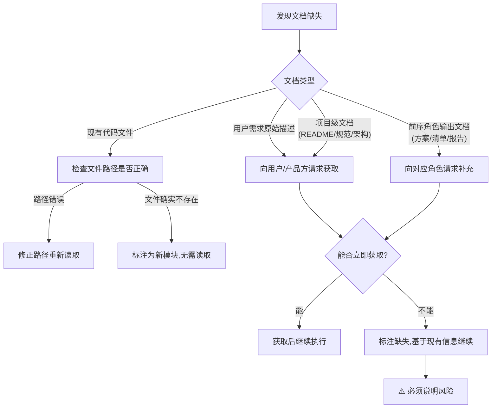

# 前置文档强制读取协议

本协议定义各角色在开始工作前必须读取的前置文档清单、读取确认机制、文档缺失处理规则以及新会话强制重载要求。所有智能体在执行任何开发任务前必须遵守本协议，确保"不读完文档不许动手"。

## 核心原则

> AI的上下文窗口是有限的，但项目文档是持久的。每开一个新会话，AI的记忆就清零了——如果不重新读取前置文档，它就会基于"想象中的项目"而不是"真实的项目"来工作。
> 强制读取不是不信任AI，而是给它一个准确的起点。

---

## 前置文档清单

各角色在进入对应阶段前，必须读取以下文档：

### 按阶段×角色的必读文档矩阵

| 阶段 | 负责角色 | 必须读取的前置文档 |
|------|---------|-------------------|
| ①需求接收 | orchestrator | 1. 用户需求原始描述<br>2. 项目 [README.md](../../README.md)<br>3. 相关历史 spec（`.trae/specs/` 下关联主题） |
| ②方案设计 | architect | 1. 任务分解清单（orchestrator输出）<br>2. 项目技术栈文档<br>3. 现有架构文档（`.agents/` 下的模块定义）<br>4. 开发规范（[docs/development-standards.md](../../docs/development-standards.md)） |
| ③任务分配 | orchestrator | 1. 技术方案文档（architect输出）<br>2. 角色能力矩阵（[.agents/roles/README.md](../roles/README.md)） |
| ④代码实现 | developer | 1. 技术方案文档（architect输出）<br>2. 任务分解清单（orchestrator输出）<br>3. 开发规范（[docs/development-standards.md](../../docs/development-standards.md)）<br>4. 相关模块现有代码（必须实际读取文件内容） |
| ⑤测试编写 | tester | 1. 需求文档（原始需求+验收标准）<br>2. 技术方案文档（architect输出）<br>3. 代码实现（developer提交的PR）<br>4. 测试规范（[.agents/workflows/testing.md](../workflows/testing.md)） |
| ⑥代码审查 | reviewer | 1. 需求文档（原始需求+验收标准）<br>2. 技术方案文档（architect输出）<br>3. 代码实现（developer提交的PR）<br>4. 测试报告（tester输出）<br>5. 审查checklist |
| ⑦合并代码 | orchestrator | 1. 审查通过报告（reviewer输出）<br>2. CI检查结果 |
| ⑧完成确认 | orchestrator | 1. 合并结果<br>2. 测试报告<br>3. 验收标准清单（需求阶段定义） |

### 功能演进场景的补充读取

| 变更类型 | 额外必读文档 |
|---------|------------|
| 功能扩展 | 1. 待扩展功能的原始需求文档<br>2. 待扩展功能的技术方案<br>3. 待扩展功能的现有代码实现 |
| 功能重构 | 1. 待重构功能的全部历史文档（需求+方案+测试）<br>2. 影响范围内所有模块的代码<br>3. 相关历史BUG修复记录 |

---

## 读取确认机制

### 确认输出格式

角色开始执行任务时，必须在输出中显式确认已读取所有前置文档，格式为：

```
📋 前置文档确认：已读取 [文档1]、[文档2]、[文档3]
```

### 确认规则

1. **逐项列举**：必须逐项列出已读取的文档名称，不得笼统地说"已读取所有文档"
2. **精确路径**：文档引用必须使用可点击链接格式，指向具体文件路径
3. **首次输出确认**：确认信息必须在该阶段的首次输出中出现，不得延后
4. **不可省略**：即使文档很长或之前读过，在新阶段开始时仍须重新确认

### 正确示例

developer开始编码时的输出：

```
📋 前置文档确认：已读取 [技术方案文档](.agents/specs/xxx.md)、[任务分解清单](.temp/tasks.md)、[开发规范](docs/development-standards.md)、[auth模块现有代码](apps/zhujian-wudao/src/auth.js)

开始实现用户认证模块，按照方案的分层架构进行编码……
```

### 错误示例

❌ "已了解需求，开始编码"——未列举读取了哪些文档
❌ "按照方案来做"——未确认具体读取了哪个方案文档
❌ 直接开始写代码，没有任何确认——完全跳过了读取确认

---

## 文档缺失处理

如果前置文档清单中的某项文档不存在或无法获取，按以下规则处理：

### 处理流程



### 缺失标注格式

当文档确实无法获取时，必须标注：

```
📋 前置文档确认：已读取 [文档1]、[文档2]
⚠️ 文档缺失：[文档3] 无法获取，原因：[具体原因]
风险说明：基于现有信息继续执行，可能存在[具体风险描述]
```

### 不允许的做法

- ❌ 静默跳过缺失文档，假装已读取
- ❌ 文档未获取就开始执行，不说明任何风险
- ❌ 用模糊表述掩盖缺失，如"部分文档已读取"

---

## 新会话强制重载

### 规则

当智能体在**新会话**中继续之前的任务时，必须**重新读取**所有相关前置文档。

### 原因

- AI在新会话中不保留前一会话的记忆
- 即使前一会话已经读过文档，新会话中必须重新读取才能建立上下文
- 依赖"前一会话记忆"是不可靠的，可能导致基于过时或错误信息工作

### 重载确认格式

新会话开始时，必须输出：

```
📋 新会话上下文重建：已重新读取 [文档1]、[文档2]、[文档3]
当前进度：[当前处于哪个阶段/任务完成到哪一步]
待办事项：[接下来要做什么]
```

### 适用场景

- 用户开启新对话，要求继续之前的开发任务
- 会话中断后恢复执行
- 智能体被重新激活继续未完成任务

---

## 协议使用示例

### 完整场景：developer收到任务分配后的读取确认

```
📋 前置文档确认：已读取 [技术方案文档](../.temp/feature-auth/spec.md)、[任务分解清单](../.temp/feature-auth/tasks.md)、[开发规范](docs/development-standards.md)、[auth模块现有代码](apps/myapp/src/auth/)

当前为④代码实现阶段，按照方案实现JWT认证中间件：
1. 首先实现token签发功能
2. 然后实现token验证中间件
3. 最后编写单元测试
```

### 完整场景：新会话恢复任务

```
📋 新会话上下文重建：已重新读取 [竹简悟道项目README](apps/zhujian-wudao/README.md)、[技术方案](.temp/zhujian/spec.md)、[任务清单](.temp/zhujian/tasks.md)、[已有代码](apps/zhujian-wudao/src/)

当前进度：④代码实现阶段，对话核心逻辑已完成，待实现竹简渲染模块
待办事项：继续实现竹简渲染模块 → 编写单元测试 → 提交PR
```

---

## 与现有体系的关联

| 关联规范 | 关联方式 |
|---------|---------|
| [.agents/rules/stage-guardrails.md](../rules/stage-guardrails.md) | 前置文档读取是阶段守卫的进入条件之一，未读取前置文档等同于跨阶段操作 |
| [.agents/protocols/handoff.md](./handoff.md) | 任务交接时，交付方应在交接文档中明确列出接收方需要读取的前置文档 |
| [.agents/workflows/feature-development.md](../workflows/feature-development.md) | 工作流每个步骤的执行要点中包含前置文档确认要求 |
| AGENTS.md 启动协议 | 本协议是AGENTS.md启动协议在开发流程中的延伸——启动时加载全局规范，每个阶段开始时加载阶段特定文档 |
