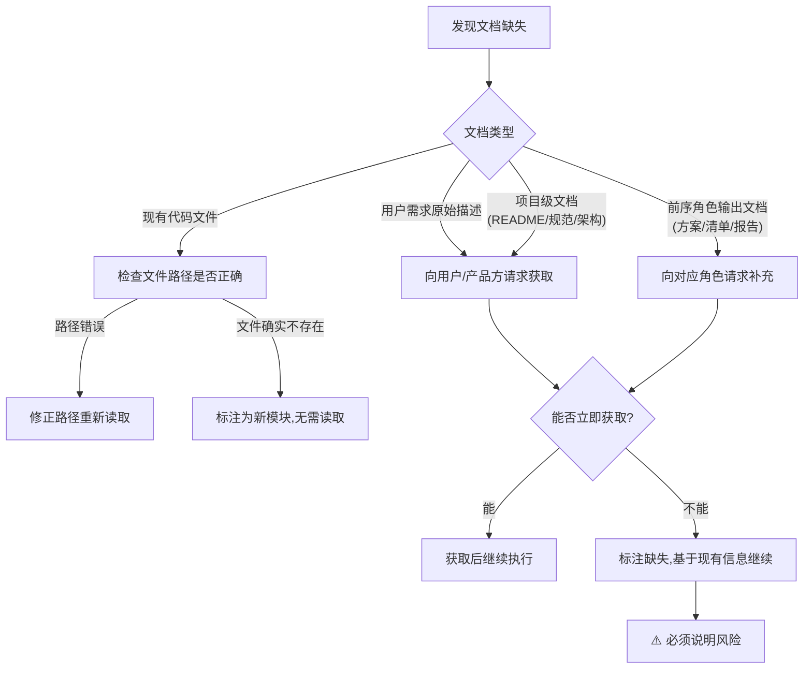

# 03 读取确认与缺失处理


### 确认输出格式

角色开始执行任务时，必须在输出中显式确认已读取所有前置文档，格式为：

```
📋 前置文档确认：已读取 [文档1]、[文档2]、[文档3]
```

### 确认规则

1. **逐项列举**：必须逐项列出已读取的文档名称，不得笼统地说"已读取所有文档"
2. **精确路径**：文档引用必须使用可点击链接格式，指向具体文件路径
3. **首次输出确认**：确认信息必须在该阶段的首次输出中出现，不得延后
4. **不可省略**：即使文档很长或之前读过，在新阶段开始时仍须重新确认

### 正确示例

developer开始编码时的输出：

```
📋 前置文档确认：已读取 [技术方案文档](../../../.agents/specs/xxx.md)、[任务分解清单](.temp/tasks.md)、[开发规范](../../../docs/development-standards.md)、[auth模块现有代码](../../../apps/zhujian-wudao/src/auth.js)

开始实现用户认证模块，按照方案的分层架构进行编码……
```

### 错误示例

❌ "已了解需求，开始编码"——未列举读取了哪些文档
❌ "按照方案来做"——未确认具体读取了哪个方案文档
❌ 直接开始写代码，没有任何确认——完全跳过了读取确认

---

如果前置文档清单中的某项文档不存在或无法获取，按以下规则处理：

### 处理流程



### 缺失标注格式

当文档确实无法获取时，必须标注：

```
📋 前置文档确认：已读取 [文档1]、[文档2]
⚠️ 文档缺失：[文档3] 无法获取，原因：[具体原因]
风险说明：基于现有信息继续执行，可能存在[具体风险描述]
```

### 不允许的做法

- ❌ 静默跳过缺失文档，假装已读取
- ❌ 文档未获取就开始执行，不说明任何风险
- ❌ 用模糊表述掩盖缺失，如"部分文档已读取"

---

### 规则

当智能体在**新会话**中继续之前的任务时，必须**重新读取**所有相关前置文档。

### 原因

- AI在新会话中不保留前一会话的记忆
- 即使前一会话已经读过文档，新会话中必须重新读取才能建立上下文
- 依赖"前一会话记忆"是不可靠的，可能导致基于过时或错误信息工作

### 重载确认格式

新会话开始时，必须输出：

```
📋 新会话上下文重建：已重新读取 [文档1]、[文档2]、[文档3]
当前进度：[当前处于哪个阶段/任务完成到哪一步]
待办事项：[接下来要做什么]
```

### 适用场景

- 用户开启新对话，要求继续之前的开发任务
- 会话中断后恢复执行
- 智能体被重新激活继续未完成任务

---

---

## 相关模式

- [渐进式上下文披露](../../../docs/retrospective/patterns/methodology-patterns/ai-collaboration/progressive-context-disclosure.md)
- [上下文恢复协议](../../../docs/retrospective/patterns/methodology-patterns/ai-collaboration/context-recovery-protocol.md)
---

← 上一章: [02 前置文档清单](02-required-docs.md) | **[返回索引](../pre-document-reading.md)** | 下一章: [04 二次暴露治理检查点](04-second-exposure-governance.md) →
