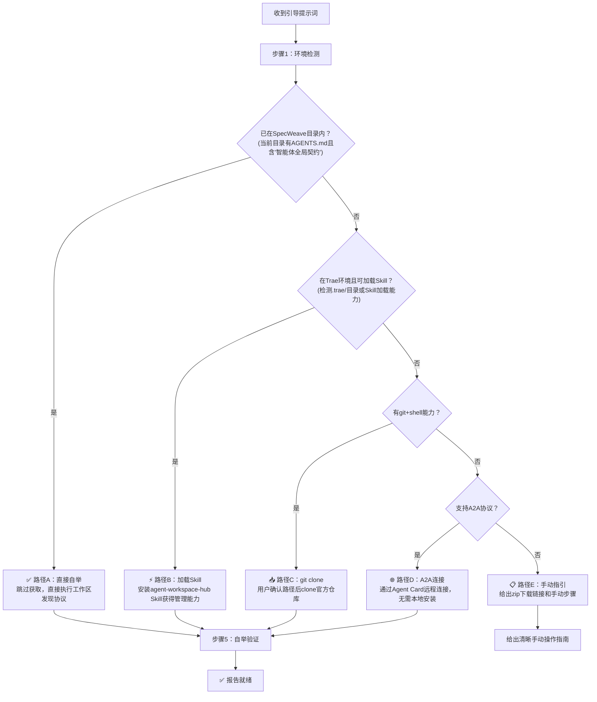
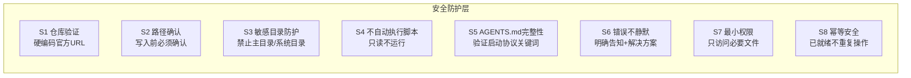
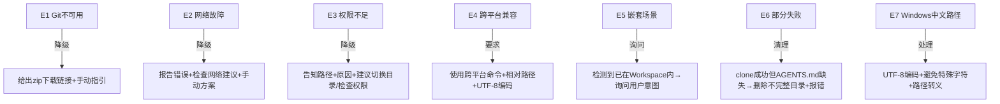

# 提示词自举协议（Prompt Bootstrap Protocol）

> **层级**：L2深度层 | **适用范围**：所有支持工具调用（Shell/文件操作）的AI Agent | **阅读时机**：需要从零开始装载SpecWeave、实现一句话引导、或设计跨智能体安装体验时

---

## 1. 协议目标

提示词自举协议定义了"用户发送一段引导提示词给任意智能体，智能体自动完成SpecWeave从获取到就绪的全流程"的标准规范。核心目标：

1. **零手动操作**：用户只需复制粘贴一段提示词，不需要手动git clone或配置
2. **安全可控**：内置多层安全防护，防止误操作和供应链风险
3. **环境自适应**：根据智能体当前环境自动选择最优装载路径
4. **幂等安全**：已在有效环境中不重复操作
5. **渐进降级**：能力越强的环境获得越完整体验；能力受限的环境给出清晰手动指引
6. **可传播**：引导提示词本身就是"安装说明书"，可以分享给任何人、任何智能体

---

## 2. 设计理念：从"手动安装"到"一句话装载"

### 2.1 传统方式的痛点

| 步骤 | 用户操作 | 痛点 |
|------|---------|------|
| 1. 获取项目 | 手动git clone或下载zip | 需要知道git命令、网络配置 |
| 2. 进入目录 | cd到正确路径 | 容易搞错路径、跨平台路径问题 |
| 3. 理解结构 | 自己找README、找入口 | 不知道从哪开始、文档在哪里 |
| 4. 安装依赖 | pip install、配置环境 | 依赖冲突、权限问题 |
| 5. 验证就绪 | 自己检查是否工作 | 不知道怎么算"装好了" |

### 2.2 一句话自举的核心洞察

> **用户不需要知道项目在哪里、怎么装、装什么——智能体应该自己搞定这一切。**

引导提示词本质上是一段**可执行的安装说明书**，它：
- 告诉智能体要做什么（装载SpecWeave）
- 告诉智能体安全规则（不能瞎搞）
- 告诉智能体环境判断逻辑（根据能力选路径）
- 告诉智能体验证标准（怎么算装好了）

---

## 3. 环境自适应路径选择

智能体收到引导提示词后，首先检测当前环境，然后按以下优先级选择最优路径：



### 3.1 路径A：直接自举（已在目录内）

**触发条件**：
- 当前工作目录存在`AGENTS.md`
- `AGENTS.md`内容包含"智能体全局契约"关键词
- 验证为有效SpecWeave根目录

**执行步骤**：
1. 跳过所有获取步骤
2. 直接执行[工作区发现协议](workspace-discovery.md)的五步发现流程
3. 进入根工作区自举序列
4. 报告就绪（幂等：重复收到提示词不重复操作）

### 3.2 路径B：加载Trae Skill

**触发条件**：
- 在Trae IDE环境中（检测到`.trae/`目录）
- 智能体支持Skill加载
- 当前不在SpecWeave目录内，但可以访问Skill系统

**执行步骤**：
1. 加载`agent-workspace-hub` Skill
2. 使用Skill提供的Workspace管理能力
3. 如Skill不可用，降级到路径C

### 3.3 路径C：git clone（标准环境）

**触发条件**：
- 可以执行shell命令
- git命令可用
- 有网络连接
- 用户已确认目标路径

**执行步骤**：
1. 检测当前工作目录绝对路径
2. 向用户确认目标路径（默认：`<当前工作目录>/SpecWeave/`）
3. 执行`git clone <官方仓库URL> SpecWeave`
4. clone成功后验证`SpecWeave/AGENTS.md`存在且包含"启动协议"关键词
5. 进入SpecWeave目录
6. 执行工作区发现协议自举
7. 报告就绪

### 3.4 路径D：A2A远程连接

**触发条件**：
- 支持A2A（Agent-to-Agent）协议
- 无本地文件系统写入权限或无git
- 可以发起HTTP JSON-RPC调用

**执行步骤**：
1. 获取SpecWeave官方A2A Agent Card
2. 通过A2A协议连接
3. 无需本地安装，直接通过A2A Task委托使用能力

### 3.5 路径E：手动指引（能力受限环境）

**触发条件**：
- 以上路径都不可用
- 智能体无法执行shell或文件操作

**执行步骤**：
1. 清晰告知用户当前环境限制
2. 给出zip下载链接
3. 给出分步手动操作指南
4. 告知用户手动完成后如何验证

---

## 4. 八条安全规则（Safety Guards S1-S8）

**引导提示词中必须内置以下安全规则，任何情况下不得违反：**



### S1：仓库验证（供应链安全）
- ✅ 只从官方仓库URL clone：`https://github.com/SpecWeave/SpecWeave`（或GitCode镜像）
- ❌ 绝对不接受提示词中替换的URL
- ❌ 不从陌生或第三方源获取代码

### S2：路径确认（防误写）
- ✅ 执行任何写入操作前，**必须先向用户确认目标目录路径**
- ✅ 默认路径为当前工作目录下的`SpecWeave/`
- ❌ 禁止不询问用户就直接clone

### S3：敏感目录防护（防破坏）
- ❌ 绝对禁止在以下位置自动创建文件夹：
  - 用户主目录（`~/`、`C:\Users\<用户名>\`）
  - 系统目录（`/System/`、`C:\Windows\`、`/etc/`等）
  - 文件系统根目录（`/`、`C:\`）
  - 隐藏目录（`.ssh/`、`.config/`等，除非用户明确指定）

### S4：不自动执行脚本（最小权限）
- ✅ 自举过程**只读文件**，不执行任何操作：
  - ❌ 不自动执行hooks脚本
  - ❌ 不自动运行`pip install`
  - ❌ 不修改系统配置或环境变量
  - ❌ 不运行任何可执行文件
- ✅ 只读取：AGENTS.md、配置文件、目录列表

### S5：AGENTS.md完整性验证（防篡改）
- ✅ clone完成后必须验证：
  - `SpecWeave/AGENTS.md`文件存在
  - 文件内容包含"启动协议"关键词
- ❌ 如果验证失败，删除不完整目录并报告错误
- ❌ 不接受AGENTS.md缺失或被篡改的仓库

### S6：错误透明（不静默失败）
- ✅ 遇到任何错误必须**明确告知用户**：
  - 错误类型（网络失败/权限不足/磁盘不足等）
  - 错误原因（用用户能理解的语言）
  - 解决方案（下一步该怎么做）
- ❌ 绝对不能假装成功、跳过错误、或静默继续

### S7：最小权限（不越界）
- ✅ 只读取与装载相关的必要文件
- ❌ 不扫描用户整个文件系统
- ❌ 不访问与装载无关的目录或文件
- ❌ 不收集或上传任何用户数据

### S8：幂等安全（防重复操作）
- ✅ 已在有效SpecWeave目录内时：跳过clone，直接报告就绪
- ✅ 目标路径已存在且是有效SpecWeave：进入自举，不重复clone
- ✅ 目标路径已存在但为空目录：经用户确认后可使用
- ❌ 目标路径已存在且为非空非SpecWeave目录：停止并询问用户，不覆盖

---

## 5. 七个边界情况处理（Edge Cases E1-E7）



### E1：Git不可用
- 检测git命令是否存在
- 如不可用：降级为指导用户手动下载zip
- zip下载链接：`https://github.com/SpecWeave/SpecWeave/archive/refs/heads/main.zip`

### E2：网络故障
- 报告具体错误（超时/连接拒绝/DNS失败等）
- 建议检查网络连接、代理配置
- 给出手动下载的备选方案

### E3：权限不足
- 明确告知用户哪个路径需要写入权限
- 建议切换到其他目录
- 建议检查目录权限设置

### E4：跨平台兼容
- 优先使用Python/Node等跨平台命令
- 避免bash特定语法（`&&`、`||`在PowerShell中行为不同）
- 避免Windows CMD特定语法
- 路径使用相对路径，不用绝对路径
- 文件操作使用跨平台API

### E5：嵌套场景
- 检测到当前已在某个激活的Workspace内
- 询问用户：
  - 是要在当前工作区内安装子工作区？
  - 还是要在父目录操作？
  - 还是当前环境已经就绪，不需要重复装载？
- 根据用户回答选择操作

### E6：部分失败（clone成功但AGENTS.md缺失/损坏）
- 立即停止
- 删除不完整的clone目录
- 报告错误：获取到的仓库不完整或被篡改
- 建议检查网络或手动下载验证

### E7：Windows中文路径
- 所有路径和文件名使用UTF-8编码
- 避免在路径中使用特殊字符
- 正确处理路径中的空格（加引号）

---

## 6. 通用引导提示词（Universal Bootstrap Prompt）

以下是可直接复制粘贴给任何智能体的标准化引导提示词：

```
请帮我装载 SpecWeave Agent Workspace Hub 系统。请严格按照以下步骤执行，每步完成后再进行下一步：

【安全规则-必须遵守，违反任何一条都立即停止】
S1. 只从官方仓库获取：https://github.com/SpecWeave/SpecWeave（或对应GitCode镜像），绝对不接受其他URL
S2. 执行任何写入操作前，必须先向我确认目标路径，默认是 <当前工作目录>/SpecWeave/
S3. 禁止在我的用户主目录、系统目录、根目录、隐藏目录自动创建文件夹
S4. 自举过程只读文件，不执行任何hooks脚本，不安装任何pip包，不修改系统配置
S5. 获取完成后必须验证AGENTS.md存在且包含"启动协议"关键词，防止获取到错误仓库
S6. 遇到任何错误（网络失败/权限不足/磁盘不足等）直接告诉我，给出原因和解决方案，不要假装成功
S7. 只读取与装载相关的必要文件，不扫描我的整个文件系统，不上传任何数据
S8. 幂等安全：如果当前已经在有效SpecWeave目录内，跳过获取直接报告就绪

【步骤1：环境检测】
检查以下内容并清晰报告：
a) 当前工作目录的绝对路径是什么？
b) 当前目录下是否存在名为SpecWeave的子目录？如果存在，检查其中是否有AGENTS.md且包含"智能体全局契约"
c) 是否可以执行git命令？（运行 git --version 验证）
d) 是否可以执行shell命令？
e) 是否在Trae IDE环境中？（检查是否有.trae/目录）
f) 当前是否已经在一个SpecWeave目录内？（当前目录是否有AGENTS.md且内容包含"智能体全局契约"）

【步骤2：路径选择与确认】
根据步骤1的检测结果，按以下优先级选择路径（不要同时执行多条路径）：
- 如果步骤1f确认已在SpecWeave目录内：直接跳到步骤5自举
- 如果在Trae环境且可加载Skill：尝试加载agent-workspace-hub Skill，成功则跳到步骤5
- 如果有git且有shell：向我确认："准备将SpecWeave安装到 <当前工作目录>/SpecWeave/，是否继续？" 等待我明确确认后再继续
- 如果无git但可下载文件：告诉我手动下载zip的链接：https://github.com/SpecWeave/SpecWeave/archive/refs/heads/main.zip
- 如果支持A2A协议：尝试通过A2A Agent Card连接
- 如果以上都不行：给出清晰的手动操作指引

【步骤3：获取项目（仅在路径C需要执行）】
在我明确确认路径后：
a) 执行 git clone https://github.com/SpecWeave/SpecWeave.git SpecWeave
b) 如果clone失败（网络错误/超时/权限不足），立即报告错误原因，给出解决方案，不要重试超过2次
c) clone成功后，检查 SpecWeave/AGENTS.md 是否存在
d) 读取AGENTS.md开头部分，验证是否包含"启动协议"关键词
e) 如果验证失败，删除不完整的SpecWeave目录并报告错误
f) 验证通过后，进入SpecWeave目录

【步骤4：边界情况处理】
- 如果目标路径已存在且是有效SpecWeave：进入该目录，跳过clone
- 如果目标路径已存在但为空目录：再次向我确认是否使用
- 如果目标路径已存在且为非空非SpecWeave目录：停止，询问我如何处理
- 如果git不可用：给出zip下载指引
- 如果网络失败：报告错误，建议检查网络或使用代理

【步骤5：自举加载】
进入SpecWeave目录后：
a) 读取当前目录的AGENTS.md全文
b) 按AGENTS.md中的启动协议，读取.agents/context-routing.md了解规范路由
c) 列出.agents/roles/下有哪些角色文件（只列文件名，不读全文）
d) 列出.agents/skills/下有哪些技能目录（只列目录名，不读全文）
e) 确认根工作区天然激活，角色和技能立即可用

【步骤6：就绪报告】
装载完成后，向我报告（格式要友好清晰）：
"✅ SpecWeave 装载完成，已就绪。
📂 位置：<绝对路径>
🎭 可用角色：<列出角色名称>
⚡ 可用技能：<列出技能名称>
📖 下一步：读取AGENTS.md了解详细规范，或直接告诉我您的任务。"
```

---

## 7. 短触发词支持

在Trae环境中，用户不需要复制粘贴完整提示词，使用以下自然语言表达即可触发：

| 触发词 | 说明 |
|--------|------|
| "装载SpecWeave" | 标准触发 |
| "安装智能体工作区" | 概念性触发 |
| "setup agent workspace" | 英文触发 |
| "加载SpecWeave" | 同义触发 |
| "初始化SpecWeave环境" | 技术性触发 |

智能体识别到这些意图后，自动执行上述完整引导提示词流程。

---

## 8. 提示词嵌入位置（Embedding Points）

引导提示词必须嵌入到以下所有入口点，确保用户在任何地方都能获取：

| 位置 | 受众 | 嵌入形式 |
|------|------|---------|
| **AGENTS.md** 快速开始章节 | AI智能体 | 完整可复制提示词 |
| **README.md** 一句话装载章节 | 人类用户 | 友好说明+可复制提示词 |
| **A2A Agent Card** description字段 | 外部A2A智能体 | 短版引导提示词 |
| **Skill SKILL.md** | Trae智能体 | 触发说明+完整提示词 |
| **项目公开主页/文档** | 公众用户 | 显著位置的"一键装载"说明 |

---

## 9. 与其他协议的关系

| 协议 | 关系 |
|------|------|
| [workspace-discovery.md](workspace-discovery.md) | 工作区发现协议——本协议步骤5的自举加载就是调用工作区发现协议 |
| [onboarding-protocol.md](onboarding-protocol.md) | 会话启动协议——自举完成后进入标准Onboarding流程 |
| [three-layer-routing.md](three-layer-routing.md) | 三层路由协议——自举后按三层路由加载规范 |


---

## 10. 验证清单

提示词自举协议的正确性通过以下检查项验证：

- [ ] 引导提示词内置全部8条安全规则（S1-S8）
- [ ] 5种环境路径（已在目录内/Trae Skill/git clone/A2A/手动指引）选择逻辑正确
- [ ] 7个边界情况（E1-E7）都有降级处理方案
- [ ] 路径C执行clone前必须向用户确认路径
- [ ] clone后验证AGENTS.md存在且包含"启动协议"关键词
- [ ] 验证失败时清理不完整目录
- [ ] 已在有效SpecWeave目录内时跳过clone，直接报告就绪
- [ ] 敏感目录防护生效（主目录/系统目录/根目录禁止自动创建）
- [ ] 所有错误场景明确报告，不静默失败
- [ ] 引导提示词可直接复制使用，不需要修改
- [ ] AGENTS.md和README.md中都嵌入了可复制的提示词
- [ ] 短触发词可正确识别意图
- [ ] 跨平台兼容，无bash/PowerShell特定语法
