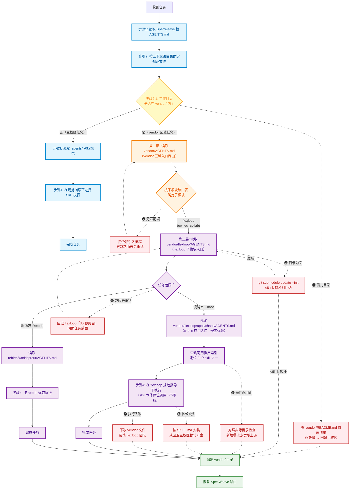

# 三层路由流程图与异常处理说明

SpecWeave 项目通过 `AGENTS.md` 启动协议实现 AI 智能体的上下文路由。当任务工作目录位于 `vendor/` 内时，触发**三层路由机制**：SpecWeave → vendor → flexloop。本文档以可视化方式呈现该路由的完整跳转逻辑（含异常处理分支）。

## 背景与三层路由机制

### 什么是三层路由

SpecWeave 根 `AGENTS.md` 的启动协议步骤 2.1 规定：若任务工作目录位于 `vendor/` 内，智能体不直接走主权区路由，而是依次读取三层 `AGENTS.md`：

| 层级 | 入口文件 | 职责 | 维护方 |
|---|---|---|---|
| 第一层 | SpecWeave 根 `AGENTS.md` | 全局契约 + 步骤 2.1 触发条件判断 | SpecWeave 主权区 |
| 第二层 | `vendor/AGENTS.md` | vendor 区域入口 + 子模块路由表 + 9 skill 资产索引 | SpecWeave 主权区 |
| 第三层 | `vendor/flexloop/AGENTS.md` | flexloop 子模块入口 + 任务范围路由 | flexloop 自治 |
| 最深层 | `vendor/flexloop/apps/chaos/AGENTS.md` | chaos 应用规则 + skill 完整规范 | flexloop 自治 |

### 嵌套优先原则

进入任意子目录后，优先读取**离当前工作目录最近**的 `AGENTS.md`。若子项目规则与父层冲突，以子项目为准（子项目覆盖父层）。

### 不萃取策略

vendor 区域内的 9 个 skill 本体保留在 `vendor/flexloop/apps/chaos/.agents/skills/` 原位，SpecWeave 不复制到主权区，通过第二层的「可用资产索引」跨边界定位调用，保持单一可信源。

## 三层路由流程图

主流程（实线）与异常处理分支（红色虚线 ❶-❼）的完整跳转逻辑可视化。编号对应下方「异常处理分支」表格：

### 图例与关键机制

- **实线箭头**(`-->`)主流程；**红色虚线箭头**(`-.->`)异常处理分支，编号 ❶-❼ 对应下方「异常处理分支」表格前 7 行
- ❽ **边界违反检测**贯穿全流程，不单独画分支，由 `python .agents/scripts/check-vendor.py --deep` 在任意节点检测，触发后按子模块流程回退
- **触发条件**：步骤 2.1 判断工作目录是否在 `vendor/` 内，是则进入三层路由，否则走 SpecWeave 主权区路由
- **嵌套优先**：进入子目录后优先读取离工作目录最近的 AGENTS.md，子项目规则覆盖父级
- **不萃取策略**：9 个 skill 本体保留在 `vendor/flexloop/apps/chaos/.agents/skills/` 原位，通过「可用资产索引」跨边界定位调用
- **退出恢复**：正常完成（Exit）或异常回退（各 E 分支汇入 Exit）均退出 `vendor/` 目录，自动恢复 SpecWeave 路由

## 异常处理分支

对应上方流程图的各决策节点，当正常路径无法走通时按以下分支处理：

| 编号 | 异常场景 | 流程图节点 | 触发条件 | 处理方式 |
|---|---|---|---|---|
| ❶ | 孤儿目录 | 步骤 2.1 | 工作目录在 `vendor/` 内，但不在任何已登记子模块路径下 | 检查是否为新增依赖（查阅 vendor/README.md 依赖清单）；若否，回退到 SpecWeave 主权区路由并提示路径可能有误 |
| ❷ | 未知子模块 | 子模块路由表 | 路由表无匹配项 | 确认依赖是否已登记；未登记则需先走依赖引入流程（`git submodule add` 或手动管理依赖初始化），再更新路由表 |
| ❸ | 子模块未初始化 | 第三层入口 | 读取 `vendor/flexloop/AGENTS.md` 失败或目录为空 | 运行 `git submodule update --init vendor/flexloop` 初始化子模块后重试；仍失败则检查 gitlink 是否损坏 |
| ❹ | 任务范围未识别 | 任务范围判断 | flexloop 任务范围既非 Chaos 也非 Rebirth | 回退到 `vendor/flexloop/AGENTS.md` 的「30 秒路由」，提示用户明确任务范围或确认是否需要新增应用入口 |
| ❺ | skill 索引定位失败 | 可用资产索引 | 索引无匹配 skill | 对照 `vendor/flexloop/apps/chaos/.agents/skills/` 实际目录检查 skill 是否已被移除或重命名；若为新增需求，走贡献上游流程 |
| ❻ | skill 依赖缺失 | 步骤 4 执行 | skill 执行时缺少 PowerShell / Python / uv / robocopy 等运行环境 | 按 SKILL.md 的依赖说明安装；无法满足时回退到 SpecWeave 主权区寻找替代方案 |
| ❼ | skill 执行失败 | 步骤 4 执行 | 脚本运行报错或校验未通过 | 读取 skill 目录下的 CHANGELOG / 日志定位原因；**不直接修改 vendor 内文件**，反馈给 flexloop 治理团队 |
| ❽ | 边界违反检测 | 全流程 | 意外修改了 `vendor/flexloop/` 内文件 | 运行 `python .agents/scripts/check-vendor.py --deep` 检测；通过 `git -C vendor/flexloop status` 查看变更并按子模块流程回退 |

### 重试 vs 回退的分类

异常分支按恢复路径分为两类：

- **可重试分支**（❷❸❹）：修复后回到对应节点继续主流程，不退出 vendor 区域
- **直接回退分支**（❶❺❻❼）：无法在 vendor 内解决，直接汇入 Exit 退出，恢复 SpecWeave 路由

### 通用回退原则

任何异常无法在 vendor 区域内解决时，退出 `vendor/` 目录（对应流程图 Exit → Restore 分支），回到 SpecWeave 主权区路由，并在 [flexloop-team.md](../teams/flexloop-team.md) 登记问题待 flexloop 团队处置。**禁止通过修改 vendor 内文件的方式绕过异常**。

## 参考链接

- [SpecWeave 根 AGENTS.md](../../AGENTS.md) — 主权区入口，启动协议步骤 2.1 定义三层路由触发条件
- [vendor/AGENTS.md](../../vendor/AGENTS.md) — vendor 区域入口路由（第二层），本流程图的源文件
- [vendor/flexloop/AGENTS.md](../../vendor/flexloop/AGENTS.md) — flexloop 子模块入口（第三层）
- [VENDOR-INTEGRATION.md](../VENDOR-INTEGRATION.md) — 外部子模块协同集成方案（边界划分/版本控制/更新同步/测试隔离/模式萃取）
- [flexloop-team.md](../teams/flexloop-team.md) — SpecWeave 的 flexloop 治理团队角色映射与交接协议
- [alternatives-guide.md](../rules/alternatives-guide.md) — ❻异常的回退替代方案查找
- [check-vendor.py](../scripts/check-vendor.py) — ❽边界违反检测脚本（`--deep` 深度验证）
