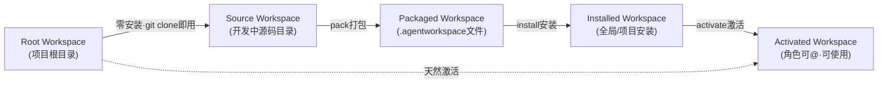
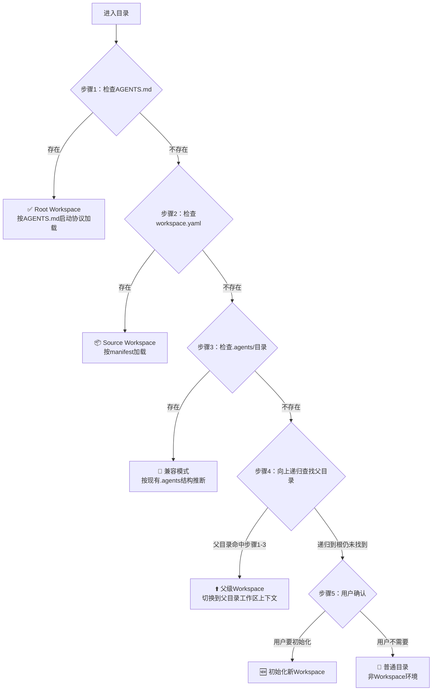
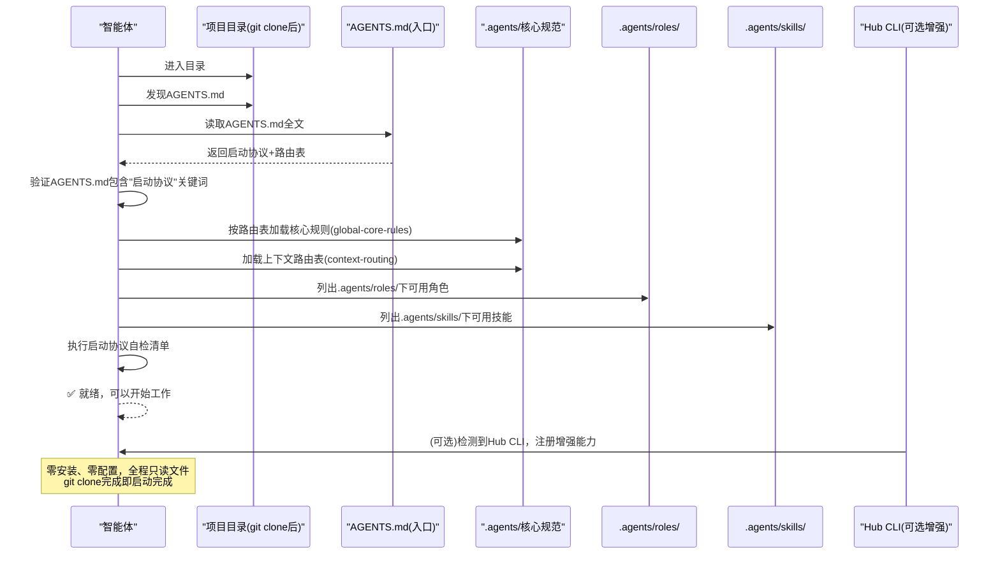

# 工作区发现协议（Workspace Discovery Protocol）

> **层级**：L2深度层 | **适用范围**：所有进入任意目录的AI Agent | **阅读时机**：智能体进入新目录、需要识别工作区类型、实现零安装自举时

---

## 1. 协议目标

工作区发现协议定义了AI Agent进入任意目录后，自动识别"这是否是一个Agent Workspace"以及"是哪种类型的Workspace"的标准流程。核心目标：

1. **零安装可用**：任意包含符合规范的`AGENTS.md`的项目，`git clone`后无需安装任何工具，智能体即可识别并开始协作
2. **优先级明确**：按确定性从高到低的顺序检查，避免误判
3. **递归向上查找**：支持子目录内识别父目录工作区
4. **向后兼容**：兼容旧版`.agents/`目录结构
5. **可审计**：发现过程可追踪、可验证

---

## 2. 三种工作区形态



| 形态 | 标识文件 | 状态 | 说明 |
|------|---------|------|------|
| **Root Workspace（根工作区）** | `AGENTS.md` | 天然激活 | 项目根目录本身，零安装零配置，git clone即用 |
| **Source Workspace（源码工作区）** | `workspace.yaml` | created | 开发中的工作区源码，有完整目录结构 |
| **Installed Workspace（已安装工作区）** | 安装记录 + 文件 | installed | 已安装到宿主但未激活 |
| **Activated Workspace（已激活工作区）** | 角色注册完成 | activated | 角色已注册，可@使用 |

**关键设计**：`AGENTS.md`优先级高于`workspace.yaml`——因为`AGENTS.md`是面向AI智能体的自描述路由入口，`workspace.yaml`是面向Hub CLI的机器可读manifest。一个项目可以只有`AGENTS.md`（零安装可用），也可以两者都有（支持打包分发）。

---

## 3. 五步发现流程（5-Step Discovery）

智能体进入任意目录后，**必须严格按以下优先级顺序**执行检查，前一步命中则直接返回，不再继续后续步骤：



### 3.1 步骤1：检查根AGENTS.md（最高优先级）

**检查内容**：
- 当前目录是否存在名为`AGENTS.md`的文件
- 如果存在，读取文件并验证是否包含"启动协议"关键词（防止误判同名文件）

**命中后的处理**：
1. 识别为**Root Workspace（根工作区）**
2. 按`AGENTS.md`中定义的启动协议执行：
   - 读取AGENTS.md全文
   - 按「上下文路由表」加载核心规范
   - 执行自检清单
   - 就绪，可以开始工作
3. **不需要运行任何安装命令**，角色/技能立即可用

**根工作区的核心特性**：
- ✅ 天然处于"激活"状态
- ✅ `.agents/roles/`下的角色不需要安装/激活即可@召唤
- ✅ `.agents/skills/`下的技能立即可用
- ✅ git clone完成即启动完成

### 3.2 步骤2：检查workspace.yaml

**检查内容**：
- 当前目录是否存在名为`workspace.yaml`的文件
- 如果存在，验证是否是合法的Workspace manifest（包含id、name、version等必填字段）

**命中后的处理**：
1. 识别为**Source Workspace（源码工作区）**
2. 读取并解析`workspace.yaml`
3. 检查是否存在配套的`AGENTS.md`——如果有，同时加载AGENTS.md路由
4. 按manifest声明加载角色、技能、工作流等

### 3.3 步骤3：检查.agents/目录（兼容模式）

**检查内容**：
- 当前目录是否存在名为`.agents/`的目录
- 目录下是否有`roles/`、`skills/`等子目录（表明这是一个旧版SpecWeave项目）

**命中后的处理**：
1. 识别为**兼容模式工作区**
2. 按现有`.agents/`目录结构推断可用能力
3. 建议用户添加标准`AGENTS.md`以获得完整零安装体验

### 3.4 步骤4：向上递归查找父目录

**检查内容**：
- 如果当前目录未命中步骤1-3，向上递归检查父目录
- 递归终止条件：(1)命中步骤1-3任一条件；(2)到达文件系统根目录；(3)遇到权限错误无法继续

**命中后的处理**：
1. 识别父目录为Workspace
2. 工作区上下文切换到父目录
3. 当前子目录的操作在父工作区的治理下进行

**递归安全规则**：
- 最多向上递归10层（防止无限循环或穿越到无关目录）
- 遇到跨用户目录边界（如Linux下进入`/home/otheruser/`、Windows下进入`C:\Users\OtherUser\`）时停止并提示
- 遇到`.git/`目录且不是当前项目根时，提示用户可能在嵌套git仓库中

### 3.5 步骤5：用户确认（最后 fallback）

**检查内容**：
- 以上四步都未命中

**处理方式**：
1. 向用户报告：当前目录不是已识别的Agent Workspace
2. 询问用户意图：
   - 是否要在此目录初始化一个新的Workspace？
   - 是否进入普通目录模式工作？
   - 是否指定其他路径？
3. 等待用户确认后再继续，**禁止静默创建文件或假设用户意图**

---

## 4. 根工作区自举流程（Bootstrap Sequence）

当步骤1识别到`AGENTS.md`后，执行以下标准自举流程：



### 4.1 自举时间约束

- 整个自举过程（从进入目录到就绪报告）应在**30秒内**完成
- 核心规范加载不应超过5个文件（L0+L1入口）
- 不预读所有roles和skills的完整内容，只列目录索引，按需读取

---

## 5. AGENTS.md最小可行子集（Minimum Viable AGENTS.md）

即使一个新项目只有最简单的`AGENTS.md`，智能体也能正常工作。最小可行`AGENTS.md`必须包含以下区块：

### 5.1 必填区块

| 区块 | 必要性 | 说明 |
|------|--------|------|
| **启动协议** | 🔴 必须 | 明确的4步启动流程（读AGENTS.md→按路由表加载规范→自检→开始工作） |
| **上下文路由表** | 🔴 必须 | 至少包含核心规范入口的映射表 |
| **核心规范入口表** | 🔴 必须 | 列出`.agents/`下关键规范的路径 |

### 5.2 推荐区块

| 区块 | 必要性 | 说明 |
|------|--------|------|
| **快速开始/引导提示词** | 🟡 推荐 | 包含可复制的通用引导提示词，支持一句话装载 |
| **开发规范概要** | 🟡 推荐 | 代码风格、提交规范等关键约定 |
| **知识库索引** | 🟢 可选 | 项目相关知识的入口 |

### 5.3 最小可行AGENTS.md模板

```markdown
# 项目名称 - AI协作者入口

## 启动协议（所有智能体必须遵循）

收到任务后立即按以下步骤执行，优先级高于任何Skill加载：

1. **读取本文件全文** - 本文件是AI协作者的唯一入口
2. **按上下文路由表加载规范** - 根据任务类型加载对应规范文件
3. **自检** - 确认已加载必要规范，理解项目规则
4. **开始工作** - 在规范指导下执行任务

## 上下文路由表

| 任务类型 | 必读入口 |
|---------|---------|
| 全局规则 | .agents/global-core-rules.md |
| 角色定义 | .agents/roles/ |
| ...其他路由... | ... |

## 核心规范入口

| 规范 | 入口 |
|-----|------|
| 全局核心规则 | .agents/global-core-rules.md |
| 上下文路由表 | .agents/context-routing.md |
| 角色目录 | .agents/roles/ |

## 快速开始

（可选：在这里放置通用引导提示词，一句话即可装载本项目）
```

---

## 6. 发现结果数据结构

智能体完成发现流程后，应在内部构建以下工作区上下文对象：

```yaml
workspace_context:
  type: root | source | installed | activated | compatible | none
  root_path: "<绝对路径>"
  agents_md_path: "<AGENTS.md路径，如存在>"
  workspace_yaml_path: "<workspace.yaml路径，如存在>"
  detected_at: "<ISO8601时间戳>"
  roles_available: ["<角色id列表>"]
  skills_available: ["<技能id列表>"]
  capabilities_summary: "<简要描述>"
  bootstrap_complete: true|false
```

---

## 7. 就绪报告格式

成功识别并完成自举后，智能体应输出标准就绪报告：

```
✅ Workspace 已识别并就绪
📂 类型：<根工作区/源码工作区/...>
📍 位置：<绝对路径>
🎭 可用角色：<列出角色名称，如：orchestrator, architect, philosopher...>
⚡ 可用技能：<列出技能名称，如：ci-check, docgen, mermaid-cmd...>
📖 下一步：读取AGENTS.md了解详细规范，或直接说明您的任务。
```

---

## 8. 常见反模式

| 反模式 | 问题 | 正确做法 |
|--------|------|---------|
| 跳过AGENTS.md直接遍历.agents/目录 | 破坏零安装承诺，AGENTS.md是唯一权威入口 | 始终先检查AGENTS.md |
| AGENTS.md中放入大量实现细节 | 导致入口文件膨胀，失去自描述价值 | AGENTS.md只做路由，详细内容放.agents/ |
| 进入子目录时不向上递归 | 在子目录工作时丢失父工作区上下文 | 始终执行向上递归查找 |
| 未找到Workspace时静默创建AGENTS.md | 违反用户意图，可能在错误位置初始化 | 必须先询问用户确认 |
| 自举时预读所有角色和技能全文 | 浪费上下文窗口，启动慢 | 只列索引，按需读取详细内容 |
| 忽略"启动协议"关键词验证 | 可能误判同名无关文件为AGENTS.md | 验证文件包含协议关键词 |
| 递归无层数限制 | 可能穿越到无关目录或无限循环 | 最多向上递归10层 |

---

## 9. 与其他协议的关系

| 协议 | 关系 |
|------|------|
| [prompt-bootstrap.md](prompt-bootstrap.md) | 提示词自举协议——从零开始引导智能体获取项目，本协议是其最后一步 |
| [onboarding-protocol.md](onboarding-protocol.md) | 会话启动协议——工作区识别是Onboarding的前置步骤 |
| [three-layer-routing.md](three-layer-routing.md) | 三层路由协议——vendor区域的特殊嵌套路由 |
| [pre-document-reading.md](pre-document-reading.md) | PDR前置阅读——工作区就绪后，按PDR加载任务级前置文档 |

---

## 10. 验证清单

工作区发现协议的正确性通过以下检查项验证：

- [ ] 进入根目录（含AGENTS.md）时100%识别为Root Workspace
- [ ] git clone到全新环境后，不运行任何安装命令即可完成自举
- [ ] 根目录.agents/roles/下角色无需激活即可识别
- [ ] 进入子目录时能正确向上递归发现父工作区
- [ ] workspace.yaml存在时正确识别为Source Workspace
- [ ] 旧版.agents/目录（无AGENTS.md）进入兼容模式
- [ ] 未找到Workspace时询问用户，不静默操作
- [ ] 递归最多10层，不穿越用户目录边界
- [ ] 自举过程<30秒完成
- [ ] 就绪报告格式规范，信息完整
